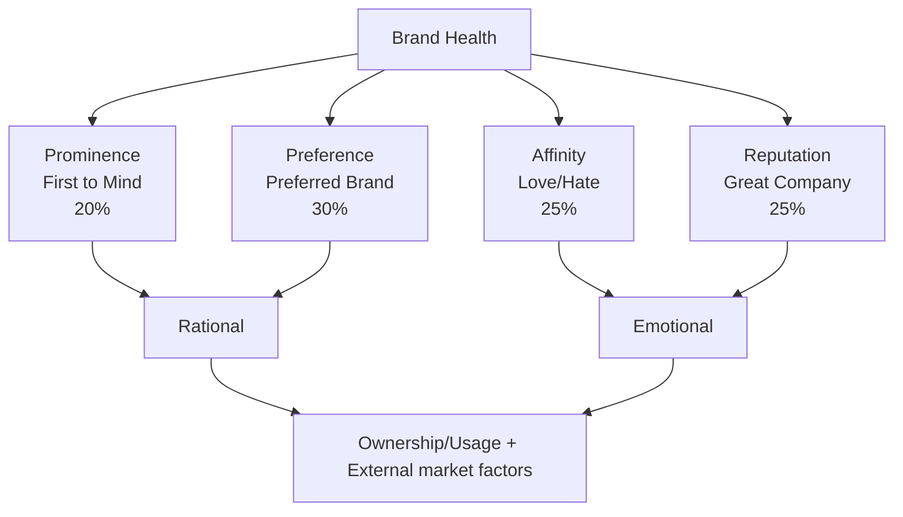

# Visa's Brand Health
# FY23 Report

ETHIOPIA 🇪🇹

JULY 2024

©2023 Visa. All rights reserved. Visa Confidential  1
# Background & Methodology

## Visa Brand Health

This report provides brand metrics on Visa and its competitors: consumer perceptions on brand imagery and key brand attributes

### Ethiopia Sample

| Wave | Sample Size | Mode |
| - | - | - |
| FY'24 | 417\* | CAPI |
| FY'23 | 412 | CAPI |
| Post AFCON'22 | 428 | CAPI |

### Key Segments (FY2023)

| Segment Name | Segment Size |
| - | - |
| Gen Z (18-26)\*\* | 199 |
| Trailing Millennials (ages 18-35) | 260 |
| International Travelers (Traveled internationally at least once in past 12 months) | 56 |
| eComm Shoppers (P1M online purchasers) | 294 |

### Brands Included

#### Blue Brands

- VISA
- Mastercard
- CBE Birr
- M-PESA
- AwashBank
- APOLLO
- bhnc telebiri

All questions administered

#### Yellow Brands

- ebirr
- Yb
- hz
- AMOLE
- EthioPay

Funnel metrics administered (BHS not measured)

*We did 50 boosters for Gen Z

**We have replaced Affluent with Gen Z across slides as Affluent does not have a reportable base

©2021 Visa. All rights reserved. Visa Confidential
# Introduction to FY24 Brand Health Measurement

Ethiopia

## Reporting

### Long Term Focus
- Reporting frequency for continuous markets is quarterly to maintain a longer-term focus on brand health; frequency for pulse countries is annual or biannual
- Wave on wave testing (see below) identifies increases, decreases, stable trend lines

### Key Measures
- Brand Health is a composite value derived from performance across four metrics – Prominence, Brand Preferred, Affinity, Reputation (Appendix 1)

### Strategic Segments
- Results among strategic target segments (e.g., Gen Z, Trailing Millennials, International Travelers, eComm shoppers) are reported unless the base size is too small (<30)

## Methodology

### Mobile Friendly
- Survey design is mobile-optimized to be more representative of the population:
  - Brand Health components - Reputation, Affinity, Prominence – are scored on 5 – point scales
  - Preference is a single choice question.
  - The attributes are streamlined and align with the Brand Framework
  - Payment brands are prioritized by country to represent key global and local competitive brands

### Affluent Segments
- Affluent definitions are updated annually, if needed, to align with changing country environments

## Wave on Wave testing

### Performance against previous wave
- In 2024, Visa seeks to maintain or improve its brand health scores achieved in year 2023
- In 2024, we have updated the brand list and hence we could observe some deviation from the past data.
- Performance of each parameter against previous wave is measured using a statistical comparative analysis of scores. The current wave scores are statistically tested against the 2023 scores to identify whether two measures are statistically different– higher or lower – at the 90% confidence level.

©2021 Visa. All rights reserved. Visa Confidential  3

# Key Highlights

[The rest of the slide appears to be intentionally left blank, likely to be filled with content in a presentation.]

©2021 Visa. All rights reserved. Visa Confidential    4
Visa demonstrates strength across key metrics, yet it faces formidable competition from Telebirr, which holds an advantage over Visa in terms of share of wallet.

## BHS

Visa remains the BHS leader despite a decline since FY'23. Both Gen Z and trailing millennials' scores dropped. Notably, Mastercard improved BHS among trailing millennials and international travelers.

## Funnel

Visa has universal awareness and ownership but loses out to Telebirr on usage and SOW conversions.

## Imagery

Visa excels in 'brand pride and connect,' and 'reliability,' but is relatively weak in 'helping the communities that matter' aspect.

## Card Types

While Visa leads in contactless card ownership and has seen strong gains in premium card awareness and ownership, the declining intent to acquire Visa travel cards and high intent to acquire Mastercard premium cards are concerning.

## eCommerce

eComm purchase is on the rise with significant increase over FY'23 seen across all segments. Visa and Mastercard both improved on intent to use however extent of use shows a decline.

## CoF & POS

Taxi, food delivery and grocery apps dominant with Visa being the strongest player.

## Wallets

Visa is the preferred card for loading digital wallets.

## Events

Reduced interest across events has led to Visa and Mastercard showing significant decline in association.
# Brand Health - Current Position

Visa outperforms major competitors in Brand Health Score and its components in FY'24.
Telebirr and CBE Birr follow VISA on BHS.

| Brand | Overall Brand Health Score | Prominence (T2B) | Brand Preferred (Solo) | Affinity (T2B) | Reputation (T2B) |
| - | - | - | - | - | - |
| VISA (a) | 80 (bcdefg) | 98 (bcdefg) | 4 (bcdefg) | 98 (bcdefg) | 97 (bcdefg) |
| Mastercard (b) | 16 | 14 | 0 | 17 | 29 |
| Birr (c) | 59 | 75 | 0 | 70 | 85 |
| M-PESA (d) | 21 | 26 | 0 | 21 | 38 |
| AwashBank (e) | 16 | 17 | 0 | 17 | 28 |
| APOLLO (f) | 24 | 28 | 0 | 29 | 37 |
| ethio telecom (g) | 69 | 83 | 1 | 83 | 88 |

Brand Health Score (BHS) is a composite value derived from performance across four metrics – Prominence, Brand Preferred (Solo), Affinity and Reputation (see Appendix 1); For the Total Base, brands are tested for significant difference to Visa - an a/b/c, etc.
# Brand Health Market Trends

Visa experienced a further decline in BHS during FY24, while Mastercard saw continued growth.
Among its BHS components, Visa has shown an increase in Prominence, affinity and reputation but significantly declined on preference.

## BHS Trends

| Brand | FY'22 | FY'23 | FY'24 |
| - | - | - | - |
| Visa | 95 | 89 ↓ | 80 ↓ |
| Mastercard | 6 | 11 ↑ | 69 |
| CBE Birr | | | 59 |
| M pesa | | | 24 |
| Awash Bank | | | 21 |
| Apollo | | | 16 ↑ |
| Tele Birr | | | 16 |

## VISA BHS Components

| Component | FY'22 | FY'23 | FY'24 |
| - | - | - | - |
| Prominence (T2B) | 94 | 87 ↓ | 98 ↑ |
| Brand Preferred (Solo) | 94 | 88 ↓ | 4 ↓ |
| Affinity (T2B) | 96 | 90 ↓ | 98 ↑ |
| Reputation (T2B) | 95 | 92 ↓ | 97 ↑ |
| Overall Brand Health Score | 95 | 89 ↓ | 80 ↓ |

Brand Health Score (BHS) is a composite value derived from performance across four metrics – Prominence, Brand Preferred (Solo), Affinity and Reputation (see Appendix 1; BHS and component scores are statistically tested over previous quarter highlighting Positive ↑ / Negative ↓ trends at 90%.
# Brand Health Current Position Among Key Segments - Competitive Landscape

Visa's BHS is equally strong across segments. Most wallet brands strong among eCommerce shoppers.

| Segment | | | | | | | |
| - | - | - | - | - | - | - | - |
| TOTAL | 80 | 16 | 59 | 21 | 16 | 24 | 69 |
| Gen Z (GZ) \[Non Gen Z (NGZ)] | 80 | 11 NGZ | 57 | 23 | 17 | 19 NGZ | 70 |
| Trailing Millennials (ML) \[Non Trailing Millennials (NM)] | 78 | 18 NML | 59 | 24 NML | 18 | 23 | 69 |
| International Travelers (IT) \[Non-Travelers = (NIT)] | 79 | 30 NIT | 74 NIT | 11 NIT | 20 | 19 | 60 |
| eComm Shoppers (ES) \[Non-eComm Shoppers (NES)] | 79 | 20 NES | 56 NES | 26 NES | 20 NES | 31 NES | 73 NES |

Brand Health Score (BHS) is a composite value derived from performance across four metrics – Prominence, Brand Preferred (Solo), Affinity and Reputation (see Appendix 1).; Where segments are shown, scores are tested against the segments in the category - notation next to a segment value (NM, NAF, NIT etc.) indicates that the noted segment value is significantly higher or lower than the segment value shown, so Millennials (ML) are tested against Non-Millennials (NM), Gen Z (GZ) are tested against Non-Gen Z (NGZ), International Travelers (IT) are tested against Non-Travelers (NIT), and eComm Shoppers (ES) are tested against Non-eComm Shoppers.

©2021 Visa. All rights reserved. Visa Confidential
# Brand Health Market Trends – By Segments

Visa's BHS declined across both age cohorts, whereas Mastercard saw significant gains among Trailing Millennials and International Travelers.
Telebirr is Visa's strongest competitor across segments, except for International Travelers, where CBE Birr leads.

| Gen Z (18-26) | Trailing Millennials (18-35) |
| - | - |
| \`\`\`mermaid graph LR FY22\["FY22"] --> FY23\["FY23 (11)"] FY23 --> FY24\["FY24 (80)"] style FY24 fill:#f9f,stroke:#333,stroke-width:2px \`\`\` NA - Visa: 80 - Mastercard: 11 - CBE Birr: 57 - M pesa: 23 - Awash Bank: 19 - Apollo: 17 - Telebirr: 90 (FY23) → 80 (FY24) | \`\`\`mermaid graph LR FY22\["FY'22 (7)"] --> FY23\["FY'23 (10)"] FY23 --> FY24\["FY24 (18)"] style FY24 fill:#f9f,stroke:#333,stroke-width:2px \`\`\` - Visa: 95 (FY'22) → 90 (FY'23) → 78 (FY24) - Mastercard: 7 → 10 → 18 - CBE Birr: 59 - M pesa: 24 - Awash Bank: 23 - Apollo: 18 - Telebirr: 69 |
| International Traveler | eComm Shoppers |
| \`\`\`mermaid graph LR FY22\["FY'22 (15)"] --> FY23\["FY'23 (22)"] FY23 --> FY24\["FY24 (30)"] style FY24 fill:#f9f,stroke:#333,stroke-width:2px \`\`\` - Visa: 94 → 79 → 79 - Mastercard: 15 → 22 → 30 - CBE Birr: 60 - M pesa: 11 - Awash Bank: 19 - Apollo: 20 - Telebirr: 74 | \`\`\`mermaid graph LR FY22\["FY'22 (10)"] --> FY23\["FY'23 (20)"] FY23 --> FY24\["FY24 (20)"] style FY24 fill:#f9f,stroke:#333,stroke-width:2px \`\`\` - Visa: 95 → 77 → 79 - Mastercard: 10 → 20 → 20 - CBE Birr: 56 - M pesa: 31 - Awash Bank: 26 - Apollo: 20 - Telebirr: 73 |

Brand Health Score (BHS) is a composite value derived from performance across four metrics – Prominence, Brand Preferred (Solo), Affinity and Reputation (see Appendix 1); BHS and component scores are statistically tested over previous quarter highlighting Positive / Negative trends at 90%.

Base: All Respondents
Gen Z: Random + Boosters
# Visa Brand Health Current Position by Components - Among Key Segments

Visa excels across components & key segments.
Affinity is weak among Gen Z, Trailing Millennials and International travelers.

| VISA | Overall Brand Health Score | Prominence (T2B) | Brand Preferred (Solo) | Affinity (T2B) | Reputation (T2B) |
| - | - | - | - | - | - |
| TOTAL | 80 | 98 | 4 | 98 | 97 |
| Gen Z (GZ) Non- Gen Z (NGZ)] | 80 | 97 | 4 | 97 NGZ | 96 |
| Trailing Millennials (ML) \[Non Trailing Millennials (NM)] | 78 | 97 | 5 | 97 NML | 96 NML |
| International Travelers (IT) \[Non-Travelers = (NIT)] | 79 | 98 | 0 | 96 NIT | 96 |
| eComm Shoppers (ES) \[Non-eComm Shoppers (NES)] | 79 | 97 | 1 NES | 98 | 97 |

Brand Health Score (BHS) is a composite value derived from performance across four metrics – Prominence, Brand Preferred (Solo), Affinity and Reputation (see Appendix 1).; Where segments are shown, scores are tested against the segments in the category - notation next to a segment value (NM, NAF, NIT etc.) indicates that the noted segment value is significantly higher or lower than the segment value shown, so Millennials (ML) are tested against Non-Millennials (NM), Gen Z (GZ) are tested against Non-Gen Z (NGZ), International Travelers (IT) are tested against Non-Travelers (NIT), and eComm Shoppers (ES) are tested against Non-eComm Shoppers.

Base: All Respondents
Gen Z: Random + Boosters

©2021 Visa. All rights reserved. Visa Confidential
# Deep Dive into VISA's BHS components
## Visa's Brand Health Components Trends – By Age Group

Visa BHS declined across both age cohorts.
Decline experienced across BHS components.

| Age Group | FY22 | FY23 | FY24 |
| - | - | - | - |
| Gen Z (18-26) | NA | Prominence (T2B): 89 | Prominence (T2B): 98 |
| | | Brand Preferred (Solo): 89 | Brand Preferred (Solo): 4 🔻 |
| | | Affinity (T2B): 90 | Affinity (T2B): 97 🔼 |
| | | Reputation (T2B): 92 | Reputation (T2B): 96 🔼 |
| | | Brand Health: 90 | Brand Health: 80 🔻 |
| Trailing Millennials (18-35) | Prominence (T2B): 93 | Prominence (T2B): 89 🔻 | Prominence (T2B): 97 🔻 |
| | Brand Preferred (Solo): 94 | Brand Preferred (Solo): 88 🔻 | Brand Preferred (Solo): 5 🔻 |
| | Affinity (T2B): 96 | Affinity (T2B): 90 🔻 | Affinity (T2B): 97 🔼 |
| | Reputation (T2B): 95 | Reputation (T2B): 92 | Reputation (T2B): 96 |
| | Brand Health: 95 | Brand Health: 90 🔻 | Brand Health: 78 🔻 |

Brand Health Score (BHS) is a composite value derived from performance across four metrics – Prominence, Brand Preferred (Solo), Affinity and Reputation (see Appendix 1); BHS and component scores are statistically tested over previous quarter highlighting Positive 🔼 / Negative 🔻 trends at 90%.

Base: All Respondents
Gen Z: Random + Boosters
# Deep Dive into VISA's BHS components
## Visa's Brand Health Components Trends – By International Travelers & eComm Shoppers

BHS stable among both segments, driven by low preference scores.
Prominence, affinity & reputation improved significantly among both.

| International Traveler | | | |
| - | - | - | - |
| !International Traveler Chart | | | |
| FY22 | FY23 | FY24 | Legend |
| 94 88 97 99 | 83 69 83 86 | 98 0 96 96 | |
| | | | Prominence (T2B) Brand Preferred (Solo) Affinity (T2B) Reputation (T2B) • Brand Health |

| eComm Shoppers | | |
| - | - | - |
| !eComm Shoppers Chart | | |
| FY22 | FY23 | FY24 |
| 97 92 97 94 | 77 67 81 83 | 97 1 98 97 |

Brand Health Score (BHS) is a composite value derived from performance across four metrics – Prominence, Brand Preferred (Solo), Affinity and Reputation (see Appendix 1); BHS and component scores are statistically tested over previous quarter highlighting Positive ↑ / Negative ↓ trends at 90%.

Base: All Respondents
# Key Indicators, Imagery and Prominence

©2021 Visa. All rights reserved. Visa Confidential  13
# Funnel Measures

Visa maintains strong funnel measures; however, Telebirr leads on conversion ratios.
Telebirr is the closest competitor followed by CBE Birr.

| | | | | | |
| - | - | - | - | - | - |
| Awareness (Total) | 100 | 35 | 93 | 58 | 46 |
| Ownership | 100 | 5 | 66 | 11 | 12 |
| Usage (p1m) | 80 → 81% | 2 → 40% | 50 → 76% | 6 → 59% | 8 → 71% |
| SOW | 22 → 27% | 1 → 32% | 15 → 30% | 1 → 22% | 2 → 21% |

| | | | | | |
| - | - | - | - | - | - |
| Awareness (Total) | 47 | 93 | 26 | 28 | 32 |
| Ownership | 17 | 81 | 6 | 7 | 12 |
| Usage (p1m) | 13 → 80% | 74 → 91% | 2 → 30% | 3 → 37% | 7 → 59% |
| SOW | 3 → 25% | 23 → 32% | 0 → 17% | 0 → 10% | 1 → 21% |

Colors of bars indicate competitive standing in the market: Lead, Above Average, Average or Below Average

Ethiopia SOW for the total base also includes Cash (25), Cheque (2), Others (3)

©2021 Visa. All rights reserved. Visa Confidential
# Key Imagery Performance Index - Total

Visa excels in 'brand pride and connect,' and 'reliability,' but is relatively weak in 'helping the communities that matter' aspect.

| Attribute | VISA(Base: 416) | Mastercard(148) | CBE Birr(388) | M-PESA(241) | AwashBank(191) | APOLLO(197) | Bank Telebirr(387) |
| - | - | - | - | - | - | - | - |
| I'm proud to be seen using this brand | 12 | -4 | -2 | -3 | 1 | -5 | 2 |
| Is a brand for someone like me | 5 | -1 | 1 | 3 | -2 | -3 | -3 |
| Helps me build financial well-being | 1 | -3 | -1 | 2 | 0 | 2 | -3 |
| Helps me make progress in life | -1 | -2 | -1 | 0 | 1 | 4 | -1 |
| I feel connected to the brand | 9 | -1 | 0 | -7 | -1 | -5 | 4 |
| Understands my needs | 5 | -4 | 0 | -3 | -2 | -5 | 8 |
| Is a brand I trust | 10 | 0 | 0 | -6 | 0 | -4 | 1 |
| The brands actions match its words | 3 | 1 | 0 | -8 | -1 | -1 | 5 |
| Shares values that inspire me | -2 | -2 | 2 | -4 | 0 | 5 | 0 |
| Helps the communities that matter to me | -5 | -1 | -3 | 3 | 1 | 1 | 3 |

Base: Brand Aware

Values indicate observed associations minus expected associations. The relative strength threshold is basis the standard deviation.

Relative Strength of the Brand (>7)
Relative Weakness of the Brand (<-7)

©2021 Visa. All rights reserved. Visa Confidential
# Key Imagery Performance (Absolutes) – Overall and Gen Z

Telebirr leads in key attributes, with Visa following.

| VISA | Overall\  | Overall\ Gen Z\  | Overall\ Gen Z\ VISA | Gen Z\  | | |
| - | - | - | - | - | - | - |
| Base | 416 | 148 | 387 | 199 | 61 | 185 |
| I'm proud to be seen using this brand | 69 | 7 | 76 | 70 | 3 | 83 |
| Is a brand for someone like me | 64 | 10 | 75 | 66 | 2 | 78 |
| Helps me build financial well-being | 55 | 7 | 67 | 56 | 3 | 74 |
| Helps me make progress in life | 55 | 8 | 72 | 56 | 0 | 79 |
| I feel connected to the brand | 64 | 9 | 76 | 63 | 7 | 83 |
| Understands my needs | 57 | 6 | 76 | 56 | 3 | 78 |
| Is a brand I trust | 67 | 11 | 75 | 65 | 8 | 77 |
| The brands actions match its words | 55 | 11 | 72 | 57 | 5 | 81 |
| Shares values that inspire me | 50 | 7 | 67 | 48 | 3 | 71 |
| Helps the communities that matter to me | 43 | 8 | 65 | 42 | 3 | 68 |

Base: Brand Aware

Refer to the appendix for complete Brand Imagery across different levels

Values indicate observed associations minus expected associations
The relative strength threshold is basis the standard deviation.

©2021 Visa. All rights reserved. Visa Confidential
# Category Level Brand Prominence

Visa leads across CEPs except for 'everyday spends' and 'contactless payments' where Telebirr leads.
CBE Birr is also stronger than Visa on 'contactless payments'.

## FY24 vs. Competition in FY24

Brand comes to mind immediately when think of ...

| Category | VISA | Mastercard | Birr | M-PESA | AmeriaBank | APOLLO | Bank of Abyssinia |
| - | - | - | - | - | - | - | - |
| ...acquiring new debit or credit Card | 69% | 13% ↓ | 28% ↓ | 2% ↓ | 3% ↓ | 5% ↓ | 19% ↓ |
| ...XB Travel Payments | 64% | 28% ↓ | 20% ↓ | 5% ↓ | 1% ↓ | 4% ↓ | 15% ↓ |
| ...everyday spend payments | 63% | 3% ↓ | 56% ↓ | 9% ↓ | 6% ↓ | 22% ↓ | 73% ↑ |
| ...XB eComm Payments | 63% | 26% ↓ | 23% ↓ | 4% ↓ | 3% ↓ | 5% ↓ | 22% ↓ |
| ...relevant benefits & offers on debit / credit cards | 63% | 12% ↓ | 33% ↓ | 6% ↓ | 5% ↓ | 10% ↓ | 38% ↓ |
| ...eComm Payments | 53% | 10% ↓ | 44% ↓ | 11% ↓ | 6% ↓ | 19% ↓ | 57% |
| .. contactless Payments | 48% | 5% ↓ | 57% ↑ | 8% ↓ | 5% ↓ | 18% ↓ | 64% ↑ |

↑ Brand Trending higher than Visa
↓ Brand Trending lower than Visa

©2021 Visa. All rights reserved. Visa Confidential
# Visa's standing Vs. competition across different card types

Contactless, Premium and Travel

©2021 Visa. All rights reserved. Visa Confidential  18
# Contactless Cards

Contactless card ownership has grown significantly for both Visa and Mastercard; However, Visa is still the clear leader.

## Contactless Card Ownership – Overall

| | FY22 | FY23 | FY24 |
| - | - | - | - |
| VISA | 19% | 63% ↑ | 75% ↑ |
| Mastercard | 1% | 0% ↓ | 4% ↑ |

Base: All Respondents

## VISA Contactless Card Ownership – Among Target Group

| | FY22 | FY23 | FY24 |
| - | - | - | - |
| Gen Z | - | 64% | 69% |
| Trailing Millennials | 19% | 65% ↑ | 68% |
| International Travelers | 31% | 74% ↑ | 88% ↑ |
| eComm Shoppers | 31% | 64% ↑ | 81% ↑ |

Base: All Respondents
Gen Z: Random + Boosters

## Contactless Cards: Intent to use (among brand holders)

T2B Scores: Very Likely + Somewhat likely

| | FY22 | FY23 | FY24 |
| - | - | - | - |
| VISA | 78% | 92% ↑ | 95% ↑ |
| Mastercard | Low Base | Low Base | Low Base |

Base: Brand owned

Scores are statistically tested over previous wave highlighting Positive ↑ / Negative ↓ trends at 90%.

©2021 Visa. All rights reserved. Visa Confidential
# Premium Cards – Visa vs. MasterCard

Strong gains witnessed in awareness and ownership of Visa premium cards, while Mastercard achieved significant gains in awareness.
Need to be cautious of the high intent to acquire Mastercard premium cards in future.

| VISA Premium Card KPI – Overall | | | | MasterCard Premium Card KPI – Overall | | | |
| - | - | - | - | - | - | - | - |
| | FY22 | FY23 | FY24 | | FY22 | FY23 | FY24 |
| Awareness NET | 21% | 11% 🔻 | 40% 🔼 | Awareness NET | 19% | 24% | 50% 🔼 |
| Ownership NET | 2% | 0% | 17% 🔼 | Ownership NET | 4% | 4% | 8% |
| *Base: All Respondents* | | | | *Base: All Respondents* | | | |

## Intent to use (among brand holders)
T2B Scores: Very Likely + Somewhat likely

| VISA | FY22 | FY23 | FY24 | MasterCard | FY22 | FY23 | FY24 |
| - | - | - | - | - | - | - | - |
| Platinum | Low Base | Low Base | Low Base | Platinum | Low Base | Low Base | Low Base |
| Infinite | Low Base | Low Base | Low Base | World | Low Base | Low Base | Low Base |
| Signature | Low Base | Low Base | 93% | World Elite | Low Base | Low Base | Low Base |

## Intent to acquire (among non-brand holders)
T2B Scores: Very Likely + Somewhat likely

| VISA | FY22 | FY23 | FY24 | MasterCard | FY22 | FY23 | FY24 |
| - | - | - | - | - | - | - | - |
| Platinum | 17% | 16% | 78% 🔼 | Platinum | 42% | 18% 🔻 | 71% 🔼 |
| Infinite | Low Base | Low Base | 92% | World | 39% | 23% 🔻 | 81% 🔼 |
| Signature | Low Base | Low Base | Low Base | World Elite | Low Base | Low Base | Low Base |
| *Base: Answering base* | | | | *Base: Answering base* | | | |

Scores are statistically tested over previous wave highlighting Positive 🔼 / Negative 🔻 trends at 90%.
# Travel Cards – Visa vs. MasterCard

Visa's travel ownership increased significantly across all the segments; however, intent to acquire declined.

| VISA Travel Card Ownership – Overall | | | | MasterCard Travel Card Ownership – Overall | | | |
| - | - | - | - | - | - | - | - |
| | FY22 | FY23 | FY24 | | FY22 | FY23 | FY24 |
| Overall | NA | 54% | 74% ↑ | Overall | NA | 0% | 4% ↑ |
| Gen Z | NA | 52% | 71% ↑ | Gen Z | NA | - | 1% |
| Trailing Millennials | NA | 53% | 67% ↑ | Trailing Millennials | NA | 0% | 5% ↑ |
| International Travelers | NA | 63% | 84% ↑ | International Travelers | NA | 6% | 29% ↑ |
| eComm Shoppers | NA | 52% | 79% ↑ | eComm Shoppers | NA | 1% | 5% ↑ |

| VISA Intent to use (among brand holders) | | | | MasterCard Intent to use (among brand holders) | | | |
| - | - | - | - | - | - | - | - |
| T2B Scores: Very Likely + Somewhat likely | | | | T2B Scores: Very Likely + Somewhat likely | | | |
| | FY22 | FY23 | FY24 | | FY22 | FY23 | FY24 |
| VISA | NA | 96% | 94% | MasterCard | NA | Low Base | Low Base |

| VISA Intent to acquire (among non-brand holders) | | | | MasterCard Intent to acquire (among non-brand holders) | | | |
| - | - | - | - | - | - | - | - |
| T2B Scores: Very Likely + Somewhat likely | | | | T2B Scores: Very Likely + Somewhat likely | | | |
| | FY22 | FY23 | FY24 | | FY22 | FY23 | FY24 |
| VISA | NA | 70% | 46% ↓ | MasterCard | NA | Low Base | Low Base |

Base: All Respondents
Gen Z: Random + Boosters

Scores are statistically tested over previous wave highlighting Positive ↑ / Negative ↓ trends at 90%.
# Specific Insights - Ethiopia

©2023 Visa. All rights reserved. Visa Confidential 22
# eCommerce/ Online shopping

Surge in online shopping observed across segments.

Although there is a significant increase in intent to use Visa cards for online shopping, Telebirr poses a strong challenge.

## P1M eComm Purchase – Overall

| | FY22 | FY23 | FY24 |
| - | - | - | - |
| Overall | 17% | 20% | 71% ↑ |
| # of times | 9.9 | 8.5 | 32.3 |

Base: All Respondents

## P1M eComm Purchase – Among Target Group

| | FY22 | FY23 | FY24 |
| - | - | - | - |
| Gen Z | - | 21% | 62% ↑ |
| Trailing Millennial | 19% | 22% | 67% ↑ |
| International Travelers | 19% | 49% ↑ | 71% ↑ |

Base: All Respondents
Gen Z: Random + Boosters

## Intent to Use (Among brand owners)
T2B Scores: Very Likely + Somewhat likely

| | FY22 | FY23 | FY24 |
| - | - | - | - |
| VISA | 67% | 74% ↑ | 86% ↑ |
| MasterCard | 22% | 33% ↑ | 68% ↑ |
| CBE Birr | | | 72% |
| M-Pesa | | | 46% |
| Awash Bank | NA | NA | 45% |
| Apollo | | | 65% |
| Tele Birr | | | 86% |

Base: Brand Aware

## Extent of Use – Total

| | FY22 | FY23 | FY24 |
| - | - | - | - |
| VISA | 36% | 40% | 24% ↓ |
| MasterCard | 3% | 1% | 2% |
| CBE Birr | | | 19% |
| M-Pesa | | | 3% |
| Awash Bank | NA | NA | 2% |
| Apollo | | | 5% |
| Tele Birr | | | 26% |
| Others | 27% | 17% ↓ | 11% ↓ |

Scores are statistically tested over Visa highlighting Positive ↑ / Negative ↓ trends at 90%.
# Merchant Category: App Ownership and Card on File

Taxi and food delivery apps dominate the market, with Visa being the strongest player across these apps.

## App Ownership in the Market

| App Category | App Ownership | VISA | Mastercard |
| - | - | - | - |
| Taxi/ ride-hailing apps | 66% | 42% | Low Base |
| Grocery delivery apps | 61% | 43% | Low Base |
| Food delivery/ pick up apps | 61% | 37% | Low Base |
| Video or music streaming services/ video on demand | 57% | 36% | Low Base |
| e-Commerce marketplace shopping/ Brand Official apps/ websites | 54% | 51% | Low Base |
| Online travel agencies/ apps/ websites | 53% | 48% | Low Base |

Base: All Respondents | Base: Cards owned

Scores are statistically tested over Visa highlighting Positive / Negative trends at 90%.
# Brand Visibility at Point of Sale

Wallets led in-store presence; Visa competes for online transactions.

| Brand | Cashier counter / in-store(retail, dining and services, etc.) | When you made a paymentonline (e.g. websites and apps etc.) | Payment via digital wallets\* |
| - | - | - | - |
| !VISA logo VISA | 41% | 42% | 20% |
| !Mastercard logo | 2% | 6% | 1% |
| !Birr logo | 53% | 41% | NA |
| !M-PESA logo | 4% | 3% | NA |
| !Awash Bank logo | 3% | 3% | NA |
| !APOLLO logo | 12% | 11% | NA |
| !Bank logo | 68% | 65% | NA |

Base: All Respondents
# Digital Wallets

Visa's leadership in overall card ownership reflects strongly over cards being loaded onto wallet brands.

## Brands/ accounts currently loaded

| Brand | Visa | MasterCard |
| - | - | - |
| Birr | 56 | |
| M-PESA | 59 | |
| AwashBank | 77 | |
| APOLLO | 13 | |
| Telebirr | 74 | |

*The figures above represents those who said that they have loaded Visa/ Mastercard in the wallet brand owned.*

**Base: Wallet/ card owned*

## Likelihood of uploading the current Visa card (T2B Score)

| Brand | Percentage | Base |
| - | - | - |
| Birr | 68% | 78 |
| M-PESA | 78% | 9\* |
| AwashBank | 91% | 13\* |
| APOLLO | 97% | 32 |
| Telebirr | 60% | 166 |

*Base: Those wallet owners who currently don't have Visa loaded in their wallet*

\* Low base

\* MasterCard has a low base among all the digital wallet brands

©2021 Visa. All rights reserved. Visa Confidential
# Events Interested vs. Sponsorship - Association

Interest across events declined, including the most recent one, AFCON.
Both Visa and Mastercard have significantly declined in being associated across events.

| Events | Last Event date | Interested (% of consumers) | | | | | | | |
| - | - | - | - | - | - | - | - | - | - |
| The CAF Africa Cup of Nations (AFCON) | Jan-24 | 36% ↓ | 18% ↓ | 6% ↓ | 24% | 26% | 10% | 6% | 24% |
| FIFA World Cup | Nov-22 | 36% ↓ | 25% ↓ | 18% ↓ | 13% | 5% | 9% | 4% | 13% |
| UEFA Champions League | Jun-23 | 29% ↓ | 17% ↓ | 8% ↓ | 4% | 4% | 2% | 1% | 4% |
| Summer Olympics | Jul-21 | 10% ↓ | 6% ↓ | 3% ↓ | 6% | 2% | 4% | 2% | 6% |
| Winter Olympics | Feb-22 | 10% | 4% ↓ | 2% ↓ | 3% | 2% | 2% | 2% | 4% |
| FIFA Women's World Cup | Jul-23 | 5% ↓ | 2% ↓ | 2% ↓ | 2% | - | 0% | 0% | 1% |

Base: All respondents

Scores are statistically tested over previous wave highlighting Positive / Negative trends at 90%.

©2021 Visa. All rights reserved. Visa Confidential 27
VISA

Thank
you

©2023 Visa. All rights reserved. Visa Confidential 28
# Appendix

©2023 Visa. All rights reserved. Visa Confidential 29
# Funnel Measures

| EthioPay | | |
| - | - | - |
| Awareness (Total) | 3 | |
| Ownership | 0 | |
| Usage (p1m) | 0 | 0% |
| SOW | 0 | 0% |

Colors of bars indicate competitive standing in the market: Lead, Above Average, Average or Below Average

Ethiopia SOW for the total base also includes Cash (25), Cheque (2), Others (3)
# Awareness of Payment Brands

| Brand | TOM | Unaided | Total | |
| - | - | - | - | - |
| Cards | Visa | 19% | 72% | 100% |
| | MasterCard | 1% | 4% | 35% |
| | Ethiopay | 0% | 0% | 3% |
| Wallets | CBE Birr | 32% | 73% | 93% |
| | TeleBirr | 34% | 82% | 93% |
| | M-Pesa | 1% | 9% | 58% |
| | Apollo | 4% | 18% | 47% |
| | Awash Birr | 2% | 6% | 46% |
| | Amole Wallet | 2% | 12% | 32% |
| | Hello Cash | 1% | 7% | 28% |
| | e-Birr | 0% | 0% | 26% |

Base: All Respondents

Note: Brands in bold fonts are Blue Brands
# Index Equity - Total

Visa excels in 'never sells personal data,' 'international purchases', 'seamless payment experience', 'brand pride and connect,' and 'reliability,' but is weak in 'convenience' and 'brand values' aspects.
Mastercard overshadows Visa on 'international purchases' and 'uniqueness'.

| | VISA | Mastercard | Birr | M-PESA | AwashBank | APOLLO | CBE Birr |
| - | - | - | - | - | - | - | - |
| **Security** | | | | | | | |
| Personal data | 9 | -3 | 4 | 1 | 0 | -6 | -5 |
| Data | 10 | -5 | 2 | 0 | 1 | -4 | -4 |
| Secure | 3 | -3 | -1 | 0 | -1 | 0 | 2 |
| Protection | 4 | -4 | 5 | 0 | 2 | -7 | 0 |
| Alert | 2 | -6 | 8 | 0 | 1 | -7 | 2 |
| I travel | 20 | 48 | -14 | -3 | -6 | -16 | -29 |
| Experience | 11 | 9 | -3 | -1 | 0 | -9 | -7 |
| Acceptance | 2 | 9 | -1 | 0 | -1 | -7 | -2 |
| **Convenience** | | | | | | | |
| Online | -8 | 3 | -1 | 0 | 2 | 1 | 3 |
| Receive | -3 | -3 | 5 | -1 | 1 | -3 | 4 |
| Retailer | -9 | -7 | 9 | 0 | -1 | 2 | 5 |
| Budget | 0 | -4 | 6 | 0 | 1 | -5 | 2 |
| Small business | -12 | -7 | 9 | -2 | 2 | 5 | 5 |
| Gaming | -7 | 5 | 1 | 1 | -2 | -6 | 8 |
| Wallet | -12 | -5 | 3 | 2 | 2 | 1 | 9 |
| Everyday payments | -13 | -7 | 11 | -4 | -2 | 2 | 12 |
| No cost | 1 | -2 | 6 | -1 | 0 | 0 | -4 |

| | VISA | Mastercard | Birr | M-PESA | AwashBank | APOLLO | CBE Birr |
| - | - | - | - | - | - | - | - |
| **Lifestyle** | | | | | | | |
| Family | -2 | -4 | -2 | 17 | 5 | 5 | -19 |
| Proud | 12 | -4 | -3 | -2 | 1 | -5 | 2 |
| Like | 5 | -1 | 3 | 1 | -2 | -3 | -3 |
| Connected | 9 | -1 | -7 | 0 | -1 | -5 | 4 |
| Needs | 5 | -4 | -3 | 0 | -2 | -5 | 8 |
| Well- being | 1 | -3 | 2 | -1 | 0 | 2 | -3 |
| Progress | -1 | -2 | 0 | -1 | 1 | 4 | -1 |
| Personalized | 0 | -2 | -1 | 0 | 1 | 3 | 0 |
| **Reliability** | | | | | | | |
| Trust | 10 | 0 | -6 | 0 | 0 | -4 | 1 |
| Brands | 8 | 20 | -14 | 2 | -1 | -4 | -12 |
| Technology | 3 | 1 | -7 | 1 | -1 | -3 | 5 |
| **Brand values** | | | | | | | |
| Everyone | 1 | -6 | -1 | 1 | 0 | 2 | 3 |
| Action | 3 | 1 | -8 | 0 | -1 | -1 | 5 |
| Values | -2 | -2 | -4 | 2 | 0 | 5 | 0 |
| Uplifting | -3 | 6 | -5 | -1 | -1 | 8 | -4 |
| Empower | -12 | -7 | 1 | -3 | 1 | 19 | 1 |
| Community | -5 | -1 | 3 | -3 | 1 | 1 | 3 |
| Support | -16 | -6 | 3 | -2 | -1 | 20 | 2 |
| Growth | -17 | -6 | 2 | -3 | 0 | 21 | 3 |

Base: Brand Aware

Relative Strength of the Brand (>7)
Relative Weakness of the Brand (<-7)

Values indicate observed associations minus expected associations
The relative strength threshold is basis the standard deviation.

©2021 Visa. All rights reserved. Visa Confidential
# Brand Image Attributes – Total

Telebirr outperforms all the brands on brand imagery attributes except on 'international purchases' and 'seamless payment experience' where Visa has an edge.

| | | | | | | | |
| - | - | - | - | - | - | - | - |
| Personal data | 67 | 8 | 55 | 12 | 10 | 26 | 71 |
| Data | 67 | 5 | 52 | 12 | 11 | 27 | 70 |
| Secure | 58 | 7 | 47 | 11 | 9 | 30 | 74 |
| Protection | 56 | 6 | 50 | 10 | 11 | 22 | 67 |
| Alert | 51 | 3 | 51 | 10 | 9 | 20 | 66 |
| I travel | 66 | 57 | 26 | 6 | 3 | 10 | 30 |
| Experience | 59 | 18 | 39 | 9 | 9 | 18 | 56 |
| Acceptance | 53 | 18 | 44 | 10 | 8 | 21 | 65 |
| Online | 48 | 14 | 49 | 11 | 13 | 32 | 77 |
| Receive | 48 | 6 | 50 | 9 | 10 | 25 | 70 |
| Retailer | 48 | 3 | 59 | 11 | 9 | 34 | 79 |
| Budget | 47 | 5 | 47 | 10 | 9 | 21 | 64 |
| Small business | 45 | 3 | 59 | 9 | 13 | 37 | 79 |
| Gaming | 42 | 14 | 44 | 10 | 7 | 22 | 72 |
| Wallet | 41 | 5 | 49 | 12 | 12 | 31 | 78 |
| Everyday payments | 38 | 3 | 55 | 6 | 7 | 30 | 77 |
| No cost | 29 | 3 | 30 | 4 | 5 | 16 | 32 |
| Family | 77 | 11 | 67 | 32 | 19 | 49 | 83 |
| Proud | 69 | 7 | 47 | 9 | 11 | 26 | 76 |
| Like | 64 | 10 | 56 | 12 | 9 | 30 | 75 |
| Connected | 64 | 9 | 42 | 11 | 9 | 26 | 76 |
| Needs | 57 | 6 | 43 | 10 | 8 | 24 | 76 |
| Well-being | 55 | 7 | 50 | 10 | 10 | 32 | 67 |
| Progress | 55 | 8 | 49 | 10 | 12 | 35 | 72 |
| Personalized | 51 | 7 | 44 | 10 | 10 | 32 | 67 |
| Trust | 67 | 11 | 44 | 11 | 10 | 28 | 75 |
| Brands | 62 | 30 | 33 | 12 | 8 | 26 | 58 |
| Technology | 60 | 11 | 43 | 12 | 9 | 29 | 79 |
| Everyone | 56 | 5 | 47 | 12 | 10 | 33 | 74 |
| Action | 55 | 11 | 38 | 10 | 9 | 28 | 72 |
| Values | 50 | 7 | 42 | 12 | 9 | 35 | 67 |
| Uplifting | 46 | 15 | 38 | 9 | 8 | 36 | 59 |
| Empower | 43 | 3 | 49 | 8 | 11 | 50 | 73 |
| Community | 43 | 8 | 45 | 6 | 9 | 28 | 65 |
| Support | 37 | 4 | 49 | 9 | 8 | 49 | 70 |
| Growth | 37 | 4 | 49 | 8 | 9 | 51 | 72 |

Base: Brand Aware

©2021 Visa. All rights reserved. Visa Confidential
# Brand Image Attributes – Total (Key Competition)

Telebirr outperforms key competition on all brand imagery attributes except on 'international purchases' and 'seamless payment experience' where Visa has an edge.

| Security | VISA | Mastercard | Telebirr | Lifestyle | VISA | Mastercard | Telebirr |
| - | - | - | - | - | - | - | - |
| Personal data | 67 | 8 | 71 | Family | 77 | 11 | 83 |
| Data | 67 | 5 | 70 | Proud | 69 | 7 | 76 |
| Secure | 58 | 7 | 74 | Like | 64 | 10 | 75 |
| Protection | 56 | 6 | 67 | Connected | 64 | 9 | 76 |
| Alert | 51 | 3 | 66 | Needs | 57 | 6 | 76 |
| I travel | 66 | 57 | 30 | Well-being | 55 | 7 | 67 |
| Experience | 59 | 18 | 56 | Progress | 55 | 8 | 72 |
| Acceptance | 53 | 18 | 65 | Personalized | 51 | 7 | 67 |
| Convenience | | | | Reliability | | | |
| Online | 48 | 14 | 77 | Trust | 67 | 11 | 75 |
| Receive | 48 | 6 | 70 | Brands | 62 | 30 | 58 |
| Retailer | 48 | 3 | 79 | Technology | 60 | 11 | 79 |
| Budget | 47 | 5 | 64 | Everyone | 56 | 5 | 74 |
| Small business | 45 | 3 | 79 | Action | 55 | 11 | 72 |
| Gaming | 42 | 14 | 72 | Values | 50 | 7 | 67 |
| Wallet | 41 | 5 | 78 | Uplifting | 46 | 15 | 59 |
| Everyday payments | 38 | 3 | 77 | Empower | 43 | 3 | 73 |
| No cost | 29 | 3 | 32 | Community | 43 | 8 | 65 |
| | | | | Support | 37 | 4 | 70 |
| | | | | Growth | 37 | 4 | 72 |

Base: Brand Aware
# Brand Image Attributes – Gen Z (18-26) (Key Competition)

Telebirr outperforms Visa across attributes except on 'international purchases'.

| Category | Attribute | VISA | Mastercard | Telebirr |
| - | - | - | - | - |
| Security | Personal data | 68 | 3 | 75 |
| | Data | 66 | 3 | 76 |
| | Secure | 58 | 5 | 79 |
| | Protection | 58 | 5 | 76 |
| | Alert | 54 | 2 | 70 |
| Convenience | I travel | 66 | 57 | 43 |
| | Experience | 56 | 8 | 65 |
| | Acceptance | 54 | 7 | 72 |
| | Online | 53 | 5 | 82 |
| | Receive | 49 | 7 | 80 |
| | Retailer | 49 | 0 | 83 |
| | Budget | 49 | 2 | 68 |
| | Small business | 47 | 0 | 83 |
| | Gaming | 40 | 2 | 78 |
| Convenience (cont.) | Wallet | 46 | 3 | 80 |
| | Everyday payments | 37 | 0 | 81 |
| | No cost | 29 | 0 | 41 |
| Lifestyle | Family | 77 | 7 | 88 |
| | Proud | 70 | 3 | 83 |
| | Like | 66 | 2 | 78 |
| | Connected | 63 | 7 | 83 |
| | Needs | 56 | 3 | 78 |
| | Well-being | 56 | 3 | 74 |
| Reliability | Progress | 56 | 0 | 79 |
| | Personalized | 52 | 3 | 76 |
| | Trust | 65 | 8 | 77 |
| | Brands | 64 | 21 | 67 |
| | Technology | 63 | 3 | 83 |
| | Everyone | 56 | 5 | 80 |
| Brand values | Action | 57 | 5 | 81 |
| | Values | 48 | 3 | 71 |
| | Uplifting | 45 | 3 | 69 |
| | Empower | 45 | 0 | 79 |
| | Community | 42 | 3 | 68 |
| | Support | 39 | 0 | 78 |
| | Growth | 40 | 2 | 78 |

Base: Brand Aware
Gen Z: Random + Boosters

©2021 Visa. All rights reserved. Visa Confidential
# Brand Image Attributes – Trailing Millennials (18-35)

| Attribute | | | | | | | |
| - | - | - | - | - | - | - | - |
| **Security** | | | | | | | |
| Personal data | 64 | 11 | 55 | 14 | 13 | 25 | 71 |
| Data | 63 | 7 | 53 | 12 | 13 | 28 | 70 |
| Secure | 51 | 9 | 50 | 12 | 11 | 28 | 77 |
| Protection | 50 | 9 | 52 | 12 | 13 | 20 | 69 |
| Alert | 45 | 5 | 50 | 10 | 12 | 19 | 69 |
| I travel | 61 | 56 | 24 | 5 | 4 | 4 | 37 |
| Experience | 49 | 15 | 41 | 10 | 10 | 18 | 63 |
| Acceptance | 46 | 22 | 45 | 12 | 10 | 16 | 67 |
| **Convenience** | | | | | | | |
| Online | 42 | 17 | 49 | 12 | 14 | 29 | 81 |
| Receive | 42 | 8 | 52 | 10 | 12 | 21 | 76 |
| Retailer | 44 | 5 | 57 | 12 | 12 | 25 | 81 |
| Budget | 39 | 7 | 47 | 10 | 12 | 19 | 67 |
| Small business | 38 | 4 | 58 | 10 | 15 | 31 | 80 |
| Gaming | 32 | 11 | 43 | 12 | 8 | 19 | 73 |
| Wallet | 37 | 7 | 53 | 14 | 14 | 29 | 83 |
| Everyday payments | 34 | 4 | 54 | 6 | 9 | 26 | 80 |
| No cost | 31 | 5 | 27 | 6 | 7 | 14 | 40 |
| **Lifestyle** | | | | | | | |
| Family | 72 | 11 | 64 | 27 | 23 | 43 | 84 |
| Proud | 65 | 9 | 49 | 8 | 13 | 24 | 78 |
| Like | 59 | 9 | 55 | 14 | 11 | 24 | 78 |
| Connected | 57 | 14 | 43 | 11 | 10 | 25 | 78 |
| Needs | 49 | 9 | 42 | 9 | 8 | 21 | 79 |
| Well-being | 46 | 8 | 46 | 12 | 12 | 29 | 69 |
| Progress | 47 | 9 | 50 | 10 | 13 | 33 | 73 |
| Personalized | 44 | 10 | 43 | 10 | 12 | 27 | 70 |
| **Reliability** | | | | | | | |
| Trust | 60 | 12 | 49 | 12 | 12 | 25 | 77 |
| Brands | 60 | 30 | 34 | 15 | 7 | 23 | 64 |
| Technology | 56 | 14 | 41 | 15 | 11 | 25 | 82 |
| Everyone | 53 | 7 | 47 | 13 | 12 | 38 | 75 |
| **Brand values** | | | | | | | |
| Action | 49 | 14 | 36 | 11 | 10 | 26 | 76 |
| Values | 40 | 8 | 40 | 14 | 12 | 27 | 66 |
| Uplifting | 38 | 12 | 38 | 9 | 10 | 33 | 63 |
| Empower | 39 | 5 | 47 | 10 | 14 | 43 | 72 |
| Community | 39 | 9 | 47 | 7 | 12 | 27 | 66 |
| Support | 32 | 6 | 47 | 10 | 10 | 44 | 71 |
| Growth | 31 | 6 | 49 | 9 | 12 | 43 | 72 |

Base: Brand Aware
# Brand Image Attributes – International Travelers

| | | | | | | | |
| - | - | - | - | - | - | - | - |
| Personal data | 80 | 36 | 79 | 12 | 16 | 39 | 63 |
| Data | 85 | 18 | 77 | 12 | 20 | 33 | 57 |
| Secure | 67 | 29 | 71 | 12 | 16 | 44 | 57 |
| Protection | 67 | 21 | 84 | 6 | 20 | 17 | 57 |
| Alert | 69 | 14 | 73 | 12 | 20 | 22 | 54 |
| I travel | 87 | 68 | 55 | 6 | 12 | 6 | 24 |
| Experience | 73 | 39 | 63 | 12 | 16 | 17 | 46 |
| Acceptance | 71 | 50 | 68 | 12 | 20 | 17 | 46 |
| Online | 67 | 46 | 75 | 0 | 20 | 33 | 61 |
| Receive | 60 | 18 | 75 | 12 | 20 | 22 | 54 |
| Retailer | 64 | 18 | 80 | 6 | 16 | 44 | 74 |
| Budget | 60 | 25 | 73 | 12 | 16 | 22 | 52 |
| Small business | 62 | 14 | 86 | 0 | 28 | 50 | 76 |
| Gaming | 73 | 36 | 68 | 12 | 12 | 28 | 65 |
| Wallet | 62 | 21 | 70 | 12 | 16 | 33 | 57 |
| Everyday payments | 64 | 11 | 80 | 6 | 16 | 50 | 70 |
| No cost | 67 | 18 | 57 | 6 | 12 | 17 | 41 |
| Family | 87 | 29 | 91 | 18 | 24 | 50 | 70 |
| Proud | 78 | 25 | 70 | 0 | 20 | 39 | 54 |
| Like | 78 | 29 | 79 | 12 | 16 | 44 | 67 |
| Connected | 84 | 36 | 66 | 6 | 20 | 33 | 63 |
| Needs | 76 | 29 | 71 | 6 | 16 | 33 | 65 |
| Well-being | 76 | 25 | 73 | 12 | 20 | 33 | 46 |
| Progress | 75 | 32 | 64 | 12 | 28 | 61 | 54 |
| Personalized | 69 | 25 | 66 | 12 | 20 | 39 | 63 |
| Trust | 80 | 32 | 68 | 12 | 20 | 39 | 63 |
| Brands | 76 | 64 | 45 | 6 | 16 | 11 | 35 |
| Technology | 75 | 39 | 68 | 12 | 16 | 28 | 61 |
| Everyone | 73 | 11 | 75 | 0 | 20 | 56 | 63 |
| Action | 75 | 29 | 61 | 6 | 20 | 33 | 52 |
| Values | 71 | 29 | 66 | 18 | 16 | 33 | 54 |
| Uplifting | 78 | 50 | 64 | 0 | 16 | 44 | 39 |
| Empower | 67 | 18 | 77 | 6 | 20 | 61 | 65 |
| Community | 75 | 36 | 73 | 12 | 28 | 39 | 57 |
| Support | 56 | 21 | 68 | 0 | 8 | 72 | 57 |
| Growth | 56 | 18 | 75 | 6 | 16 | 72 | 67 |

Base: Brand Aware

©2021 Visa. All rights reserved. Visa Confidential
# Brand Image Attributes – eComm Shoppers

| | | | | | | | |
| - | - | - | - | - | - | - | - |
| **Security** | | | | | | | |
| Personal data | 62 | 7 | 50 | 13 | 10 | 27 | 76 |
| Data | 63 | 5 | 47 | 12 | 11 | 29 | 77 |
| Secure | 55 | 7 | 40 | 12 | 10 | 33 | 76 |
| Protection | 51 | 6 | 44 | 11 | 11 | 23 | 70 |
| Alert | 47 | 3 | 45 | 10 | 10 | 22 | 67 |
| **Convenience** | | | | | | | |
| I travel | 67 | 57 | 16 | 6 | 3 | 9 | 25 |
| Experience | 57 | 16 | 31 | 10 | 9 | 20 | 55 |
| Acceptance | 52 | 17 | 36 | 11 | 9 | 24 | 67 |
| Online | 47 | 12 | 42 | 11 | 13 | 34 | 80 |
| Receive | 47 | 5 | 44 | 9 | 11 | 26 | 73 |
| Retailer | 45 | 3 | 53 | 13 | 8 | 35 | 82 |
| Budget | 46 | 4 | 40 | 11 | 10 | 24 | 67 |
| Small business | 43 | 3 | 53 | 9 | 11 | 37 | 82 |
| Gaming | 37 | 14 | 37 | 11 | 7 | 22 | 72 |
| Wallet | 38 | 4 | 42 | 14 | 11 | 31 | 79 |
| Everyday payments | 29 | 3 | 50 | 6 | 7 | 29 | 82 |
| No cost | 15 | 4 | 20 | 3 | 6 | 15 | 26 |
| **Lifestyle** | | | | | | | |
| Family | 73 | 10 | 61 | 33 | 16 | 48 | 84 |
| Proud | 66 | 6 | 39 | 10 | 11 | 29 | 80 |
| Like | 60 | 10 | 50 | 13 | 10 | 31 | 79 |
| Connected | 63 | 7 | 35 | 12 | 10 | 26 | 79 |
| Needs | 54 | 5 | 36 | 11 | 8 | 26 | 81 |
| Well-being | 55 | 7 | 43 | 11 | 10 | 33 | 70 |
| Progress | 55 | 8 | 44 | 10 | 11 | 37 | 75 |
| Personalized | 52 | 7 | 37 | 11 | 11 | 34 | 71 |
| **Reliability** | | | | | | | |
| Trust | 65 | 10 | 38 | 11 | 11 | 29 | 80 |
| Brands | 57 | 30 | 25 | 14 | 10 | 27 | 58 |
| Technology | 57 | 11 | 36 | 12 | 10 | 28 | 82 |
| Everyone | 48 | 4 | 40 | 13 | 9 | 33 | 76 |
| Action | 55 | 9 | 30 | 11 | 10 | 27 | 76 |
| **Brand values** | | | | | | | |
| Values | 49 | 7 | 36 | 13 | 10 | 35 | 70 |
| Uplifting | 42 | 13 | 30 | 10 | 8 | 38 | 61 |
| Empower | 41 | 3 | 44 | 9 | 11 | 50 | 76 |
| Community | 37 | 7 | 38 | 6 | 7 | 27 | 67 |
| Support | 33 | 4 | 43 | 10 | 8 | 50 | 76 |
| Growth | 32 | 4 | 43 | 9 | 10 | 51 | 76 |

Base: Brand Aware

©2021 Visa. All rights reserved. Visa Confidential 38
# Brand Image Attributes – Definition

| Security | Definition | Lifestyle | Definition |
| - | - | - | - |
| Alert | Actively alerts me about potential fraudulent transactions | Connected | I feel connected to the brand |
| Data | Actively protects my personal data | Family | Is what my friends / families are using |
| Personal data | Never sells my personal data | Like | Is a brand for someone like me |
| Protection | Proactively protects my payments | Needs | Understands my needs |
| Secure | Is a secure way to pay | Personalized | Offers me relevant benefits, privileges, and personalized features |
| Convenience | Definition | Progress | Helps me make progress in life |
| Acceptance | Is accepted wherever and whenever I need it | Proud | I'm proud to be seen using this brand |
| Budget | Helps me feel in control of my spending | Well-being | Helps me build financial well-being |
| Everyday | Is best for paying everyday small amounts | Reliability | Definition |
| Experience | Enables a seamless payment experience | Brands | Is distinct from other payment brands |
| Gaming | Is easy to make purchases while gaming | Technology | Is always improving the technology behind my payments |
| I Travel | Is the best way to make purchases while travelling internationally | Trust | Is a brand I trust |
| No cost | There is no cost to use | Brand values | Definition |
| Online | Is best for online transactions | Action | The brands actions match its words |
| Receive | Is the best way to get paid | Community | Helps the communities that matter to me make progress |
| Retailer | Is a brand that retailers prefer I use | Empower | Is a brand that empowers small and micro businesses |
| Small business | Is best for sending and receiving money between people, small businesses | Everyone | Opens doors to opportunities for everyone |
| Wallet | Easy to use with my smartphone or digital wallets | Growth | Supports small business growth |
| | | Support | Is a brand that supports small business |
| | | Uplifting | Cares about uplifting people |
| | | Values | Shares values that inspire me |

# Our Brand Health Score is a derived metric

Ethiopia flag

The Brand Health Score is composed of four main components:

1. **Prominence** (20%): First to Mind
2. **Preference** (30%): Preferred Brand
3. **Affinity** (25%): Love/Hate
4. **Reputation** (25%): Great Company

These components are further categorized into:

- **Rational**: Prominence and Preference
- **Emotional**: Affinity and Reputation

The overall Brand Health Score is influenced by Ownership/Usage and External market factors.

©2021 Visa. All rights reserved. Visa Confidential
# Calculating Brand Health Score

The Brand Health Score is a composite score of four individual questions.

| Question Wording | 4 Questions | 2 Dimensions | 1 Metric |
| - | - | - | - |
| Which payment brand(s) do you prefer? | Preference 60% | Rational 50% | Brand Health Score |
| When I think about ways to pay, this brand comes to my mind immediately. | Prominence 40% | | |
| Is a great company in all respects. | Reputation 50% | Emotional 50% | |
| How do you feel about each brand? | Affinity 50% | | |

Brand Health Score is calculated at the respondent level

VISA

©2021 Visa. All rights reserved. Visa Confidential
# Components of the Brand & Campaign Survey

Each consumer asked to answer questions below

## Brand Health Score

- Brand Preference
- Brand Affinity
- Prominence
- Reputation

| Funnel Measures | Brand Attributes | Advertising Effectiveness | Global & Market KPIs |
| - | - | - | - |
| * Awareness
* Ownership
* Usage
* Share of wallet | - 20+ brand attributes
- Brand Image
- Brand Experience
- Brand Purpose
- Product Experience
- Product Benefits
- Payment Occasions | * All media formats
* Recall
* Brand Linkage
* Ad Diagnostics
* Custom Message Perf.
* Monthly & Qrtly
* Rptg: 14 audiences | - Cross Border
- eCommerce
- Contactless
- SMB
- Cash Conversion
- Market-specific KPIs
- Quarterly Reporting |

  
<strong>Brand Performance</strong>

  
<strong>Campaign Performance</strong>

# CEMEA Coverage & frequency

| Brand Health Study | | |
| - | - | - |
| Global Managed & Funded | Regional Managed & Funded (FY21+) | |
| **Continues/Quarterly** 1. UAE 2. KSA (FY22 & Prior was Annual) **Annual:** 1. Ukraine 2. South Africa 3. Nigeria 4. Saudi Arabia | 1. Belarus, 2. Kazakhstan 3. Serbia 4. Pakistan 5. Qatar, 6. Egypt, 7. Ethiopia, 8. Morocco, 9. Ivory Coast, 10. Kenya, 11. Cameroon, 12. DR Congo | |
