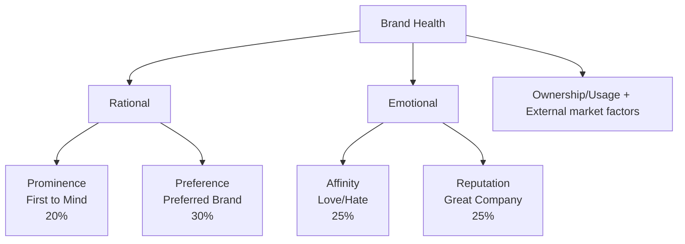

# Visa's Brand Health
# FY24 Report

KENYA 🇰🇪

JULY 2024

©2023 Visa. All rights reserved. Visa Confidential  1
# Background & Methodology

## Visa Brand Health

This report provides brand metrics on Visa and its competitors: consumer perceptions on brand imagery and key brand attributes

### Kenya Sample

| Wave | Sample Size | Mode |
| - | - | - |
| FY24 | 413\* | CAPI + Online |
| FY23 | 459 | CAPI + Online |
| FY22 | 461 | CAPI |

### Key Segments (FY24)

| Segment Name | Segment Size |
| - | - |
| Gen Z (18-26)\*\* | 154 |
| Trailing Millennials (ages 18-35) | 209 |
| International Travelers (Traveled internationally at least once in past 12 months) | 323 |
| eComm Shoppers (P1M online purchasers) | 261 |

### Brands Included

#### Blue Brands

- VISA
- Mastercard
- PayPal
- Airtel Money
- M-PESA

All questions administered

#### Yellow Brands

- UnionPay
- PesaLink

Funnel metrics administered (BHS not measured)

*We did 50 boosters for Gen Z

**We have replaced Affluent with Gen Z across slides as Affluent does not have a reportable base
# Introduction to FY24 Brand Health Measurement

Kenya

## Reporting

| Long Term Focus | • Reporting frequency for continuous markets is quarterly to maintain a longer-term focus on brand health; frequency for pulse countries is annual or biannual • Wave on wave testing (see below) identifies increases, decreases, stable trend lines |
| - | - |
| Key Measures | • Brand Health is a composite value derived from performance across four metrics – Prominence, Brand Preferred, Affinity, Reputation (Appendix 1) |
| Strategic Segments | • Results among strategic target segments (e.g., Gen Z, Trailing Millennials, International Travelers, eComm shoppers) are reported unless the base size is too small (<30) |

## Methodology

| Mobile Friendly | • Survey design is mobile-optimized to be more representative of the population: • Brand Health components - Reputation, Affinity, Prominence – are scored on 5 – point scales • Preference is a single choice question. • The attributes are streamlined and align with the Brand Framework • Payment brands are prioritized by country to represent key global and local competitive brands |
| - | - |
| Affluent Segments | • Affluent definitions are updated annually, if needed, to align with changing country environments |

## Wave on Wave testing

| Performance against previous wave | • In 2024, Visa seeks to maintain or improve its brand health scores achieved in year 2023 • In 2024, we have updated the brand list and hence we could observe some deviation from the past data. • Performance of each parameter against previous wave is measured using a statistical comparative analysis of scores. The current wave scores are statistically tested against the 2023 scores to identify whether two measures are statistically different – higher or lower – at the 90% confidence level. |
| - | - |

# Key Highlights

[The rest of the slide appears to be blank, with no additional content provided.]

©2021 Visa. All rights reserved. Visa Confidential  4
Visa's places second on BHS with improved scores among key segments of Gen Z and eCommerce shoppers. Conversions to usage and SOW for Visa not as strong as wallet brands.

| BHS | Funnel | Imagery | Card Types |
| - | - | - | - |
| Visa's brand strength is growing. Gen Z and eCommerce shoppers, show significant improvements in solo preference while remaining stable across other BHS components. | Visa competes strongly in awareness and ownership next only to M-PESA however, scope to improve conversions to usage and SOW. | Visa lacks differentiation across key attributes. | Visa contactless card ownership is higher, though intent to use has declined. Visa's premium cards maintain higher awareness and ownership over Mastercard. |

| eCommerce | CoF & POS | Wallets | Events |
| - | - | - | - |
| Visa has experienced significant growth in intent to use, driven by the overall increase in online shopping across segments, although M-PESA continues to lead in both intent and extent of use. | Visa remains the leading card brand for online transactions; however, its visibility is low in physical stores and on streaming apps. | Visa at par with Mastercard as preferred card for loading wallets. | Despite a significant increase in overall interest across various events, Visa's association with these events has declined. |

# Brand Health - Current Position

M-PESA leads on BHS across all BHS components; Visa comes second

| Brand | Overall Brand Health Score | Prominence (T2B) | Brand Preferred (Solo) | Affinity (T2B) | Reputation (T2B) |
| - | - | - | - | - | - |
| VISA | 51 (bcde) | 62 (bcde) | 4 (bcde) | 65 (bcde) | 68 (bcde) |
| Mastercard | 37 | 39 | 5 | 45 | 55 |
| PayPal | 33 | 38 | 0 | 47 | 48 |
| M-PESA | 74 | 90 | 23 | 90 | 83 |
| Airtel Money | 9 | 20 | 0 | 22 | 27 |

**Column Descriptions:**
- Prominence (T2B): When I think about ways to pay, this brand comes to my mind immediately.
- Brand Preferred (Solo): Which payment brand do you prefer?
- Affinity (T2B): How do you feel about each brand?
- Reputation (T2B): Is a great company in all respects.

Base: All Respondents

Brand Health Score (BHS) is a composite value derived from performance across four metrics – Prominence, Brand Preferred (Solo), Affinity and Reputation (see Appendix 1); For the Total Base, brands are tested for significant difference to Visa - an a/b/c, etc.

©2021 Visa. All rights reserved. Visa Confidential
# Brand Health Market Trends

Visa and Mastercard have shown an improvement in brand strength compared to previous years, while M-PESA has experienced a decline. All BHS components for Visa remain stable compared to the previous year, except for preference, which saw a significant increase.

## BHS Trends

| Brand | FY22 | FY23 | FY24 |
| - | - | - | - |
| Visa | 49 | 47 | 51 |
| Mastercard | 26 | 29 | 37 ↑ |
| PayPal | 16 | 21 ↑ | 33 ↑ |
| mPesa | 80 | 82 | 74 ↓ |
| Airtel Money | - | - | 9 |

## VISA BHS Components

| Component | FY22 | FY23 | FY24 |
| - | - | - | - |
| Prominence (T2B) | 61 | 58 | 62 |
| Brand Preferred (Solo) | 0 | 0 | 4 ↑ |
| Affinity (T2B) | 69 | 70 | 65 |
| Reputation (T2B) | 76 | 73 | 68 |
| Overall Brand Health Score | 49 | 47 | 51 |

Base: All Respondents

Brand Health Score (BHS) is a composite value derived from performance across four metrics – Prominence, Brand Preferred (Solo), Affinity and Reputation (see Appendix 1; BHS and component scores are statistically tested over previous quarter highlighting Positive ↑ / Negative ↓ trends at 90%.
# Brand Health Current Position Among Key Segments - Competitive Landscape

Visa performs strongly among eCommerce shoppers.

eComm shoppers are key strength segment for Mastercard and PayPal as well; M-PESA relatively stronger among Non-International Travelers and Trailing Millennials.

| Segment | VISA | Mastercard | PayPal | M-PESA | Airtel Money |
| - | - | - | - | - | - |
| TOTAL | 51 | 37 | 33 | 74 | 9 |
| Gen Z (GZ) \[Non Gen Z (NGZ)] | 48 | 29 NGZ | 27 | 79 | 3 (NGZ) |
| Trailing Millennials (ML) \[Non Trailing Millennials (NM)] | 48 | 32 NTM | 31 | 78 NTM | 9 |
| International Travelers (IT) \[Non-Travelers = (NIT)] | 49 | 38 | 32 | 71 NIT | 7 (NIT) |
| eComm Shoppers (ES) \[Non-eComm Shoppers (NES)] | 57 NES | 43 NES | 37 NES | 73 | 9 |

Base: All Respondents

Brand Health Score (BHS) is a composite value derived from performance across four metrics – Prominence, Brand Preferred (Solo), Affinity and Reputation (see Appendix 1).; Where segments are shown, scores are tested against the segments in the category- notation next to a segment value (NM, NAF, NIT etc.) indicates that the noted segment value is significantly higher or lower than the segment value shown, so Millennials (ML) are tested against Non-Millennials (NM), Gen Z (GZ) are tested against Non-Gen Z (NGZ), International Travelers (IT) are tested against Non-Travelers (NIT), and eComm Shoppers (ES) are tested against Non-eComm Shoppers.

©2021 Visa. All rights reserved. Visa Confidential
# Visa Brand Health Current Position by Components - Among Key Segments

Except for preference, Visa's BHS component scores are higher among eCommerce shoppers.

Visa's affinity and Reputation high among Non-International Travelers.

| Segment | Overall Brand Health Score | Prominence (T2B) | Brand Preferred (Solo) | Affinity (T2B) | Reputation (T2B) |
| - | - | - | - | - | - |
| TOTAL | 51 | 62 | 4 | 65 | 68 |
| Gen Z (GZ) \[Non- Gen Z (NGZ)] | 48 | 56 NGZ | 3 | 62 | 69 |
| Trailing Millennials (ML) \[Non Trailing Millennials (NM)] | 48 | 62 | 4 | 63 | 66 |
| International Travelers (IT) \[Non-Travelers = (NIT)] | 49 | 61 | 5 | 62 NIT | 63 NIT |
| eComm Shoppers (ES) \[Non-eComm Shoppers (NES)] | 57 NES | 67 NES | 5 | 74 NES | 76 NES |

Brand Health Score (BHS) is a composite value derived from performance across four metrics – Prominence, Brand Preferred (Solo), Affinity and Reputation (see Appendix 1).; Where segments are shown, scores are tested against the segments in the category- notation next to a segment value (NM, NAF, NIT etc.) indicates that the noted segment value is significantly higher or lower than the segment value shown, so Millennials (ML) are tested against Non-Millennials (NM), Gen Z (GZ) are tested against Non-Gen Z (NGZ), International Travelers (IT) are tested against Non-Travelers (NIT), and eComm Shoppers (ES) are tested against Non-eComm Shoppers.

Base: All Respondents
Gen Z: Random + Boosters
# Brand Health Market Trends – By Segments

Visa's BHS saw improvement among Gen Z and eCommerce shoppers, while improving directionally among trailing millennials. PayPal demonstrated significant growth across all segments, while Mastercard also experienced growth, particularly among eCommerce shoppers.

| Gen Z (18-26) | Trailing Millennials (18-35) |
| - | - |
| 	FY22	FY23	FY24&#xA;Visa	NA	39	48 🔼&#xA;Mastercard	NA	26	29&#xA;PayPal	NA	21	27 🔼&#xA;Mpesa	NA	82	79&#xA;Airtel Money	NA	NA	3 | |

</td>
<td>

| | FY22 | FY23 | FY24 |
| - | - | - | - |
| Visa | 47 | 43 | 48 |
| Mastercard | 24 | 28 | 31 🔼 |
| PayPal | 16 | 21 | 32 🔼 |
| Mpesa | 82 | 82 | 78 |
| Airtel Money | NA | NA | 9 |

</td>
</tr>
<tr>
<th>International Traveler</th>
<th>eComm Shoppers</th>
</tr>
<tr>
<td>

| | FY22 | FY23 | FY24 |
| - | - | - | - |
| Visa | 51 | 53 | 49 |
| Mastercard | 33 | 36 | 38 |
| PayPal | 24 | 24 | 32 🔼 |
| Mpesa | 71 | 75 | 71 |
| Airtel Money | NA | NA | 7 |

</td>
<td>

| | FY22 | FY23 | FY24 |
| - | - | - | - |
| Visa | 52 | 50 | 57 🔼 |
| Mastercard | 24 | 35 | 43 🔼 |
| PayPal | 16 | 28 | 37 🔼 |
| Mpesa | 78 | 81 | 73 🔽 |
| Airtel Money | NA | NA | 9 |

</td>
</tr>
</table>

Brand Health Score (BHS) is a composite value derived from performance across four metrics – Prominence, Brand Preferred (Solo), Affinity and Reputation (see Appendix 1; BHS and component scores are statistically tested over previous quarter highlighting Positive 🔼 / Negative 🔽 trends at 90%.

Base: All Respondents
Gen Z: Random + Boosters
# Deep Dive into VISA's BHS components
## Visa's Brand Health Components Trends – By Age Group

Visa BHS grew significantly among Gen Z and directionally among Trailing Millennials.
Gains across components among Gen Z and in prominence and preference among Trailing Millennials.

| Age Group | FY22 | FY23 | FY24 |
| - | - | - | - |
| Gen Z (18-26) | NA | Prominence (T2B): 46 | Prominence (T2B): 56 ↑ |
| | | Brand Preferred (Solo): 0 | Brand Preferred (Solo): 3 ↑ |
| | | Affinity (T2B): 62 | Affinity (T2B): 62 |
| | | Reputation (T2B): 55 | Reputation (T2B): 69 ↑ |
| | | Brand Health: 39 | Brand Health: 48 ↑ |
| Trailing Millennials (18-35) | Prominence (T2B): 58 | Prominence (T2B): 51 | Prominence (T2B): 62 ↑ |
| | Brand Preferred (Solo): 0 | Brand Preferred (Solo): 1 | Brand Preferred (Solo): 4 ↑ |
| | Affinity (T2B): 67 | Affinity (T2B): 66 | Affinity (T2B): 63 |
| | Reputation (T2B): 76 | Reputation (T2B): 64 | Reputation (T2B): 66 |
| | Brand Health: 47 | Brand Health: 43 ↓ | Brand Health: 48 ↑ |

Brand Health Score (BHS) is a composite value derived from performance across four metrics – Prominence, Brand Preferred (Solo), Affinity and Reputation (see Appendix 1); BHS and component scores are statistically tested over previous quarter highlighting Positive ↑ / Negative ↓ trends at 90%.

Base: All Respondents
Gen Z: Random + Boosters
# Deep Dive into VISA's BHS components
## Visa's Brand Health Components Trends – By International Travelers & eCommerce Shoppers

eCommerce shoppers showed a significant gain, driven by increased solo preference.
Visa's solo preference improved in both segments.

| International Traveler | FY22 | FY22\ FY23 | FY22\ FY23\ FY24 | FY22\ FY23\ FY24 | FY23\ FY24 | FY24 | | | | | | |
| - | - | - | - | - | - | - | - | - | - | - | - | - |
| Prominence (T2B) | 68 | 51 | 74 | 77 | 70 | 53 | 76 | 78 | 61 🔻 | 49 🔻 | 62 🔻 | 63 |
| Brand Preferred (Solo) | 0 | | | | 1 | | | | 5 🔼 | | | |
| Affinity (T2B) | | | | | | | | | | | | |
| Reputation (T2B) | | | | | | | | | | | | |

| eComm Shoppers | FY22 | FY22\ FY23 | FY22\ FY23\ FY24 | FY22\ FY23\ FY24 | FY23\ FY24 | FY24 | | | | | | |
| - | - | - | - | - | - | - | - | - | - | - | - | - |
| Prominence (T2B) | 66 | 52 | 75 | 82 | 63 | 50 | 73 | 75 | 67 | 57 🔼 | 74 | 76 |
| Brand Preferred (Solo) | 1 | | | | 0 | | | | 5 🔼 | | | |
| Affinity (T2B) | | | | | | | | | | | | |
| Reputation (T2B) | | | | | | | | | | | | |

Brand Health Score (BHS) is a composite value derived from performance across four metrics – Prominence, Brand Preferred (Solo), Affinity and Reputation (see Appendix 1); BHS and component scores are statistically tested over previous quarter highlighting Positive 🔼 / Negative 🔻 trends at 90%.

Base: All Respondents
# Key Indicators, Imagery and Prominence

VISA

©2021 Visa. All rights reserved. Visa Confidential  13
# Funnel Measures

M-PESA leads across measures and enjoys strong conversions.

Visa competes strongly on awareness but lags in other measures. Cash ranked second in spend share of SOW.

| Measure | VISA | Mastercard | M-PESA | PayPal | Airtel Money | PesaLink |
| - | - | - | - | - | - | - |
| Awareness (Total) | 90 | 78 | 97 | 81 | 74 | 52 |
| Ownership | 79 | 44 | 95 | 56 | 27 | 11 |
| Usage (p1m) | 39 | 24 | 90 | 22 | 10 | 4 |
| Usage % (p1m) | 49% | 54% | 95% | 39% | 37% | 32% |
| SOW | 12 | 8 | 50 | 5 | 2 | 1 |
| SOW % | 32% | 34% | 56% | 23% | 17% | 23% |

Colors of bars indicate competitive standing in the market:
- Lead: Green
- Above Average: Light Green
- Average: Yellow
- Below Average: Red

SOW for the total base also includes Cash (17), Cheque (1), Others (3)
# Key Imagery Performance - Total

Visa currently non-differentiated across key attributes.
M-PESA differentiated on attribute 'helping the communities that matter to me,' an area where most brands are weak.

| Attribute | VISA(Base: 374) | Mastercard(Base: 326) | PayPal(Base: 347) | M-PESA(Base: 403) | Airtel Money(Base: 309) |
| - | - | - | - | - | - |
| I'm proud to be seen using this brand | 1 | 5 | 3 | -7 | -3 |
| Is a brand for someone like me | 1 | 0 | 3 | -4 | -1 |
| Helps me build financial well-being | 3 | 3 | -5 | 2 | -3 |
| Helps me make progress in life | 1 | -2 | -1 | 5 | -2 |
| I feel connected to the brand | -2 | -1 | 1 | 5 | -3 |
| Understands my needs | -3 | -2 | -7 | 10 | 1 |
| Is a brand I trust | 4 | 7 | 1 | -10 | -2 |
| The brands actions match its words | 1 | 5 | 2 | -7 | -1 |
| Shares values that inspire me | -2 | 4 | -2 | -2 | 2 |
| Helps the communities that matter to me | -9 | -2 | -12 | 20 | 3 |

Base: Brand Aware

Values indicate observed associations minus expected associations.
The relative strength threshold is basis the standard deviation.

Relative Strength of the Brand (>11)
Relative Weakness of the Brand (<-11)

©2021 Visa. All rights reserved. Visa Confidential
# Key Imagery Performance (Absolutes) – Overall and Gen Z

M-PESA, the largest payment brand in Kenya, has the strongest associations across various attributes.

| | Overall\ VISA | Overall\ Gen Z\ mastercard | Overall\ Gen Z\ M-PESA | Gen Z\ VISA | mastercard | M-PESA |
| - | - | - | - | - | - | - |
| Base | 374 | 326 | 403 | 144 | 116 | 152 |
| I'm proud to be seen using this brand | 49 | 47 | 71 | 36 | 41 | 77 |
| Is a brand for someone like me | 49 | 42 | 75 | 36 | 31 | 81 |
| Helps me build financial well-being | 44 | 39 | 69 | 35 | 28 | 78 |
| Helps me make progress in life | 42 | 34 | 72 | 34 | 25 | 77 |
| I feel connected to the brand | 40 | 37 | 74 | 31 | 27 | 79 |
| Understands my needs | 36 | 32 | 75 | 28 | 23 | 78 |
| Is a brand I trust | 52 | 50 | 69 | 40 | 41 | 82 |
| The brands actions match its words | 47 | 47 | 70 | 37 | 36 | 83 |
| Shares values that inspire me | 41 | 42 | 70 | 32 | 32 | 79 |
| Helps the communities that matter to me | 27 | 30 | 79 | 17 | 20 | 89 |

Base: Brand Aware

Refer to the appendix for complete Brand Imagery across different segments

Values indicate observed associations minus expected associations.
The relative strength threshold is basis the standard deviation.

©2021 Visa. All rights reserved. Visa Confidential
# Category Level Brand Prominence

Visa showing the strongest immediate brand recall in key payment scenarios, except for 'everyday payments' where M-PESA leads.

## Brand comes to mind immediately when think of ...

| Scenario | VISA FY24 | vs. Competition in FY24 | vs. Competition in FY24 | vs. Competition in FY24 | vs. Competition in FY24 |
| - | - | - | - | - | - |
| ...XB Travel Payments | 69% | 52% ↓ | 31% ↓ | 15% ↓ | 3% ↓ |
| ...acquiring new debit or credit Card | 67% | 50% ↓ | 8% ↓ | 10% ↓ | 3% ↓ |
| ...relevant benefits & offers on debit / credit cards | 66% | 49% ↓ | 12% ↓ | 13% ↓ | 5% ↓ |
| ...XB eComm Payments | 62% | 48% ↓ | 35% ↓ | 19% ↓ | 4% ↓ |
| .. contactless Payments | 59% | 45% ↓ | 22% ↓ | 33% ↓ | 11% ↓ |
| ...eComm Payments | 51% | 40% ↓ | 35% ↓ | 37% ↓ | 9% ↓ |
| ...everyday spend payments | 21% | 14% ↓ | 15% ↓ | 83% ↑ | 14% ↓ |

↑ Brand Trending higher than Visa
↓ Brand Trending lower than Visa

The competitors in order from left to right are: Mastercard, PayPal, M-PESA, and Airtel Money.

©2021 Visa. All rights reserved. Visa Confidential
# Visa's standing Vs. competition across different card types

Contactless, Premium and Travel

[VISA logo]

©2021 Visa. All rights reserved. Visa Confidential  18
# Contactless Cards

Visa contactless card ownership remained stable despite significant increase across segments except International Travelers. Mastercard grew significantly while maintaining high intent to use.

## Contactless Card Ownership – Overall

| Brand | FY22 | FY23 | FY24 |
| - | - | - | - |
| VISA | 61% | 57% | 61% |
| Mastercard | 25% | 17% ↓ | 31% ↑ |

Base: All Respondents

## VISA Contactless Card Ownership – Among Target Group

| Segment | FY22 | FY23 | FY24 |
| - | - | - | - |
| Gen Z | - | 42% | 65% ↑ |
| Trailing Millennials | 57% | 52% | 59% ↑ |
| International Travelers | 63% | 64% | 59% |
| eComm Shoppers | 74% | 59% ↓ | 67% ↑ |

Base: All Respondents
Gen Z: Random + Boosters

## Contactless Cards: Intent to use (among brand holders)

T2B Scores: Very Likely + Somewhat likely

| Brand | FY22 | FY23 | FY24 |
| - | - | - | - |
| VISA | 80% | 86% ↑ | 85% |
| Mastercard | 79% | 92% ↑ | 91% |

Base: Brand owned

Scores are statistically tested over previous wave highlighting Positive ↑ / Negative ↓ trends at 90%.

©2021 Visa. All rights reserved. Visa Confidential
# Premium Cards – Visa vs. MasterCard

Premium card awareness and ownership for both brands – Visa & Mastercard improved vs.FY23.

| Premium Card KPI – Overall (Visa)\  | Premium Card KPI – Overall (Visa)\ Premium Card KPI – Overall (MasterCard)\ FY22 | Premium Card KPI – Overall (Visa)\ Premium Card KPI – Overall (MasterCard)\ FY23 | Premium Card KPI – Overall (Visa)\ Premium Card KPI – Overall (MasterCard)\ FY24 | Premium Card KPI – Overall (MasterCard)\  | FY22 | FY23 | FY24 |
| - | - | - | - | - | - | - | - |
| Awareness NET | 57% | 68% ↑ | 98% ↑ | Awareness NET | 51% | 58% ↑ | 99% ↑ |
| Ownership NET | 38% | 38% | 44% ↑ | Ownership NET | 29% | 19% ↓ | 30% ↑ |

Base: All Respondents

## Intent to use (among brand holders)
T2B Scores: Very Likely + Somewhat likely

| Visa | FY22 | FY23 | FY24 | MasterCard | FY22 | FY23 | FY24 |
| - | - | - | - | - | - | - | - |
| Platinum | 76% | 69% | 86% ↑ | Platinum | 82% | 81% | 89% |
| Infinite | Low Base | 92% | 73% ↓ | World | 66% | 76% | 75% |
| Signature | Low Base | 81% | 79% | World Elite | Low Base | Low Base | Low Base |

## Intent to acquire (among non-brand holders)
T2B Scores: Very Likely + Somewhat likely

| Visa | FY22 | FY23 | FY24 | MasterCard | FY22 | FY23 | FY24 |
| - | - | - | - | - | - | - | - |
| Platinum | 35% | 42% | 41% | Platinum | 45% | 28% ↓ | 48% ↑ |
| Infinite | 45% | 44% | 59% ↑ | World | 35% | 35% | 30% |
| Signature | 31% | 35% | 57% ↑ | World Elite | 45% | 38% | 34% |

Base: Answering base

Scores are statistically tested over previous wave highlighting Positive ↑ / Negative ↓ trends at 90%.

©2021 Visa. All rights reserved. Visa Confidential
# Travel Cards – Visa vs. MasterCard

Visa's travel ownership increased significantly driven by both the age cohorts; however, intent to acquire declined.
Mastercard grew significantly across segments with again a decline in future acquisition.

## Visa Travel Card Ownership – Overall

| Segment | FY22 | FY23 | FY24 |
| - | - | - | - |
| Overall | NA | 47% | 54% ↑ |
| Gen Z | - | 34% | 62% ↑ |
| Trailing Millennials | NA | 39% | 53% ↑ |
| International Travelers | NA | 64% | 56% ↓ |
| eComm Shoppers | NA | 56% | 58% |

## MasterCard Travel Card Ownership – Overall

| Segment | FY22 | FY23 | FY24 |
| - | - | - | - |
| Overall | NA | 14% | 31% ↑ |
| Gen Z | - | 11% | 27% ↑ |
| Trailing Millennials | NA | 12% | 28% ↑ |
| International Travelers | NA | 27% | 34% ↑ |
| eComm Shoppers | NA | 22% | 36% ↑ |

## Intent to use (among brand holders)
Base: All Respondents
Gen Z: Random + Boosters
T2B Scores: Very Likely + Somewhat likely

| Brand | FY22 | FY23 | FY24 |
| - | - | - | - |
| Visa | NA | 87% | 90% |
| MasterCard | NA | 94% | 91% |

## Intent to acquire (among non-brand holders)
T2B Scores: Very Likely + Somewhat likely

| Brand | FY22 | FY23 | FY24 |
| - | - | - | - |
| Visa | NA | 88% | 55% ↓ |
| MasterCard | NA | 87% | 45% ↓ |

Base: Answering base

Scores are statistically tested over previous wave highlighting Positive ↑ / Negative ↓ trends at 90%.

©2021 Visa. All rights reserved. Visa Confidential
# Specific Insights - Kenya

©2023 Visa. All rights reserved. Visa Confidential 22
# eCommerce/ Online shopping

Growth in online shopping is observed across segments.

Intent to use grew significantly for Visa, Mastercard, and PayPal, but M-PESA continues to have the strongest intent and extent of use.

## P1M eComm Purchase – Overall

| | FY22 | FY23 | FY24 |
| - | - | - | - |
| Overall | 37% | 39% | 63% ↑ |
| # of times | 19.9 | 9.4 | 11.4 |

Base: All Respondents

## Intent to Use (Among brand owners)

T2B Scores: Very Likely + Somewhat likely

| | FY22 | FY23 | FY24 |
| - | - | - | - |
| Visa | 57% | 51% ↓ | 65% ↑ |
| Mastercard | 32% | 36% | 48% ↑ |
| PayPal | 25% | 33% ↑ | 50% ↑ |
| M-PESA | 91% | 91% | 89% |
| Airtel Money | NA | NA | 19% |

Base: Brand Aware

## P1M eComm Purchase – Among Target Group

| | FY22 | FY23 | FY24 |
| - | - | - | - |
| Gen Z | - | 39% | 65% ↑ |
| Trailing Millennial | 35% | 42% ↑ | 65% ↑ |
| International Travelers | 51% | 50% | 64% ↑ |

Base: All Respondents
Gen Z: Random + Boosters

## Extent of Use – Total

| | FY22 | FY23 | FY24 |
| - | - | - | - |
| Visa | 15% | 15% | 18% |
| Mastercard | 7% | 5% | 10% ↑ |
| PayPal | 3% | 4% | 8% ↑ |
| M-PESA | 40% | 47% | 48% |
| Airtel Money | NA | NA | 3% |
| Others | 22% | 16% | 9% ↓ |

Scores are statistically tested over previous wave highlighting Positive ↑ / Negative ↓ trends at 90%.
# Merchant Category: App Ownership and Card on File

Taxi, online travel, streaming and eCommerce apps dominate the market.
Visa underperforms in video streaming and travel categories.

## App Ownership in the Market

| Category | App Ownership | VISA | Mastercard |
| - | - | - | - |
| Taxi/ ride-hailing apps | 89% | 48% | 44% |
| Video or music streaming services/ video on demand | 88% | 57% ⬇ | 67% |
| e-Commerce marketplace shopping/ Brand Official apps/ websites | 88% | 62% | 66% |
| Online travel agencies/ apps/ websites | 87% | 61% ⬇ | 72% |
| Food delivery/ pick up apps | 84% | 50% | 53% |
| Grocery delivery apps | 76% | 41% ⬇ | 53% |

Base: All Respondents | Base: Cards owned

Scores are statistically tested over Visa highlighting Positive / Negative trends at 90%.
# Brand Visibility at Point of Sale

While M-PESA lead in-store presence, Visa remains the top card brand for online transactions.

| Brand | Cashier counter / in-store(retail, dining and services, etc.) | When you made a paymentonline (e.g. websites and apps etc.) | Payment via digital wallets\* |
| - | - | - | - |
| !VISA logo | 39% | 54% | 45% |
| !Mastercard logo | 27% | 36% | 28% |
| !PayPal logo | 9% | 30% | NA |
| !M-PESA logo | 81% | 40% | NA |
| !Airtel Money logo | 10% | 5% | NA |

Base: All Respondents
# Digital Wallets

Visa's leadership in overall card ownership (vs Mastercard) does not reflect in cards loaded on the wallets.

## Brands/ accounts currently loaded

| Brand | Visa | MasterCard |
| - | - | - |
| PayPal | 54 | 55 |
| M-PESA | 38 | 35 |

*The figures above represents those who said that they have loaded Visa/ Mastercard in the wallet brand owned.*

## Likelihood of uploading the current Visa card (T2B Score)

| Brand | Percentage | Base |
| - | - | - |
| PayPal | 64% | 96 |
| M-PESA | 41% | 227 |

*Base: Those wallet owners who currently don't have Visa loaded in their wallet*

Base: Wallet/ card owned

© 2021 Visa. All rights reserved. Visa Confidential
# Events Interested vs. Sponsorship - Association

Level of interest increased significantly across events except for FIFA World Cup (vs 2023).
There's a decline in Visa's association across events.

| Events | Last season date | Interested (% of consumers) | | | | | |
| - | - | - | - | - | - | - | - |
| FIFA World Cup | Nov 2022 | 70% | 57% ⬇ | 44% ⬇ | 16% | 3% ⬇ | 1% |
| UEFA Champions League | Jun 2023 | 65% ⬆ | 51% | 48% | 17% | 4% ⬇ | 2% |
| The CAF Africa Cup of Nations (AFCON) | Jan 2024 | 56% ⬆ | 44% ⬇ | 39% ⬇ | 14% | 24% | 14% |
| FIFA Women's World Cup | July 2023 | 28% ⬆ | 31% ⬇ | 30% ⬇ | 12% ⬇ | 4% ⬇ | 2% |
| Summer Olympics | July 2021 | 27% ⬆ | 19% ⬇ | 21% ⬇ | 10% | 3% ⬇ | 1% |
| Winter Olympics | Feb 2022 | 22% ⬆ | 23% ⬇ | 20% ⬇ | 10% ⬇ | 3% ⬇ | 1% |

Base: All Respondents

Scores are statistically tested over previous wave highlighting Positive ⬆ / Negative ⬇ trends at 90%.

©2021 Visa. All rights reserved. Visa Confidential
VISA

Thank
you

©2023 Visa. All rights reserved. Visa Confidential
# Appendix

©2023 Visa. All rights reserved. Visa Confidential 29
# Funnel Measures

| Measure | Value | Percentage |
| - | - | - |
| Awareness (Total) | 21 | |
| Ownership | 3 | |
| Usage (p1m) | 0 | 0% |
| SOW | 0 | 0% |

Colors of bars indicate competitive standing in the market - Lead, Above Average, Average or Below Average

Kenya

[UnionPay logo is displayed above the data]

©2021 Visa. All rights reserved. Visa Confidential
# Awareness of Payment Brands

| | Brand | TOM | Unaided | Total |
| - | - | - | - | - |
| Cards | Visa | 9% | 39% | 90% |
| | MasterCard | 4% | 33% | 78% |
| | UnionPay | 0% | 3% | 21% |
| Wallets | PayPal | 7% | 42% | 81% |
| | M-PESA | 48% | 77% | 97% |
| | Airtel Money | 2% | 22% | 74% |
| | PesaLink | 1% | 7% | 52% |

Base: All Respondents

Note: Brands in bold fonts are Blue Brands
# Index Equity - Total

Visa's strengths lies in purchases made while 'gaming' and 'international travel.
Visa is weak on supporting, promoting and enabling transactions with 'small businesses' and on 'everyday payments. M-PESA weak on security aspects, presenting an opportunity for Visa to develop a differentiated strength.

| | | | | | | |
| - | - | - | - | - | - | - |
| Security | Secure | 6 | 9 | 5 | -21 | 1 |
| | Data | 8 | 5 | 10 | -24 | 1 |
| | Protection | 6 | 5 | 8 | -17 | -2 |
| | Personal data | 6 | 5 | 8 | -21 | 2 |
| | Alert | 10 | 3 | 3 | -14 | -3 |
| I travel | 30 | 25 | 9 | -53 | -12 | |
| Online | 7 | 0 | 20 | -20 | -7 | |
| Gaming | 11 | 2 | 13 | -21 | -6 | |
| Convenience | Acceptance | 8 | 3 | -7 | 0 | -5 |
| | Experience | 1 | 1 | 0 | 0 | -2 |
| | Budget | 4 | 3 | -5 | 2 | -3 |
| | Wallet | -4 | -8 | 14 | -5 | 2 |
| | Receive | -6 | -4 | 13 | 2 | -5 |
| | Retailer | -4 | -12 | -11 | 26 | 1 |
| No cost | 4 | 1 | 3 | -14 | 7 | |
| Small business | -14 | -15 | -8 | 26 | 11 | |
| Everyday payments | -14 | -13 | -11 | 31 | 6 | |

| | | | | | | |
| - | - | - | - | - | - | - |
| Lifestyle | Like | 1 | 0 | 3 | -4 | -1 |
| | Proud | 1 | 5 | 3 | -7 | -3 |
| | Well- being | 3 | 3 | -5 | 2 | -3 |
| | Personalized | 2 | 3 | -2 | 1 | -4 |
| | Progress | 1 | -2 | -1 | 5 | -2 |
| | Family | -8 | -3 | -3 | 7 | 7 |
| | Connected | -2 | -1 | 1 | 5 | -3 |
| | Needs | -3 | -2 | -7 | 10 | 1 |
| Reliability | Trust | 4 | 7 | 1 | -10 | -2 |
| | Technology | 4 | 3 | 5 | -8 | -4 |
| | Brands | -2 | 2 | 6 | -2 | -3 |
| Brand values | Action | 1 | 5 | 2 | -7 | -1 |
| | Values | -2 | 4 | -2 | -2 | 2 |
| | Everyone | -8 | -1 | -2 | 11 | 0 |
| | Uplifting | -8 | 0 | -10 | 15 | 4 |
| | Community | -9 | -2 | -12 | 20 | 3 |
| | Empower | -10 | -10 | -14 | 28 | 6 |
| | Support | -12 | -12 | -14 | 28 | 10 |
| | Growth | -12 | -9 | -14 | 30 | 6 |

Base: Brand Aware

Relative Strength of the Brand (>11)
Relative Weakness of the Brand (<11)

Values indicate observed associations minus expected associations
The relative strength threshold is basis the standard deviation.
# Brand Image Attributes – Total

M-PESA is strongly associated across attributes; Mastercard and Visa follow.
Compared to competition, Visa strongest on 'international travel' and 'gaming' purchases.

| Category | Attribute | VISA | Mastercard | PayPal | M-PESA | Airtel money |
| - | - | - | - | - | - | - |
| Security | Secure | 59 | 56 | 41 | 66 | 21 |
| | Data | 58 | 50 | 45 | 58 | 20 |
| | Protection | 56 | 49 | 42 | 65 | 16 |
| | Personal data | 55 | 49 | 42 | 60 | 21 |
| | Alert | 54 | 42 | 33 | 58 | 14 |
| Convenience | I travel | 74 | 64 | 40 | 19 | 5 |
| | Online | 55 | 41 | 53 | 57 | 11 |
| | Gaming | 53 | 39 | 42 | 48 | 10 |
| | Acceptance | 49 | 40 | 22 | 68 | 11 |
| | Experience | 47 | 42 | 32 | 76 | 16 |
| | Budget | 44 | 38 | 22 | 67 | 12 |
| | Wallet | 43 | 33 | 46 | 72 | 20 |
| | Receive | 36 | 33 | 43 | 72 | 11 |
| | Retailer | 31 | 20 | 14 | 85 | 14 |
| Other | No cost | 27 | 21 | 19 | 24 | 16 |
| | Small business | 23 | 18 | 18 | 87 | 25 |
| | Everyday payments | 20 | 17 | 13 | 87 | 19 |

| Category | Attribute | VISA | Mastercard | PayPal | M-PESA | Airtel money |
| - | - | - | - | - | - | - |
| Lifestyle | Like | 49 | 42 | 36 | 75 | 17 |
| | Proud | 49 | 47 | 36 | 71 | 15 |
| | Well-being | 44 | 39 | 23 | 69 | 12 |
| | Personalized | 42 | 38 | 26 | 67 | 11 |
| | Progress | 42 | 34 | 27 | 72 | 13 |
| | Family | 41 | 40 | 30 | 88 | 25 |
| | Connected | 40 | 37 | 30 | 74 | 12 |
| | Needs | 36 | 32 | 20 | 75 | 16 |
| Reliability | Trust | 52 | 50 | 35 | 69 | 16 |
| | Technology | 48 | 42 | 36 | 66 | 13 |
| | Brands | 36 | 36 | 33 | 61 | 11 |
| Brand values | Action | 47 | 47 | 34 | 70 | 16 |
| | Values | 41 | 42 | 28 | 70 | 18 |
| | Everyone | 33 | 35 | 26 | 79 | 16 |
| | Uplifting | 30 | 33 | 16 | 78 | 19 |
| | Community | 27 | 30 | 13 | 79 | 17 |
| | Empower | 25 | 21 | 10 | 86 | 19 |
| | Support | 24 | 19 | 10 | 86 | 23 |
| Other | Growth | 23 | 23 | 11 | 89 | 19 |

Base: Brand Aware
# Brand Image Attributes – Total (Key Competition)

Visa excels in 'international purchases' and 'gaming,' while M-PESA dominates the remaining attributes.

| Category | Attribute | VISA | Mastercard | M-PESA |
| - | - | - | - | - |
| Security | Secure | 59 | 56 | 66 |
| | Data | 58 | 50 | 58 |
| | Protection | 56 | 49 | 65 |
| | Personal data | 55 | 49 | 60 |
| | Alert | 54 | 42 | 58 |
| Convenience | I travel | 74 | 64 | 19 |
| | Online | 55 | 41 | 57 |
| | Gaming | 53 | 39 | 48 |
| | Acceptance | 49 | 40 | 68 |
| | Experience | 47 | 42 | 76 |
| | Budget | 44 | 38 | 67 |
| | Wallet | 43 | 33 | 72 |
| | Receive | 36 | 33 | 72 |
| | Retailer | 31 | 20 | 85 |
| Other | No cost | 27 | 21 | 24 |
| | Small business | 23 | 18 | 87 |
| | Everyday payments | 20 | 17 | 87 |
| Lifestyle | Like | 49 | 42 | 75 |
| | Proud | 49 | 47 | 71 |
| | Well-being | 44 | 39 | 69 |
| | Personalized | 42 | 38 | 67 |
| | Progress | 42 | 34 | 72 |
| | Family | 41 | 40 | 88 |
| | Connected | 40 | 37 | 74 |
| | Needs | 36 | 32 | 75 |
| Reliability | Trust | 52 | 50 | 69 |
| | Technology | 48 | 42 | 66 |
| | Brands | 36 | 36 | 61 |
| Brand values | Action | 47 | 47 | 70 |
| | Values | 41 | 42 | 70 |
| | Everyone | 33 | 35 | 79 |
| | Uplifting | 30 | 33 | 78 |
| | Community | 27 | 30 | 79 |
| | Empower | 25 | 21 | 86 |
| | Support | 24 | 19 | 86 |
| | Growth | 23 | 23 | 89 |

Base: Brand Aware
# Brand Image Attributes – Gen Z (18-26) (Key Competition)

Even among Gen Z, Visa leads on 'international purchases' and 'gaming purchases' while M-PESA leads on all other attributes.

| Category | Attribute | VISA | Mastercard | M-PESA |
| - | - | - | - | - |
| Security | Secure | 44 | 48 | 75 |
| | Data | 42 | 39 | 68 |
| | Protection | 44 | 38 | 76 |
| | Personal data | 43 | 36 | 69 |
| | Alert | 49 | 29 | 61 |
| Convenience | I travel | 73 | 59 | 23 |
| | Online | 47 | 32 | 63 |
| | Gaming | 48 | 28 | 46 |
| | Acceptance | 40 | 33 | 72 |
| | Experience | 31 | 28 | 86 |
| | Budget | 30 | 23 | 73 |
| | Wallet | 42 | 27 | 76 |
| | Receive | 32 | 30 | 67 |
| | Retailer | 19 | 11 | 95 |
| | No cost | 22 | 12 | 31 |
| Small business | | 19 | 12 | 96 |
| Everyday payments | | 12 | 11 | 95 |
| Lifestyle | Like | 36 | 31 | 81 |
| | Proud | 36 | 41 | 77 |
| | Well-being | 35 | 28 | 78 |
| | Personalized | 34 | 21 | 69 |
| | Progress | 34 | 25 | 77 |
| | Family | 36 | 32 | 96 |
| | Connected | 31 | 27 | 79 |
| | Needs | 28 | 23 | 78 |
| Reliability | Trust | 40 | 41 | 82 |
| | Technology | 41 | 39 | 71 |
| | Brands | 25 | 26 | 72 |
| Brand values | Action | 37 | 36 | 83 |
| | Values | 32 | 32 | 79 |
| | Everyone | 22 | 23 | 85 |
| | Uplifting | 22 | 20 | 89 |
| | Community | 17 | 20 | 89 |
| | Empower | 17 | 8 | 92 |
| | Support | 17 | 13 | 92 |
| | Growth | 14 | 13 | 95 |

Base: Brand Aware
Gen Z: random + Boosters
# Brand Image Attributes – Gen Z (18-26)

Similar trend as seen among key competition.

| Category | Attribute | | | | | |
| - | - | - | - | - | - | - |
| Security | Secure | 44 | 48 | 41 | 75 | 15 |
| | Data | 42 | 39 | 40 | 68 | 17 |
| | Protection | 44 | 38 | 37 | 76 | 14 |
| | Personal data | 43 | 36 | 37 | 69 | 17 |
| | Alert | 49 | 29 | 26 | 61 | 8 |
| Convenience | I travel | 73 | 59 | 38 | 23 | 1 |
| | Online | 47 | 32 | 56 | 63 | 3 |
| | Gaming | 48 | 28 | 42 | 46 | 3 |
| | Acceptance | 40 | 33 | 21 | 72 | 4 |
| | Experience | 31 | 28 | 21 | 86 | 14 |
| | Budget | 30 | 23 | 14 | 73 | 4 |
| | Wallet | 42 | 27 | 47 | 76 | 10 |
| | Receive | 32 | 30 | 41 | 67 | 8 |
| | Retailer | 19 | 11 | 7 | 95 | 11 |
| | No cost | 22 | 12 | 21 | 31 | 12 |
| | Small business | 19 | 12 | 12 | 96 | 18 |
| | Everyday payments | 12 | 11 | 9 | 95 | 13 |
| Lifestyle | Like | 36 | 31 | 36 | 81 | 11 |
| | Proud | 36 | 41 | 30 | 77 | 8 |
| | Well- being | 35 | 28 | 21 | 78 | 5 |
| | Personalized | 34 | 21 | 22 | 69 | 10 |
| | Progress | 34 | 25 | 25 | 77 | 8 |
| | Family | 36 | 32 | 27 | 96 | 18 |
| | Connected | 31 | 27 | 19 | 79 | 8 |
| | Needs | 28 | 23 | 16 | 78 | 16 |
| Reliability | Trust | 40 | 41 | 27 | 82 | 12 |
| | Technology | 41 | 39 | 35 | 71 | 7 |
| | Brands | 25 | 26 | 30 | 72 | 6 |
| Brand values | Action | 37 | 36 | 26 | 83 | 14 |
| | Values | 32 | 32 | 22 | 79 | 12 |
| | Everyone | 22 | 23 | 21 | 85 | 15 |
| | Uplifting | 22 | 20 | 14 | 89 | 14 |
| | Community | 17 | 20 | 12 | 89 | 12 |
| | Empower | 17 | 8 | 8 | 92 | 14 |
| | Support | 17 | 13 | 8 | 92 | 14 |
| | Growth | 14 | 13 | 8 | 95 | 12 |

Base: Brand Aware
Gen Z: random + Boosters
# Brand Image Attributes – Trailing Millennials (18-35)

| Category | Attribute | | | | | |
| - | - | - | - | - | - | - |
| Security | Secure | 56 | 53 | 38 | 76 | 20 |
| | Data | 57 | 46 | 41 | 65 | 21 |
| | Protection | 53 | 46 | 41 | 72 | 14 |
| | Personal data | 54 | 43 | 42 | 70 | 22 |
| | Alert | 52 | 36 | 32 | 67 | 11 |
| Convenience | I travel | 80 | 64 | 44 | 16 | 1 |
| | Online | 55 | 35 | 60 | 57 | 7 |
| | Gaming | 53 | 35 | 49 | 42 | 8 |
| | Acceptance | 46 | 33 | 20 | 71 | 9 |
| | Experience | 41 | 36 | 27 | 85 | 15 |
| | Budget | 34 | 32 | 13 | 71 | 10 |
| | Wallet | 44 | 34 | 53 | 77 | 18 |
| | Receive | 34 | 31 | 42 | 70 | 7 |
| | Retailer | 24 | 15 | 10 | 91 | 14 |
| Convenience | No cost | 25 | 16 | 18 | 28 | 16 |
| | Small business | 22 | 11 | 13 | 93 | 24 |
| | Everyday payments | 15 | 13 | 9 | 92 | 14 |
| Lifestyle | Like | 47 | 37 | 36 | 85 | 17 |
| | Proud | 43 | 45 | 34 | 82 | 14 |
| | Well- being | 41 | 37 | 21 | 80 | 11 |
| | Personalized | 38 | 31 | 24 | 74 | 10 |
| | Progress | 37 | 28 | 25 | 78 | 10 |
| | Family | 36 | 32 | 23 | 93 | 18 |
| | Connected | 34 | 28 | 28 | 84 | 8 |
| | Needs | 26 | 28 | 15 | 82 | 14 |
| Reliability | Trust | 48 | 45 | 32 | 77 | 14 |
| | Technology | 43 | 41 | 32 | 70 | 10 |
| | Brands | 27 | 32 | 30 | 70 | 6 |
| Brand values | Action | 40 | 41 | 30 | 80 | 18 |
| | Values | 35 | 37 | 24 | 75 | 15 |
| | Everyone | 25 | 31 | 21 | 85 | 15 |
| | Uplifting | 24 | 32 | 13 | 83 | 15 |
| | Community | 21 | 28 | 11 | 86 | 14 |
| | Empower | 20 | 13 | 10 | 91 | 17 |
| | Support | 20 | 15 | 7 | 93 | 20 |
| | Growth | 18 | 18 | 7 | 94 | 21 |

Base: Brand Aware
# Brand Image Attributes – International Travelers

| Category | Attribute | | | | | |
| - | - | - | - | - | - | - |
| Security | Secure | 56 | 54 | 40 | 61 | 18 |
| | Data | 54 | 47 | 43 | 54 | 16 |
| | Protection | 52 | 47 | 40 | 60 | 15 |
| | Personal data | 51 | 49 | 39 | 54 | 17 |
| | Alert | 53 | 41 | 33 | 54 | 11 |
| Convenience | I travel | 73 | 62 | 40 | 19 | 6 |
| | Online | 53 | 42 | 51 | 50 | 11 |
| | Gaming | 55 | 39 | 42 | 43 | 8 |
| | Acceptance | 49 | 39 | 24 | 65 | 11 |
| | Experience | 44 | 43 | 31 | 71 | 14 |
| | Budget | 41 | 38 | 22 | 63 | 11 |
| | Wallet | 45 | 34 | 46 | 66 | 16 |
| | Receive | 35 | 33 | 38 | 69 | 8 |
| | Retailer | 33 | 22 | 16 | 82 | 12 |
| | No cost | 30 | 25 | 22 | 27 | 16 |
| | Small business | 28 | 22 | 17 | 85 | 21 |
| | Everyday payments | 23 | 20 | 15 | 84 | 15 |
| Lifestyle | Like | 45 | 43 | 34 | 72 | 16 |
| | Proud | 44 | 49 | 33 | 66 | 15 |
| | Well- being | 42 | 38 | 24 | 66 | 13 |
| | Personalized | 41 | 41 | 27 | 64 | 12 |
| | Progress | 40 | 37 | 28 | 69 | 14 |
| | Family | 40 | 43 | 31 | 85 | 23 |
| | Connected | 36 | 38 | 29 | 70 | 12 |
| | Needs | 36 | 34 | 20 | 72 | 16 |
| Reliability | Trust | 47 | 50 | 33 | 65 | 14 |
| | Technology | 47 | 43 | 34 | 62 | 13 |
| | Brands | 36 | 38 | 33 | 59 | 12 |
| Brand values | Action | 47 | 46 | 33 | 67 | 15 |
| | Values | 39 | 42 | 27 | 66 | 16 |
| | Everyone | 32 | 36 | 25 | 76 | 14 |
| | Uplifting | 32 | 35 | 19 | 74 | 17 |
| | Community | 28 | 31 | 15 | 76 | 15 |
| | Empower | 29 | 24 | 11 | 83 | 18 |
| | Support | 27 | 21 | 12 | 83 | 21 |
| | Growth | 26 | 26 | 11 | 86 | 19 |

Base: Brand Aware

©2021 Visa. All rights reserved. Visa Confidential
# Brand Image Attributes – eComm Shoppers

| Category | Attribute | | | | | |
| - | - | - | - | - | - | - |
| Security | Secure | 65 | 58 | 44 | 64 | 20 |
| | Data | 63 | 52 | 48 | 56 | 19 |
| | Protection | 59 | 53 | 46 | 60 | 13 |
| | Personal data | 63 | 53 | 47 | 54 | 19 |
| | Alert | 53 | 42 | 37 | 56 | 14 |
| Convenience | I travel | 74 | 66 | 39 | 20 | 5 |
| | Online | 53 | 43 | 50 | 60 | 10 |
| | Gaming | 53 | 41 | 39 | 50 | 13 |
| | Acceptance | 48 | 41 | 21 | 71 | 9 |
| | Experience | 51 | 45 | 32 | 75 | 14 |
| | Budget | 49 | 41 | 24 | 63 | 10 |
| | Wallet | 46 | 35 | 46 | 73 | 19 |
| | Receive | 42 | 34 | 48 | 69 | 9 |
| | Retailer | 34 | 19 | 14 | 84 | 12 |
| Other | No cost | 31 | 24 | 20 | 20 | 15 |
| | Small business | 24 | 19 | 21 | 87 | 25 |
| | Everyday payments | 26 | 18 | 14 | 86 | 18 |
| Lifestyle | Like | 56 | 46 | 41 | 70 | 15 |
| | Proud | 56 | 51 | 40 | 67 | 14 |
| | Well-being | 49 | 41 | 25 | 66 | 11 |
| | Personalized | 46 | 43 | 29 | 62 | 10 |
| | Progress | 49 | 37 | 31 | 65 | 12 |
| | Family | 52 | 43 | 36 | 88 | 24 |
| | Connected | 45 | 37 | 32 | 68 | 10 |
| | Needs | 43 | 35 | 20 | 70 | 15 |
| Reliability | Trust | 59 | 51 | 39 | 65 | 15 |
| | Technology | 56 | 44 | 39 | 59 | 11 |
| | Brands | 44 | 37 | 33 | 56 | 11 |
| Brand values | Action | 54 | 47 | 38 | 65 | 15 |
| | Values | 50 | 46 | 34 | 63 | 16 |
| | Everyone | 38 | 38 | 30 | 75 | 12 |
| | Uplifting | 35 | 35 | 18 | 73 | 17 |
| | Community | 31 | 32 | 15 | 78 | 14 |
| | Empower | 27 | 20 | 11 | 86 | 16 |
| | Support | 24 | 17 | 10 | 85 | 22 |
| | Growth | 25 | 23 | 12 | 89 | 20 |

Base: Brand Aware

©2021 Visa. All rights reserved. Visa Confidential
# Brand Image Attributes – Definition

| Security | | Lifestyle | |
| - | - | - | - |
| Alert | Actively alerts me about potential fraudulent transactions | Connected | I feel connected to the brand |
| Data | Actively protects my personal data | Family | Is what my friends / families are using |
| Personal data | Never sells my personal data | Like | Is a brand for someone like me |
| Protection | Proactively protects my payments | Needs | Understands my needs |
| Secure | Is a secure way to pay | Personalized | Offers me relevant benefits, privileges, and personalized features |
| Convenience | | Progress | Helps me make progress in life |
| Acceptance | Is accepted wherever and whenever I need it | Proud | I'm proud to be seen using this brand |
| Budget | Helps me feel in control of my spending | Well-being | Helps me build financial well-being |
| Everyday | Is best for paying everyday small amounts | Reliability | |
| Experience | Enables a seamless payment experience | Brands | Is distinct from other payment brands |
| Gaming | Is easy to make purchases while gaming | Technology | Is always improving the technology behind my payments |
| I Travel | Is the best way to make purchases while traveling internationally | Trust | Is a brand I trust |
| No cost | There is no cost to use | Brand values | |
| Online | Is best for online transactions | Action | The brands actions match its words |
| Receive | Is the best way to get paid | Community | Helps the communities that matter to me make progress |
| Retailer | Is a brand that retailers prefer I use | Empower | Is a brand that empowers small and micro businesses |
| Small business | Is best for sending and receiving money between people, small businesses | Everyone | Opens doors to opportunities for everyone |
| Wallet | Easy to use with my smartphone or digital wallets | Growth | Supports small business growth |
| | | Support | Is a brand that supports small business |
| | | Uplifting | Cares about uplifting people |
| | | Values | Shares values that inspire me |

# Our Brand Health Score is a derived metric

The Brand Health Score is composed of four main components:

1. **Prominence** (20%): First to Mind
2. **Preference** (30%): Preferred Brand
3. **Affinity** (25%): Love/Hate
4. **Reputation** (25%): Great Company

These components are further categorized into:

- **Rational**: Prominence and Preference
- **Emotional**: Affinity and Reputation

The Brand Health Score also takes into account:

- Ownership/Usage
- External market factors

Kenya

©2021 Visa. All rights reserved. Visa Confidential
# Calculating Brand Health Score

The Brand Health Score is a composite score of four individual questions.

| Question Wording | 4 Questions | 2 Dimensions | 1 Metric |
| - | - | - | - |
| Which payment brand(s) do you prefer? | Preference 60% | Rational 50% | Brand Health Score |
| When I think about ways to pay, this brand comes to my mind immediately. | Prominence 40% | | |
| Is a great company in all respects. | Reputation 50% | Emotional 50% | |
| How do you feel about each brand? | Affinity 50% | | |

Brand Health Score is calculated at the respondent level
# Components of the Brand & Campaign Survey

Each consumer asked to answer questions below

## Brand Health Score

- Brand Preference
- Brand Affinity
- Prominence
- Reputation

The Brand Health Score is connected to four main components:

| Funnel Measures | Brand Attributes | Advertising Effectiveness | Global & Market KPIs |
| - | - | - | - |
| * Awareness
* Ownership
* Usage
* Share of wallet | - 20+ brand attributes
- Brand Image
- Brand Experience
- Brand Purpose
- Product Experience
- Product Benefits
- Payment Occasions | * All media formats
* Recall
* Brand Linkage
* Ad Diagnostics
* Custom Message Perf.
* Monthly & Qrtly
* Rptg: 14 audiences | - Cross Border
- eCommerce
- Contactless
- SMB
- Cash Conversion
- Market-specific KPIs
- Quarterly Reporting |

  
Brand Performance

  
Campaign Performance

# CEMEA Coverage & frequency

Kenya

## Brand Health Study

| Global Managed & Funded | Regional Managed & Funded (FY21+) |
| - | - |
| **Continues/Quarterly** 1. UAE 2. KSA (FY22 & Prior was Annual) **Annual:** 1. Ukraine 2. South Africa 3. Nigeria 4. Saudi Arabia | 1. Belarus, 2. Kazakhstan 3. Serbia 4. Pakistan 5. Qatar, 6. Egypt, 7. Ethiopia, 8. Morocco, 9. Ivory Coast, 10. Kenya, 11. Cameroon, 12. DR Congo |

©2021 Visa. All rights reserved. Visa Confidential  44
