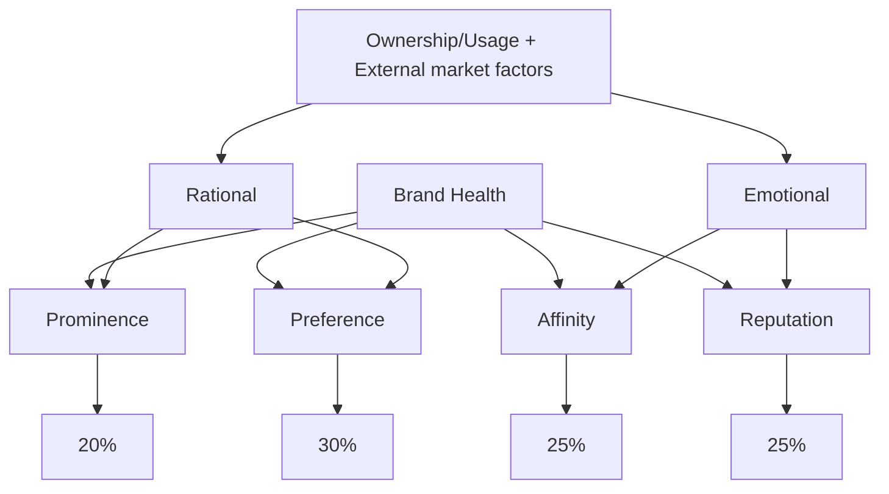

# Visa's Brand Health FY24 Report

MOROCCO 🇲🇦

JULY 2024

[An illustration on the right side of the image depicts various icons related to finance and technology, including a clock, briefcase, bank building, globe, Bitcoin symbol, smartphone, shopping bag, and human profiles, all interconnected within an arrow shape.]

©2023 Visa. All rights reserved. Visa Confidential  1
# Background & Methodology

## Visa Brand Health

This report provides brand metrics on Visa and its competitors: consumer perceptions on brand imagery and key brand attributes

### Morocco Sample

| Wave | Sample Size | Mode          |
| ---- | ----------- | ------------- |
| FY24 | 410\*       | CAPI + Online |
| FY23 | 421         | CAPI + Online |
| FY22 | 404         | CAPI          |

### Key Segments (FY2023)

| Segment Name                                                                           | Segment Size |
| -------------------------------------------------------------------------------------- | ------------ |
| Gen Z (18-26)\*\*                                                                      | 164          |
| Trailing Millennials (ages 18-35)                                                      | 200          |
| International Travelers (Traveled internationally at least once in past 12 months) | 140          |
| eComm Shoppers (P1M online purchasers)                                             | 233          |

### Brands Included

#### Blue Brands

VISA, Mastercard, PayPal, CMI

All questions administered

#### Yellow Brands

Orange Money, Inwi Money, BPAY, M-wallet, CashPlus, Wafacash

Funnel metrics administered (BHS not measured)

*We did 50 boosters for GenZ

**We have replaced Affluent with Gen Z across slides as Affluent does not have a reportable base
# Introduction to FY24 Brand Health Measurement

Morocco

## Reporting

### Long Term Focus
- Reporting frequency for continuous markets is quarterly to maintain a longer-term focus on brand health; frequency for pulse countries is annual or biannual
- Wave on wave testing (see below) identifies increases, decreases, stable trend lines

### Key Measures
- Brand Health is a composite value derived from performance across four metrics – Prominence, Brand Preferred, Affinity, Reputation (Appendix 1)

### Strategic Segments
- Results among strategic target segments (e.g., Gen Z, Trailing Millennials, International Travelers, eComm shoppers) are reported unless the base size is too small (<30)

## Methodology

### Mobile Friendly
- Survey design is mobile-optimized to be more representative of the population:
- Brand Health components - Reputation, Affinity, Prominence – are scored on 5 – point scales
- Preference is a single choice question.
- The attributes are streamlined and align with the Brand Framework
- Payment brands are prioritized by country to represent key global and local competitive brands

### Affluent Segments
- Affluent definitions are updated annually, if needed, to align with changing country environments

## Wave on Wave testing

### Performance against previous wave
- In 2024, Visa seeks to maintain or improve its brand health scores achieved in year 2023
- In 2024, we have updated the brand list and hence we could observe some deviation from the past data.
- Performance of each parameter against previous wave is measured using a statistical comparative analysis of scores. The current wave scores are statistically tested against the 2023 scores to identify whether two measures are statistically different – higher or lower – at the 90% confidence level.

©2021 Visa. All rights reserved. Visa Confidential  3
# Key Highlights

[The rest of the slide appears to be blank, with no additional content provided.]

©2021 Visa. All rights reserved. Visa Confidential  4
Visa remains the market leader on BHS however it has declined significantly over FY'23. Need to watchout for Mastercard which has improved on BHS across segments.

| BHS                                                                                                                | Funnel                                                                                                                                                                                  | Imagery                                                                                                                                                                                                | Card Types                                                                                                                                                          |
| ------------------------------------------------------------------------------------------------------------------ | --------------------------------------------------------------------------------------------------------------------------------------------------------------------------------------- | ------------------------------------------------------------------------------------------------------------------------------------------------------------------------------------------------------ | ------------------------------------------------------------------------------------------------------------------------------------------------------------------- |
| Visa led on all Brand Health Score (BHS) components but declined significantly from FY23, while Mastercard gained. | Visa continues to be at the forefront of all funnel metrics, demonstrating exceptional conversion rates that drive usage and increase share of wallet. Mastercard next strongest brand. | Visa excels in 'reliability' and 'understanding needs,' however, it is not seen as strong on attributes of 'helping communities that matter to people,' an area currently dominated by PayPal and CMI. | Visa drops on premium and contactless card ownership over FY'23 while Mastercard has grown in both the card segments. Visa remains stable on travel card ownership. |

| eCommerce                                                                                                                                                             | CoF & POS                                | Wallets                                                                          | Events                                                                                                                  |
| --------------------------------------------------------------------------------------------------------------------------------------------------------------------- | ---------------------------------------- | -------------------------------------------------------------------------------- | ----------------------------------------------------------------------------------------------------------------------- |
| Recent e-comm purchases in Morocco has increased, however intent to use most brands declined except for Mastercard which has shown a directional increase over FY'23. | Visa leads in-store and online presence. | Visa is the preferred brand when it comes to loading on prominent wallet brands. | While interest in sports events like AFCON and UEFA is waning, Visa's association with the FIFA World Cup has improved. |

# Brand Health - Current Position

Visa outperforms major competitors in Brand Health Score.

| Brand      | Overall Brand Health Score | Prominence (T2B) | Brand Preferred (Solo) | Affinity (T2B) | Reputation (T2B) |
| ---------- | -------------------------- | ---------------- | ---------------------- | -------------- | ---------------- |
| VISA       | 64 (bcd)                   | 75 (bcd)         | 34 (bcd)               | 81 (bcd)       | 77 (bcd)         |
| Mastercard | 43                         | 51               | 11                     | 59             | 60               |
| PayPal     | 31                         | 39               | 5                      | 44             | 45               |
| CMI        | 12                         | 17               | 2                      | 18             | 20               |

Base: All Respondents

Brand Health Score (BHS) is a composite value derived from performance across four metrics – Prominence, Brand Preferred (Solo), Affinity and Reputation (see Appendix 1); For the Total Base, brands are tested for significant difference to Visa - an a/b/c, etc.
# Brand Health Market Trends

Visa experienced a significant decline in BHS in FY24, while Mastercard showed further gains during the same period.
Among its BHS components, Visa has significantly declined across components.

## BHS Trends

| Brand      | FY22 | FY23  | FY24  |
| ---------- | ---- | ----- | ----- |
| Visa       | 81   | 78    | 64 🔻 |
| Mastercard | 31   | 38 🔼 | 43    |
| PayPal     | 29   | 32 🔼 | 31    |
| CMI        | 17   | 33    | 12 🔻 |

## VISA BHS Components

| Component                  | FY22 | FY23  | FY24  |
| -------------------------- | ---- | ----- | ----- |
| Prominence (T2B)           | 91   | 89    | 75 🔻 |
| Brand Preferred (Solo)     | 54   | 46 🔻 | 34 🔻 |
| Affinity (T2B)             | 93   | 93    | 81 🔻 |
| Reputation (T2B)           | 93   | 91    | 77 🔻 |
| Overall Brand Health Score | 81   | 78    | 64 🔻 |

Brand Health Score (BHS) is a composite value derived from performance across four metrics – Prominence, Brand Preferred (Solo), Affinity and Reputation (see Appendix 1; BHS and component scores are statistically tested over previous quarter highlighting Positive 🔼 / Negative 🔻 trends at 90%.

Base: All Respondents
# Brand Health Current Position Among Key Segments - Competitive Landscape

Visa performs strongly among international travelers and non-Gen Z.
Mastercard and PayPal are performing better among Gen Z and eCommerce shoppers.

| Segment                                                        |        |        |        |       |
| -------------------------------------------------------------- | ------ | ------ | ------ | ----- |
| TOTAL                                                          | 64     | 43     | 31     | 12    |
| Gen Z (GZ) \[Non Gen Z (NGZ)]                              | 58 NGZ | 50 NGZ | 42 NGZ | 7 NGZ |
| Trailing Millennials (ML) \[Non Trailing Millennials (NM)] | 61     | 47     | 37 NTM | 11    |
| International Travelers (IT) \[Non-Travelers = (NIT)]      | 71 NIT | 54 NIT | 47 NIT | 12    |
| eComm Shoppers (ES) \[Non-eComm Shoppers (NES)]            | 65     | 50 NES | 39 NES | 13    |

Base: All Respondents

Brand Health Score (BHS) is a composite value derived from performance across four metrics – Prominence, Brand Preferred (Solo), Affinity and Reputation (see Appendix 1).; Where segments are shown, scores are tested against the segments in the category- notation next to a segment value (NM, NAF, NIT etc.) indicates that the noted segment value is significantly higher or lower than the segment value shown, so Millennials (ML) are tested against Non-Millennials (NM), Gen Z (GZ) are tested against Non-Gen Z (NGZ), International Travelers (IT) are tested against Non-Travelers (NIT), and eComm Shoppers (ES) are tested against Non-eComm Shoppers.

©2021 Visa. All rights reserved. Visa Confidential
# Brand Health Market Trends – By Segments

Visa's BHS declined across segments, whereas Mastercard's BHS increased.
PayPal demonstrated significant growth among Gen Z and eCommerce shoppers.

| Gen Z (18-26)                                                                                        | Trailing Millennials (18-35) |
| ---------------------------------------------------------------------------------------------------- | ---------------------------- |
| 	FY22	FY23	FY24Visa	NA	73	58 🔻&#xA;Mastercard	NA	36	50 🔺&#xA;Paypal	NA	33	42 🔺&#xA;CMI	NA	18	7 🔻 |                              |

|            | FY22 | FY23 | FY24  |
| ---------- | ---- | ---- | ----- |
| Visa       | 79   | 76   | 61 🔻 |
| Mastercard | 36   | 41   | 47 🔺 |
| Paypal     | 30   | 35   | 37 🔺 |
| CMI        | 19   | 29   | 11 🔻 |

International Traveler
eComm Shoppers

|            | FY22 | FY23 | FY24  |
| ---------- | ---- | ---- | ----- |
| Visa       | 72   | 78   | 71 🔻 |
| Mastercard | 29   | 44   | 54 🔺 |
| Paypal     | 29   | 43   | 47 🔺 |
| CMI        | 25   | 38   | 12 🔻 |

|            | FY22 | FY23 | FY24  |
| ---------- | ---- | ---- | ----- |
| Visa       | 89   | 84   | 65 🔻 |
| Mastercard | 26   | 31   | 50 🔺 |
| Paypal     | 23   | 34   | 39 🔺 |
| CMI        | 11   | 29   | 13 🔻 |

Brand Health Score (BHS) is a composite value derived from performance across four metrics – Prominence, Brand Preferred (Solo), Affinity and Reputation (see Appendix 1); BHS and component scores are statistically tested over previous quarter highlighting Positive 🔺 / Negative 🔻 trends at 90%.

Base: All Respondents
Gen Z: Random + Boosters
# Visa Brand Health Current Position by Components - Among Key Segments

Visa excels across key segments, particularly among international travelers.
Visa's preference is stronger among older generations and non-eCommerce shoppers.

|                                                                | Overall Brand Health Score | Prominence (T2B) | Brand Preferred (Solo) | Affinity (T2B) | Reputation (T2B) |
| -------------------------------------------------------------- | -------------------------- | ---------------- | ---------------------- | -------------- | ---------------- |
| TOTAL                                                          | 64                         | 75               | 34                     | 81             | 77               |
| Gen Z (GZ) Non- Gen Z (NGZ)]                               | 58                         | 67 NGZ           | 26 NGZ                 | 74 NGZ         | 73               |
| Trailing Millennials (ML) \[Non Trailing Millennials (NM)] | 61                         | 73               | 30 NTM                 | 79             | 77               |
| International Travelers (IT) \[Non-Travelers = (NIT)]      | 71                         | 85 NIT           | 26 NIT                 | 89 NIT         | 86 NIT           |
| eComm Shoppers (ES) \[Non-eComm Shoppers (NES)]            | 65                         | 79 NES           | 30 NES                 | 82             | 78               |

Brand Health Score (BHS) is a composite value derived from performance across four metrics – Prominence, Brand Preferred (Solo), Affinity and Reputation (see Appendix 1).; Where segments are shown, scores are tested against the segments in the category- notation next to a segment value (NM, NAF, NIT etc.) indicates that the noted segment value is significantly higher or lower than the segment value shown, so Millennials (ML) are tested against Non-Millennials (NM), Gen Z (GZ) are tested against Non-Gen Z (NGZ), International Travelers (IT) are tested against Non-Travelers (NIT), and eComm Shoppers (ES) are tested against Non-eComm Shoppers.

Base: All Respondents
Gen Z: Random + Boosters
# Deep Dive into VISA's BHS components
## Visa's Brand Health Components Trends – By Age Group

Visa BHS declined across both age cohorts.
Decline experienced across BHS components.

| Gen Z (18-26)                                                                                                            | Gen Z (18-26)                                                                                                                    | Gen Z (18-26)                                                                                                                      | Gen Z (18-26)                                                                                        |
| ------------------------------------------------------------------------------------------------------------------------ | -------------------------------------------------------------------------------------------------------------------------------- | ---------------------------------------------------------------------------------------------------------------------------------- | ---------------------------------------------------------------------------------------------------- |
| FY22                                                                                                                     | FY23                                                                                                                             | FY24                                                                                                                               | Legend                                                                                               |
| NA                                                                                                                       | Prominence (T2B): 77 Brand Preferred (Solo): 36 Affinity (T2B): 90 Reputation (T2B): 96 Brand Health: 73         | Prominence (T2B): 67 ↓ Brand Preferred (Solo): 26 ↓ Affinity (T2B): 74 ↓ Reputation (T2B): 73 ↓ Brand Health: 58 ↓ |                                                                                                      |
| Trailing Millennials (18-35)                                                                                             |                                                                                                                                  |                                                                                                                                    |                                                                                                      |
| Prominence (T2B): 91 Brand Preferred (Solo): 48 Affinity (T2B): 93 Reputation (T2B): 93 Brand Health: 79 | Prominence (T2B): 84 ↓ Brand Preferred (Solo): 44 ↓ Affinity (T2B): 93 Reputation (T2B): 90 ↓ Brand Health: 76 ↓ | Prominence (T2B): 73 ↓ Brand Preferred (Solo): 30 ↓ Affinity (T2B): 79 ↓ Reputation (T2B): 77 ↓ Brand Health: 61 ↓ | Prominence (T2B) Brand Preferred (Solo) Affinity (T2B) Reputation (T2B) Brand Health |

Brand Health Score (BHS) is a composite value derived from performance across four metrics – Prominence, Brand Preferred (Solo), Affinity and Reputation (see Appendix 1); BHS and component scores are statistically tested over previous quarter highlighting Positive ↑ / Negative ↓ trends at 90%.

Base: All Respondents
Gen Z: Random + Boosters
# Deep Dive into VISA's BHS components
## Visa's Brand Health Components Trends – By International Travelers & eComm Shoppers

BHS declined across both segments, with international travelers losing the momentum in prominence and affinity gained last year. Reputation remained stable among international travelers.

| International Traveler | International Traveler | International Traveler | International Traveler                                                                               |
| ---------------------- | ---------------------- | ---------------------- | ---------------------------------------------------------------------------------------------------- |
| FY22                   | FY23                   | FY24                   | Prominence (T2B) Brand Preferred (Solo) Affinity (T2B) Reputation (T2B) Brand Health |
| 84 41 88 85            | 95 40 95 90            | 85 26 89 86            |                                                                                                      |
| 72 → 78 → 71           |                        |                        |                                                                                                      |

| eComm Shoppers | eComm Shoppers | eComm Shoppers | eComm Shoppers |
| -------------- | -------------- | -------------- | -------------- |
| FY22           | FY23           | FY24           |                |
| 98 70 99 97    | 96 57 96 93    | 79 30 82 78    |                |
| 89 → 84 → 65   |                |                |                |

Brand Health Score (BHS) is a composite value derived from performance across four metrics – Prominence, Brand Preferred (Solo), Affinity and Reputation (see Appendix 1); BHS and component scores are statistically tested over previous quarter highlighting Positive ↑ / Negative ↓ trends at 90%.

Base: All Respondents
# Key Indicators, Imagery and Prominence

[The content of this slide is simply the title of a section or presentation, displayed on a blue background. At the bottom right corner, there is a Visa logo and copyright information.]

©2021 Visa. All rights reserved. Visa Confidential  13
# Funnel Measures

Visa leads across measures and enjoys strong conversions. Mastercard follows.
Cash ranked first in spend share of SOW.

| Measure           | VISA     | Mastercard | PayPal   | CASHPLUS | Wafacash | CMI     |
| ----------------- | -------- | ---------- | -------- | -------- | -------- | ------- |
| Awareness (Total) | 96       | 87         | 78       | 82       | 81       | 49      |
| Ownership         | 77       | 44         | 36       | 16       | 12       | 12      |
| Usage (p1m)       | 58 (75%) | 30 (68%)   | 17 (47%) | 8 (46%)  | 4 (31%)  | 7 (53%) |
| SOW               | 27 (47%) | 13 (43%)   | 5 (32%)  | 2 (26%)  | 1 (25%)  | 2 (33%) |

Colors of bars indicate competitive standing in the market:
- Lead
- Above Average
- Average or Below Average

Morocco SOW for the total base also includes Cash (41), Cheque (3), Others (5)

©2021 Visa. All rights reserved. Visa Confidential
# Key Imagery Performance Index - Total

Visa is perceived as strong in 'reliability' and 'understanding needs,' but it is not seen as effectively 'helping communities that matter to people,' an area where PayPal and CMI have a stronger presence.

| Attribute                               | VISA | Mastercard | PayPal | CMI |
| --------------------------------------- | ---- | ---------- | ------ | --- |
| Base                                    | 394  | 355        | 321    | 200 |
| I'm proud to be seen using this brand   | 3    | -2         | 4      | -5  |
| Is a brand for someone like me          | -2   | 2          | 2      | -1  |
| Helps me build financial well-being     | 0    | -2         | 4      | -2  |
| Helps me make progress in life          | 1    | -1         | 3      | -2  |
| I feel connected to the brand           | 3    | -2         | 1      | -3  |
| Understands my needs                    | 4    | -1         | -3     | 0   |
| Is a brand I trust                      | 5    | 0          | -6     | 1   |
| The brands actions match its words      | -1   | 2          | 0      | -1  |
| Shares values that inspire me           | 1    | 0          | 3      | -4  |
| Helps the communities that matter to me | -4   | -1         | 3      | 2   |

Base: Brand Aware

Relative Strength of the Brand (>4)
Relative Weakness of the Brand (<-4)

Values indicate observed associations minus expected associations.
The relative strength threshold is basis the standard deviation.

©2021 Visa. All rights reserved. Visa Confidential
# Key Imagery Performance (Absolutes) – Overall and Gen Z

Visa has the strongest associations across various attributes, but Mastercard competes closely among Gen Z, particularly as a 'brand for someone like me.'

| Attribute                               | Overall | Overall | Overall | Gen Z | Gen Z | Gen Z |
| --------------------------------------- | ------- | ------- | ------- | ----- | ----- | ----- |
| Base                                    | 394     | 355     | 200     | 156   | 139   | 60    |
| I'm proud to be seen using this brand   | 53      | 30      | 10      | 49    | 38    | 10    |
| Is a brand for someone like me          | 57      | 39      | 16      | 47    | 46    | 10    |
| Helps me build financial well-being     | 47      | 28      | 12      | 41    | 35    | 13    |
| Helps me make progress in life          | 53      | 32      | 13      | 48    | 40    | 12    |
| I feel connected to the brand           | 57      | 33      | 13      | 46    | 40    | 12    |
| Understands my needs                    | 61      | 35      | 16      | 51    | 42    | 13    |
| Is a brand I trust                      | 72      | 43      | 21      | 55    | 50    | 18    |
| The brands actions match its words      | 57      | 39      | 16      | 57    | 43    | 17    |
| Shares values that inspire me           | 45      | 28      | 9       | 41    | 39    | 7     |
| Helps the communities that matter to me | 51      | 34      | 19      | 48    | 40    | 13    |

Base: Brand Aware

Refer to the appendix for complete Brand Imagery across different segments

Values indicate observed associations minus expected associations.
The relative strength threshold is basis the standard deviation.

©2021 Visa. All rights reserved. Visa Confidential
# Category Level Brand Prominence

Visa leads in CEPs, outperforming the competition.

## Brand comes to mind immediately when think of ...

| Category                                              | VISA FY24 | Mastercard | PayPal | CMI   |
| ----------------------------------------------------- | --------- | ---------- | ------ | ----- |
| .. contactless Payments                               | 63%       | 34% ↓      | 13% ↓  | 10% ↓ |
| ...eComm Payments                                     | 60%       | 37% ↓      | 31% ↓  | 3% ↓  |
| ...XB Travel Payments                                 | 59%       | 31% ↓      | 9% ↓   | 5% ↓  |
| ...everyday spend payments                            | 59%       | 33% ↓      | 15% ↓  | 6% ↓  |
| ...XB eComm Payments                                  | 57%       | 35% ↓      | 40% ↓  | 4% ↓  |
| ...acquiring new debit or credit Card                 | 56%       | 29% ↓      | 12% ↓  | 6% ↓  |
| ...relevant benefits & offers on debit / credit cards | 56%       | 33% ↓      | 41% ↓  | 6% ↓  |

Base: All Respondents

↑ Brand Trending higher than Visa
↓ Brand Trending lower than Visa

©2021 Visa. All rights reserved. Visa Confidential
# Visa's standing Vs. competition across different card types

Contactless, Premium and Travel

[VISA logo]

©2021 Visa. All rights reserved. Visa Confidential  18
# Contactless Cards

Visa loses the momentum it gained last year as the ownership dipped across segments. Intent to use both the brands declined.

## Contactless Card Ownership – Overall

| Brand      | FY22 | FY23  | FY24  |
| ---------- | ---- | ----- | ----- |
| VISA       | 56%  | 73% ↑ | 64% ↓ |
| Mastercard | 11%  | 17% ↑ | 31% ↑ |

Base: All Respondents

## VISA Contactless Card Ownership – Among Target Group

| Target Group            | FY22 | FY23  | FY24  |
| ----------------------- | ---- | ----- | ----- |
| Gen Z                   | -    | 78%   | 56% ↓ |
| Trailing Millennials    | 56%  | 72% ↑ | 58% ↓ |
| International Travelers | 61%  | 79% ↑ | 66% ↓ |
| eComm Shoppers          | 49%  | 76% ↑ | 64% ↓ |

Base: All Respondents
Gen Z: Random + Boosters

## Contactless Cards: Intent to use (among brand holders)

T2B Scores: Very Likely + Somewhat likely

| Brand      | FY22 | FY23 | FY24  |
| ---------- | ---- | ---- | ----- |
| VISA       | 97%  | 95%  | 77% ↓ |
| Mastercard | 93%  | 97%  | 79% ↓ |

Base: Brand owned

Scores are statistically tested over previous wave highlighting Positive ↑ / Negative ↓ trends at 90%.

©2021 Visa. All rights reserved. Visa Confidential
# Premium Cards – Visa vs. MasterCard

Awareness and ownership of Visa's premium cards have significantly declined, while both have significantly increased for Mastercard.

## Premium Card KPI – Overall

|               | Visa FY22 | Visa FY23 | Visa FY24 | Mastercard FY22 | Mastercard FY23 | Mastercard FY24 |
| ------------- | ------------- | ------------- | ------------- | ------------------- | ------------------- | ------------------- |
| Awareness NET | 53%           | 66% ↑         | 50% ↓         | 29%                 | 53% ↑               | 67% ↑               |
| Ownership NET | 14%           | 32% ↑         | 23% ↓         | 1%                  | 15% ↑               | 25% ↑               |

Base: All Respondents

## Intent to use (among brand holders)
T2B Scores: Very Likely + Somewhat likely

|                       | Visa FY22 | Visa FY23 | Visa FY24 | Mastercard FY22 | Mastercard FY23 | Mastercard FY24 |
| --------------------- | ------------- | ------------- | ------------- | ------------------- | ------------------- | ------------------- |
| Platinum              | Low Base      | 84%           | 75% ↓         | Low Base            | 86%                 | Low Base            |
| Infinite/World        | Low Base      | Low Base      | 84%           | NA                  | Low Base            | 77%                 |
| Signature/World Elite | Low Base      | Low Base      | Low Base      | NA                  | NA                  | Low Base            |

## Intent to acquire (among non-brand holders)
T2B Scores: Very Likely + Somewhat likely

|                       | Visa FY22 | Visa FY23 | Visa FY24 | Mastercard FY22 | Mastercard FY23 | Mastercard FY24 |
| --------------------- | ------------- | ------------- | ------------- | ------------------- | ------------------- | ------------------- |
| Platinum              | 57%           | 62%           | 59%           | 11%                 | 39% ↑               | 42%                 |
| Infinite/World        | 37%           | 39%           | 72% ↑         | 13%                 | 32% ↑               | 52% ↑               |
| Signature/World Elite | 21%           | 33% ↑         | Low Base      | 12%                 | 20%                 | 60% ↑               |

Base: Answering base

Scores are statistically tested over previous wave highlighting Positive ↑ / Negative ↓ trends at 90%.

©2021 Visa. All rights reserved. Visa Confidential
# Travel Cards – Visa vs. MasterCard

Visa's travel card ownership higher than Mastercard across segments; however, intent to use is higher for Mastercard.

| VISA Travel Card Ownership – Overall | VISA Travel Card Ownership – Overall | VISA Travel Card Ownership – Overall | MasterCard Travel Card Ownership – Overall | MasterCard Travel Card Ownership – Overall | MasterCard Travel Card Ownership – Overall |
| ------------------------------------ | ------------------------------------ | ------------------------------------ | ------------------------------------------ | ------------------------------------------ | ------------------------------------------ |
|                                      | FY23                                 | FY24                                 |                                            | FY23                                       | FY24                                       |
| Overall                              | NA                                   | 43%                                  | Overall                                    | NA                                         | 22%                                        |
| Gen Z                                | NA                                   | 40%                                  | Gen Z                                      | NA                                         | 33%                                        |
| Trailing Millennials                 | NA                                   | 42%                                  | Trailing Millennials                       | NA                                         | 27%                                        |
| International Travelers              | NA                                   | 60%                                  | International Travelers                    | NA                                         | 31%                                        |
| eComm Shoppers                       | NA                                   | 46%                                  | eComm Shoppers                             | NA                                         | 27%                                        |

| VISA                                                                              | VISA | VISA | MasterCard                                                                        | MasterCard | MasterCard |
| --------------------------------------------------------------------------------- | ---- | ---- | --------------------------------------------------------------------------------- | ---------- | ---------- |
| Intent to use (among brand holders) T2B Scores: Very Likely + Somewhat likely |      |      | Intent to use (among brand holders) T2B Scores: Very Likely + Somewhat likely |            |            |
|                                                                                   | FY23 | FY24 |                                                                                   | FY23       | FY24       |
|                                                                                   | NA   | 88%  |                                                                                   | NA         | 93%        |
| Base: All Respondents Gen Z: Random + Boosters                                |      |      | Base: All Respondents Gen Z: Random + Boosters                                |            |            |

| VISA                                                                                      | VISA | VISA | MasterCard                                                                                | MasterCard | MasterCard |
| ----------------------------------------------------------------------------------------- | ---- | ---- | ----------------------------------------------------------------------------------------- | ---------- | ---------- |
| Intent to acquire (among non-brand holders) T2B Scores: Very Likely + Somewhat likely |      |      | Intent to acquire (among non-brand holders) T2B Scores: Very Likely + Somewhat likely |            |            |
|                                                                                           | FY23 | FY24 |                                                                                           | FY23       | FY24       |
|                                                                                           | NA   | 71%  |                                                                                           | NA         | 62%        |
| Base: Answering base                                                                      |      |      | Base: Answering base                                                                      |            |            |

Scores are statistically tested over previous wave highlighting Positive / Negative trends at 90%.

©2021 Visa. All rights reserved. Visa Confidential
# Specific Insights - Morocco

[The rest of the page is blank, with only the Visa logo and copyright information at the bottom]

©2021 Visa. All rights reserved. Visa Confidential  22
# eCommerce/ Online shopping

Surge in online shopping observed across segments.

Intent to use declined across all brands except Mastercard, which saw a directional gain. Similar trend observed for extent of usage in future.

## P1M eComm Purchase – Overall

|            | FY22 | FY23 | FY24  |
| ---------- | ---- | ---- | ----- |
| Overall    | 53%  | 51%  | 57% ↑ |
| # of times | 1.9  | 4.6  | 5.3   |

Base: All Respondents

## P1M eComm Purchase – Among Target Group

|                         | FY22 | FY23  | FY24  |
| ----------------------- | ---- | ----- | ----- |
| Gen Z                   | -    | 45%   | 63% ↑ |
| Trailing Millennial     | 50%  | 40% ↓ | 65% ↑ |
| International Travelers | 35%  | 56% ↑ | 79% ↑ |

Base: All Respondents
Gen Z: Random + Boosters

## Intent to Use (Among brand owners)
T2B Scores: Very Likely + Somewhat likely

|            | FY22 | FY23  | FY24  |
| ---------- | ---- | ----- | ----- |
| VISA       | 82%  | 86%   | 67% ↓ |
| MasterCard | 30%  | 44% ↑ | 49%   |
| PayPal     | 27%  | 56% ↑ | 47% ↓ |
| CMI        | 27%  | 36% ↑ | 25% ↓ |

Base: Brand Aware

## Extent of Use – Total

|            | FY22 | FY23  | FY24  |
| ---------- | ---- | ----- | ----- |
| VISA       | 44%  | 39%   | 29% ↓ |
| MasterCard | 8%   | 10%   | 16% ↑ |
| PayPal     | 2%   | 10% ↑ | 12%   |
| CMI        | 8%   | 9%    | 3% ↓  |
| Others     | 36%  | 29% ↓ | 38% ↑ |

Scores are statistically tested over previous wave highlighting Positive ↑ / Negative ↓ trends at 90%.

©2021 Visa. All rights reserved. Visa Confidential
# Merchant Category: App Ownership and Card on File

Grocery delivery and eCommerce apps dominate the market, with Visa and Mastercard competing strongly to be the preferred card on file.

## App Ownership in the Market

| Category                                                       | App Ownership | Visa | Mastercard |
| -------------------------------------------------------------- | ------------- | ---- | ---------- |
| e-Commerce marketplace shopping/ Brand Official apps/ websites | 75%           | 49%  | 51%        |
| Grocery delivery apps                                          | 73%           | 48%  | 45%        |
| Food delivery/ pick up apps                                    | 69%           | 45%  | 40%        |
| Online travel agencies/ apps/ websites                         | 67%           | 41%  | 38%        |
| Video or music streaming services/ video on demand             | 60%           | 31%  | 30%        |
| Taxi/ ride-hailing apps                                        | 59%           | 22%  | 24%        |

Base: All Respondents (for App Ownership column)
Base: Cards owned (for Visa and Mastercard columns)

Scores are statistically tested over Visa highlighting Positive / Negative trends at 90%.

©2021 Visa. All rights reserved. Visa Confidential
# Brand Visibility at Point of Sale

Visa leads both in-store and online presence.

| Brand                                   | Cashier counter / in-store(retail, dining and services, etc.) | When you made a paymentonline (e.g. websites and apps etc.) | Payment via digital wallets\* |
| --------------------------------------- | ------------------------------------------------------------- | ----------------------------------------------------------- | ----------------------------- |
| !VISA logo             | 62%                                                           | 58%                                                         | 35%                           |
| !Mastercard logo | 38%                                                           | 40%                                                         | 20%                           |
| !PayPal logo         | 10%                                                           | 33%                                                         | NA                            |
| !CMI logo               | 13%                                                           | 8%                                                          | NA                            |

Base: All Respondents
# Digital Wallets

Visa's dominance in ownership is reflecting strongly on being loaded onto prominent wallet brands.
Likelihood of uploading Visa onto PayPal, the biggest wallet brand is high.

## Brands/ accounts currently loaded

| Brand  | Visa | MasterCard |
| ------ | ---- | ---------- |
| PayPal | 69   | 52         |
| cmi    | 52   | 43         |

## Likelihood of uploading the current Visa card (T2B Score)

| Brand  | Percentage | Number |
| ------ | ---------- | ------ |
| PayPal | 67%        | 40     |
| cmi    | 40%        | 24\*   |

*Low base

The figures above represents those who said that they have loaded Visa/ Mastercard in the wallet brand owned.

Base: Wallet/ card owned

Base: Those wallet owners who currently don't have Visa loaded in their wallet
# Events Interested vs. Sponsorship - Association

Level of interest declined significantly for AFCON, UEFA Champions League and Winter Olympics.
Visa's association with FIFA World Cup increased.

| Events                                | Last season date | Interested(% of consumers) | Brand Association with... VISA | Brand Association with... mastercard | Brand Association with... PayPal | Brand Association with... cmi |
| ------------------------------------- | ---------------- | -------------------------- | ---------------------------------- | ---------------------------------------- | ------------------------------------ | --------------------------------- |
| FIFA World Cup                        | Nov 2022         | 78%                        | 47% ↑                              | 35%                                      | 19% ↑                                | 5% ↓                              |
| The CAF Africa Cup of Nations (AFCON) | Jan 2024         | 67% ↓                      | 36%                                | 27%                                      | 11%                                  | 10% ↓                             |
| UEFA Champions League                 | Jun 2023         | 54% ↓                      | 33%                                | 34% ↑                                    | 21% ↑                                | 6%                                |
| Summer Olympics                       | July 2021        | 29%                        | 17% ↓                              | 16% ↓                                    | 13% ↑                                | 3% ↓                              |
| FIFA Women's World Cup                | July 2023        | 18%                        | 20% ↓                              | 17% ↓                                    | 10%                                  | 3% ↓                              |
| Winter Olympics                       | Feb 2022         | 10% ↓                      | 14% ↓                              | 15% ↓                                    | 10%                                  | 2% ↓                              |

Base: All Respondents

Scores are statistically tested over previous wave highlighting Positive ↑ / Negative ↓ trends at 90%.
VISA

Thank
you

©2023 Visa. All rights reserved. Visa Confidential
# Appendix

©2023 Visa. All rights reserved. Visa Confidential 29
# Awareness of Payment Brands

|         | Brand        | TOM | Unaided | Total |
| ------- | ------------ | --- | ------- | ----- |
| Cards   | Visa         | 33% | 40%     | 96%   |
|         | MasterCard   | 8%  | 27%     | 87%   |
|         | PayPal       | 3%  | 11%     | 78%   |
|         | Orange Money | 0%  | 1%      | 27%   |
|         | CMI          | 1%  | 4%      | 49%   |
| Wallets | Inwi Money   | 1%  | 1%      | 30%   |
|         | BPAY         | 0%  | 0%      | 7%    |
|         | M-Wallet     | 0%  | 0%      | 10%   |
|         | CashPlus     | 1%  | 3%      | 82%   |
|         | WafaCash     | 0%  | 2%      | 81%   |

Base: All Respondents

Note: Brands in bold fonts are Blue Brands
# Funnel Measures

Most wallet brands still weak across measures.

| Measure           | Orange Money | inwi Money | BPAY   | M-wallet |
| ----------------- | ------------ | ---------- | ------ | -------- |
| Awareness (Total) | 27           | 30         | 7      | 10       |
| Ownership         | 4 (25%)      | 3 (36%)    | 1 (0%) | 1 (0%)   |
| Usage (p1m)       | 1            | 1          | 0      | 0        |
| SOW               | 0 (0%)       | 0 (0%)     | 0 (0%) | 0 (0%)   |

Colors of bars indicate competitive standing in the market- Lead, Above Average, Average or Below Average

Morocco SOW for the total base also includes Cash (41), Cheque (3), Others (5)

©2021 Visa. All rights reserved. Visa Confidential
# Index Equity - Total

Visa strengths lies in 'global acceptance', 'everyday payments', 'trust' and 'brand that family & friends use'.
Visa is weak on 'online purchases' and 'helping communities grow'.

|                    | !VISA | !Mastercard | !PayPal | !CMI |
| ------------------ | ---------------------- | ---------------------------------- | -------------------------- | -------------------- |
| Security           | Secure: -2             | 0                                  | -1                         | 3                    |
|                    | Data: -1               | 0                                  | 1                          | 0                    |
|                    | Protection: -1         | 0                                  | 1                          | 0                    |
|                    | Alert: 1               | 1                                  | 1                          | -2                   |
|                    | Personal data: -4      | 0                                  | 0                          | 4                    |
| Convenience        | Acceptance: 11         | 7                                  | -15                        | -4                   |
|                    | Receive: 3             | 1                                  | -4                         | 0                    |
|                    | Wallet: -4             | -4                                 | 8                          | 0                    |
|                    | Everyday payments: 5   | 0                                  | -11                        | 6                    |
|                    | Experience: -2         | 0                                  | 1                          | 1                    |
|                    | Budget: 3              | 1                                  | -2                         | -2                   |
|                    | I travel: 1            | 4                                  | 3                          | -7                   |
|                    | Retailer: 2            | -1                                 | -12                        | 12                   |
|                    | Online: -6             | -2                                 | 13                         | -5                   |
| Small business: -2 | -1                     | 0                                  | 3                          |                      |
| Gaming: -1         | -2                     | 7                                  | -5                         |                      |
| No cost: -4        | 2                      | 1                                  | 2                          |                      |

|              | !VISA | !Mastercard | !PayPal | !CMI |
| ------------ | ---------------------- | ---------------------------------- | -------------------------- | -------------------- |
| Lifestyle    | Family: 5              | 3                                  | -13                        | 5                    |
|              | Needs: 4               | -1                                 | -3                         | 0                    |
|              | Connected: 3           | -2                                 | 1                          | -3                   |
|              | Personalized: 3        | 0                                  | 0                          | -3                   |
|              | Like: -2               | 2                                  | 2                          | -1                   |
|              | Proud: 3               | -2                                 | 4                          | -5                   |
|              | Progress: 1            | -1                                 | 3                          | -2                   |
|              | Well-being: 0          | -2                                 | 4                          | -2                   |
| Reliability  | Trust: 5               | 0                                  | -6                         | 1                    |
|              | Technology: -3         | 2                                  | 7                          | -7                   |
|              | Brands: -3             | -2                                 | 10                         | -6                   |
|              | Everyone: -4           | -3                                 | 4                          | 2                    |
| Brand values | Action: -1             | 2                                  | 0                          | -1                   |
|              | Empower: -3            | 2                                  | -7                         | 8                    |
|              | Uplifting: 0           | 0                                  | 1                          | -1                   |
|              | Growth: -2             | -1                                 | -4                         | 7                    |
|              | Community: -4          | -1                                 | 3                          | 2                    |
|              | Support: -1            | -2                                 | -2                         | 5                    |
|              | Values: 1              | 0                                  | 3                          | -4                   |

Base: Brand Aware

Relative Strength of the Brand (>4)
Relative Weakness of the Brand (<-4)

Values indicate observed associations minus expected associations
The relative strength threshold is basis the standard deviation.

©2021 Visa. All rights reserved. Visa Confidential
# Brand Image Attributes – Total

Visa outperforms all the brands on brand imagery attributes.

| Attribute         |    |    |    |    |
| ----------------- | -- | -- | -- | -- |
| **Security**      |    |    |    |    |
| Secure            | 71 | 47 | 38 | 25 |
| Data              | 64 | 42 | 37 | 19 |
| Protection        | 61 | 39 | 34 | 18 |
| Alert             | 56 | 36 | 31 | 14 |
| Personal data     | 54 | 37 | 32 | 21 |
| **Convenience**   |    |    |    |    |
| Acceptance        | 77 | 49 | 21 | 15 |
| Receive           | 67 | 43 | 31 | 19 |
| Wallet            | 67 | 41 | 46 | 21 |
| Everyday payments | 65 | 38 | 22 | 23 |
| Experience        | 65 | 43 | 37 | 21 |
| Budget            | 63 | 40 | 31 | 15 |
| I travel          | 62 | 43 | 36 | 11 |
| Retailer          | 61 | 37 | 20 | 29 |
| Online            | 61 | 41 | 50 | 14 |
| Small business    | 59 | 38 | 33 | 21 |
| Gaming            | 58 | 36 | 39 | 13 |
| No cost           | 41 | 30 | 25 | 15 |
| **Lifestyle**     |    |    |    |    |
| Family            | 75 | 47 | 25 | 25 |
| Needs             | 61 | 35 | 28 | 16 |
| Connected         | 57 | 33 | 30 | 13 |
| Personalized      | 57 | 35 | 29 | 13 |
| Like              | 57 | 39 | 34 | 16 |
| Proud             | 53 | 30 | 32 | 10 |
| Progress          | 53 | 32 | 31 | 13 |
| Well-being        | 47 | 28 | 29 | 12 |
| **Reliability**   |    |    |    |    |
| Trust             | 72 | 43 | 31 | 21 |
| Technology        | 61 | 43 | 42 | 12 |
| Brands            | 53 | 34 | 41 | 11 |
| Everyone          | 60 | 38 | 39 | 21 |
| **Brand values**  |    |    |    |    |
| Action            | 57 | 39 | 31 | 16 |
| Empower           | 54 | 38 | 24 | 24 |
| Uplifting         | 53 | 34 | 29 | 15 |
| Growth            | 52 | 33 | 25 | 22 |
| Community         | 51 | 34 | 33 | 19 |
| Support           | 51 | 32 | 26 | 20 |
| Values            | 45 | 28 | 27 | 9  |

Base: Brand Aware

©2021 Visa. All rights reserved. Visa Confidential
# Brand Image Attributes – Total (Key Competition)

At an absolute level, Visa outperforms key competition on brand imagery attributes.

| Category     | Attribute         | VISA | Mastercard | CMI |
| ------------ | ----------------- | ---- | ---------- | --- |
| Security     | Secure            | 71   | 47         | 25  |
|              | Data              | 64   | 42         | 19  |
|              | Protection        | 61   | 39         | 18  |
|              | Alert             | 56   | 36         | 14  |
|              | Personal data     | 54   | 37         | 21  |
| Convenience  | Acceptance        | 77   | 49         | 15  |
|              | Receive           | 67   | 43         | 19  |
|              | Wallet            | 67   | 41         | 21  |
|              | Everyday payments | 65   | 38         | 23  |
|              | Experience        | 65   | 43         | 21  |
|              | Budget            | 63   | 40         | 15  |
|              | I travel          | 62   | 43         | 11  |
|              | Retailer          | 61   | 37         | 29  |
|              | Online            | 61   | 41         | 14  |
|              | Small business    | 59   | 38         | 21  |
| Gaming       |                   | 58   | 36         | 13  |
| No cost      |                   | 41   | 30         | 15  |
| Lifestyle    | Family            | 75   | 47         | 25  |
|              | Needs             | 61   | 35         | 16  |
|              | Connected         | 57   | 33         | 13  |
|              | Personalized      | 57   | 35         | 13  |
|              | Like              | 57   | 39         | 16  |
|              | Proud             | 53   | 30         | 10  |
|              | Progress          | 53   | 32         | 13  |
|              | Well-being        | 47   | 28         | 12  |
|              | Trust             | 72   | 43         | 21  |
| Reliability  | Technology        | 61   | 43         | 12  |
|              | Brands            | 53   | 34         | 11  |
|              | Everyone          | 60   | 38         | 21  |
|              | Action            | 57   | 39         | 16  |
| Brand values | Empower           | 54   | 38         | 24  |
|              | Uplifting         | 53   | 34         | 15  |
|              | Growth            | 52   | 33         | 22  |
|              | Community         | 51   | 34         | 19  |
|              | Support           | 51   | 32         | 20  |
|              | Values            | 45   | 28         | 9   |

Base: Brand Aware
# Brand Image Attributes – Gen Z (18-26) (Key Competition)

While Visa leads across most attributes, Mastercard competes, perform better among a few.

|                | !VISA | !mastercard | !cmi |    |
| -------------- | ---------------------- | ---------------------------------- | -------------------- | -- |
| Security       | Secure                 | 62                                 | 51                   | 18 |
|                | Data                   | 53                                 | 50                   | 13 |
|                | Protection             | 53                                 | 47                   | 13 |
|                | Alert                  | 45                                 | 46                   | 17 |
|                | Personal data          | 46                                 | 42                   | 20 |
| Convenience    | Acceptance             | 64                                 | 56                   | 13 |
|                | Receive                | 59                                 | 48                   | 18 |
|                | Wallet                 | 50                                 | 43                   | 15 |
|                | Everyday payments      | 53                                 | 44                   | 15 |
|                | Experience             | 57                                 | 48                   | 17 |
|                | Budget                 | 51                                 | 52                   | 15 |
|                | I travel               | 50                                 | 45                   | 8  |
|                | Retailer               | 54                                 | 44                   | 23 |
|                | Online                 | 51                                 | 45                   | 8  |
| Small business | 47                     | 47                                 | 18                   |    |
| Gaming         | 46                     | 44                                 | 10                   |    |
| No cost        | 36                     | 42                                 | 12                   |    |

|              | !VISA | !mastercard | !cmi |    |
| ------------ | ---------------------- | ---------------------------------- | -------------------- | -- |
| Lifestyle    | Family                 | 64                                 | 52                   | 17 |
|              | Needs                  | 51                                 | 42                   | 13 |
|              | Connected              | 46                                 | 40                   | 12 |
|              | Personalized           | 51                                 | 36                   | 12 |
|              | Like                   | 47                                 | 46                   | 10 |
|              | Proud                  | 49                                 | 38                   | 10 |
|              | Progress               | 48                                 | 40                   | 12 |
|              | Well-being             | 41                                 | 35                   | 13 |
| Reliability  | Trust                  | 55                                 | 50                   | 18 |
|              | Technology             | 53                                 | 44                   | 8  |
|              | Brands                 | 44                                 | 36                   | 12 |
|              | Everyone               | 47                                 | 47                   | 18 |
|              | Action                 | 57                                 | 43                   | 17 |
| Brand values | Empower                | 50                                 | 45                   | 23 |
|              | Uplifting              | 46                                 | 36                   | 8  |
|              | Growth                 | 47                                 | 40                   | 18 |
|              | Community              | 48                                 | 40                   | 13 |
|              | Support                | 47                                 | 39                   | 18 |
|              | Values                 | 41                                 | 39                   | 7  |

Base: Brand Aware
Gen Z: random + Boosters
# Brand Image Attributes – Gen Z (18-26)

While Visa leads across most attributes, Mastercard and PayPal compete, perform better among a few.

|                | !VISA | !mastercard | !PayPal | !cmi |    |
| -------------- | ---------------------- | ---------------------------------- | -------------------------- | -------------------- | -- |
| Security       | Secure                 | 62                                 | 51                         | 46                   | 18 |
|                | Data                   | 53                                 | 50                         | 38                   | 13 |
|                | Protection             | 53                                 | 47                         | 35                   | 13 |
|                | Alert                  | 45                                 | 46                         | 32                   | 17 |
|                | Personal data          | 46                                 | 42                         | 31                   | 20 |
| Convenience    | Acceptance             | 64                                 | 56                         | 26                   | 13 |
|                | Receive                | 59                                 | 48                         | 33                   | 18 |
|                | Wallet                 | 50                                 | 43                         | 50                   | 15 |
|                | Everyday payments      | 53                                 | 44                         | 28                   | 15 |
|                | Experience             | 57                                 | 48                         | 33                   | 17 |
|                | Budget                 | 51                                 | 52                         | 36                   | 15 |
|                | I travel               | 50                                 | 45                         | 40                   | 8  |
|                | Retailer               | 54                                 | 44                         | 26                   | 23 |
|                | Online                 | 51                                 | 45                         | 54                   | 8  |
| Small business | 47                     | 47                                 | 35                         | 18                   |    |
| Gaming         | 46                     | 44                                 | 48                         | 10                   |    |
| No cost        | 36                     | 42                                 | 30                         | 12                   |    |

|              | !VISA | !mastercard | !PayPal | !cmi |    |
| ------------ | ---------------------- | ---------------------------------- | -------------------------- | -------------------- | -- |
| Lifestyle    | Family                 | 64                                 | 52                         | 26                   | 17 |
|              | Needs                  | 51                                 | 42                         | 30                   | 13 |
|              | Connected              | 46                                 | 40                         | 31                   | 12 |
|              | Personalized           | 51                                 | 36                         | 30                   | 12 |
|              | Like                   | 47                                 | 46                         | 35                   | 10 |
|              | Proud                  | 49                                 | 38                         | 36                   | 10 |
|              | Progress               | 48                                 | 40                         | 35                   | 12 |
|              | Well-being             | 41                                 | 35                         | 32                   | 13 |
| Reliability  | Trust                  | 55                                 | 50                         | 33                   | 18 |
|              | Technology             | 53                                 | 44                         | 41                   | 8  |
|              | Brands                 | 44                                 | 36                         | 45                   | 12 |
| Brand values | Everyone               | 47                                 | 47                         | 43                   | 18 |
|              | Action                 | 57                                 | 43                         | 38                   | 17 |
|              | Empower                | 50                                 | 45                         | 23                   | 23 |
|              | Uplifting              | 46                                 | 36                         | 33                   | 8  |
|              | Growth                 | 47                                 | 40                         | 28                   | 18 |
|              | Community              | 48                                 | 40                         | 41                   | 13 |
|              | Support                | 47                                 | 39                         | 32                   | 18 |
|              | Values                 | 41                                 | 39                         | 27                   | 7  |

Base: Brand Aware
Gen Z: random + Boosters

©2021 Visa. All rights reserved. Visa Confidential
# Brand Image Attributes – Trailing Millennials (18-35)

| Category     | Attribute         |    |    |    |    |
| ------------ | ----------------- | -- | -- | -- | -- |
| Security     | Secure            | 65 | 47 | 42 | 23 |
|              | Data              | 61 | 44 | 37 | 14 |
|              | Protection        | 55 | 43 | 38 | 18 |
|              | Alert             | 52 | 42 | 32 | 14 |
|              | Personal data     | 51 | 40 | 33 | 19 |
| Convenience  | Acceptance        | 73 | 51 | 26 | 15 |
|              | Receive           | 58 | 49 | 36 | 20 |
|              | Wallet            | 60 | 44 | 49 | 21 |
|              | Everyday payments | 60 | 44 | 28 | 21 |
|              | Experience        | 58 | 46 | 39 | 23 |
|              | Budget            | 59 | 47 | 36 | 18 |
|              | I travel          | 58 | 43 | 39 | 13 |
|              | Retailer          | 57 | 44 | 24 | 30 |
|              | Online            | 55 | 43 | 54 | 14 |
| Other        | Small business    | 50 | 43 | 37 | 20 |
|              | Gaming            | 54 | 39 | 43 | 15 |
|              | No cost           | 39 | 40 | 29 | 15 |
| Lifestyle    | Family            | 69 | 51 | 29 | 21 |
|              | Needs             | 58 | 38 | 31 | 20 |
|              | Connected         | 53 | 39 | 33 | 12 |
|              | Personalized      | 53 | 34 | 32 | 14 |
|              | Like              | 46 | 43 | 38 | 18 |
|              | Proud             | 48 | 32 | 35 | 13 |
|              | Progress          | 49 | 37 | 30 | 13 |
|              | Well-being        | 46 | 31 | 30 | 14 |
| Reliability  | Trust             | 66 | 48 | 34 | 20 |
|              | Technology        | 56 | 44 | 45 | 14 |
|              | Brands            | 49 | 38 | 45 | 12 |
| Brand values | Everyone          | 52 | 43 | 43 | 19 |
|              | Action            | 54 | 43 | 37 | 18 |
|              | Empower           | 55 | 46 | 30 | 24 |
|              | Uplifting         | 48 | 37 | 34 | 13 |
|              | Growth            | 54 | 38 | 30 | 20 |
|              | Community         | 47 | 34 | 38 | 19 |
|              | Support           | 51 | 38 | 30 | 20 |
|              | Values            | 40 | 36 | 30 | 7  |

Base: Brand Aware

©2021 Visa. All rights reserved. Visa Confidential
# Brand Image Attributes – International Travelers

| Category     | Attribute         |    |    |    |    |
| ------------ | ----------------- | -- | -- | -- | -- |
| Security     | Secure            | 74 | 51 | 51 | 27 |
|              | Data              | 67 | 50 | 47 | 29 |
|              | Protection        | 63 | 44 | 48 | 20 |
|              | Alert             | 62 | 43 | 43 | 19 |
|              | Personal data     | 62 | 50 | 41 | 26 |
|              | Acceptance        | 77 | 52 | 28 | 19 |
|              | Receive           | 69 | 44 | 42 | 21 |
| Convenience  | Wallet            | 65 | 42 | 54 | 20 |
|              | Everyday payments | 69 | 38 | 32 | 23 |
|              | Experience        | 65 | 47 | 43 | 24 |
|              | Budget            | 58 | 43 | 43 | 14 |
|              | I travel          | 65 | 46 | 46 | 16 |
|              | Retailer          | 64 | 40 | 25 | 31 |
|              | Online            | 57 | 44 | 61 | 23 |
|              | Small business    | 55 | 41 | 42 | 29 |
|              | Gaming            | 61 | 38 | 54 | 14 |
|              | No cost           | 42 | 34 | 28 | 14 |
| Lifestyle    | Family            | 69 | 50 | 34 | 33 |
|              | Needs             | 63 | 42 | 35 | 21 |
|              | Connected         | 62 | 38 | 42 | 13 |
|              | Personalized      | 58 | 42 | 35 | 14 |
|              | Like              | 58 | 42 | 43 | 24 |
|              | Proud             | 61 | 40 | 46 | 19 |
|              | Progress          | 53 | 40 | 38 | 16 |
|              | Well-being        | 57 | 36 | 38 | 13 |
| Reliability  | Trust             | 72 | 50 | 39 | 27 |
|              | Technology        | 64 | 44 | 50 | 17 |
|              | Brands            | 51 | 35 | 47 | 13 |
| Brand values | Everyone          | 65 | 45 | 48 | 27 |
|              | Action            | 59 | 47 | 38 | 17 |
|              | Empower           | 60 | 43 | 31 | 30 |
|              | Uplifting         | 58 | 42 | 36 | 19 |
|              | Growth            | 60 | 43 | 30 | 31 |
|              | Community         | 56 | 40 | 41 | 19 |
|              | Support           | 54 | 38 | 33 | 21 |
|              | Values            | 51 | 33 | 32 | 14 |

Base: Brand Aware

©2021 Visa. All rights reserved. Visa Confidential
# Brand Image Attributes – eComm Shoppers

| Category     | Attribute         |    |    |    |    |
| ------------ | ----------------- | -- | -- | -- | -- |
| Security     | Secure            | 71 | 51 | 44 | 25 |
|              | Data              | 64 | 48 | 44 | 22 |
|              | Protection        | 60 | 45 | 41 | 18 |
|              | Alert             | 57 | 41 | 36 | 15 |
|              | Personal data     | 57 | 46 | 38 | 25 |
| Convenience  | Acceptance        | 77 | 54 | 22 | 16 |
|              | Receive           | 66 | 49 | 37 | 20 |
|              | Wallet            | 65 | 44 | 52 | 22 |
|              | Everyday payments | 67 | 43 | 27 | 22 |
|              | Experience        | 65 | 49 | 44 | 23 |
|              | Budget            | 60 | 42 | 38 | 15 |
|              | I travel          | 62 | 46 | 42 | 13 |
|              | Retailer          | 62 | 40 | 25 | 27 |
|              | Online            | 59 | 49 | 55 | 14 |
|              | Small business    | 57 | 46 | 40 | 21 |
|              | Gaming            | 61 | 43 | 45 | 16 |
|              | No cost           | 41 | 36 | 28 | 15 |
| Lifestyle    | Family            | 74 | 50 | 31 | 26 |
|              | Needs             | 60 | 42 | 35 | 18 |
|              | Connected         | 59 | 38 | 38 | 11 |
|              | Personalized      | 56 | 39 | 35 | 11 |
|              | Like              | 57 | 44 | 41 | 19 |
|              | Proud             | 56 | 35 | 39 | 15 |
|              | Progress          | 56 | 35 | 37 | 11 |
|              | Well-being        | 52 | 32 | 36 | 15 |
|              | Trust             | 72 | 47 | 36 | 23 |
| Reliability  | Technology        | 63 | 48 | 46 | 13 |
|              | Brands            | 53 | 40 | 49 | 11 |
|              | Everyone          | 58 | 42 | 47 | 25 |
| Brand values | Action            | 59 | 45 | 36 | 16 |
|              | Empower           | 56 | 42 | 28 | 28 |
|              | Uplifting         | 53 | 36 | 34 | 18 |
|              | Growth            | 54 | 39 | 28 | 25 |
|              | Community         | 55 | 38 | 40 | 21 |
|              | Support           | 53 | 34 | 31 | 23 |
|              | Values            | 47 | 33 | 32 | 10 |

Base: Brand Aware

©2021 Visa. All rights reserved. Visa Confidential 39
# Brand Image Attributes – Definition

| Attribute       | Definition                                                               | Attribute        | Definition                                                         |
| --------------- | ------------------------------------------------------------------------ | ---------------- | ------------------------------------------------------------------ |
| **Security**    |                                                                          | **Lifestyle**    |                                                                    |
| Alert           | Actively alerts me about potential fraudulent transactions               | Connected        | I feel connected to the brand                                      |
| Data            | Actively protects my personal data                                       | Family           | Is what my friends / families are using                            |
| Personal data   | Never sells my personal data                                             | Like             | Is a brand for someone like me                                     |
| Protection      | Proactively protects my payments                                         | Needs            | Understands my needs                                               |
| Secure          | Is a secure way to pay                                                   | Personalized     | Offers me relevant benefits, privileges, and personalized features |
| **Convenience** |                                                                          | Progress         | Helps me make progress in life                                     |
| Acceptance      | Is accepted wherever and whenever I need it                              | Proud            | I'm proud to be seen using this brand                              |
| Budget          | Helps me feel in control of my spending                                  | Well-being       | Helps me build financial well-being                                |
| Everyday        | Is best for paying everyday small amounts                                | **Reliability**  |                                                                    |
| Experience      | Enables a seamless payment experience                                    | Brands           | Is distinct from other payment brands                              |
| Gaming          | Is easy to make purchases while gaming                                   | Technology       | Is always improving the technology behind my payments              |
| I Travel        | Is the best way to make purchases while traveling internationally        | Trust            | Is a brand I trust                                                 |
| No cost         | There is no cost to use                                                  | **Brand values** |                                                                    |
| Online          | Is best for online transactions                                          | Action           | The brands actions match its words                                 |
| Receive         | Is the best way to get paid                                              | Community        | Helps the communities that matter to me make progress              |
| Retailer        | Is a brand that retailers prefer I use                                   | Empower          | Is a brand that empowers small and micro businesses                |
| Small business  | Is best for sending and receiving money between people, small businesses | Everyone         | Opens doors to opportunities for everyone                          |
| Wallet          | Easy to use with my smartphone or digital wallets                        | Growth           | Supports small business growth                                     |
|                 |                                                                          | Support          | Is a brand that supports small business                            |
|                 |                                                                          | Uplifting        | Cares about uplifting people                                       |
|                 |                                                                          | Values           | Shares values that inspire me                                      |

# Our Brand Health Score is a derived metric

Morocco flag

| Metric | Description | Percentage | Category |
|--------|-------------|------------|----------|
| Prominence | First to Mind | 20% | Rational |
| Preference | Preferred Brand | 30% | Rational |
| Affinity | Love/Hate | 25% | Emotional |
| Reputation | Great Company | 25% | Emotional |

The Brand Health Score is based on a combination of rational and emotional factors, which are influenced by ownership/usage and external market factors.

VISA

©2021 Visa. All rights reserved. Visa Confidential  41
# Calculating Brand Health Score

The Brand Health Score is a composite score of four individual questions.

| Question Wording                                                         | 4 Questions        | 2 Dimensions      | 1 Metric           |
| ------------------------------------------------------------------------ | ------------------ | ----------------- | ------------------ |
| Which payment brand(s) do you prefer?                                    | Preference 60% | Rational 50%  | Brand Health Score |
| When I think about ways to pay, this brand comes to my mind immediately. | Prominence 40% |                   |                    |
| Is a great company in all respects.                                      | Reputation 50% | Emotional 50% |                    |
| How do you feel about each brand?                                        | Affinity 50%   |                   |                    |

Brand Health Score is calculated at the respondent level
# Components of the Brand & Campaign Survey

Each consumer asked to answer questions below

## Brand Health Score

- Brand Preference
- Brand Affinity
- Prominence
- Reputation

The Brand Health Score is connected to four main components:

### Funnel Measures

- Awareness
- Ownership
- Usage
- Share of wallet

### Brand Attributes

- 20+ brand attributes
- Brand Image
- Brand Experience
- Brand Purpose
- Product Experience
- Product Benefits
- Payment Occasions

### Advertising Effectiveness

- All media formats
- Recall
- Brand Linkage
- Ad Diagnostics
- Custom Message Perf.
- Monthly & Qrtly
- Rptg: 14 audiences

### Global & Market KPIs

- Cross Border
- eCommerce
- Contactless
- SMB
- Cash Conversion
- Market-specific KPIs
- Quarterly Reporting

The components are further categorized into:

**Brand Performance** (includes Funnel Measures and Brand Attributes)

**Campaign Performance** (includes Advertising Effectiveness and Global & Market KPIs)
# CEMEA Coverage & frequency

Morocco

## Brand Health Study

| Global Managed & Funded                                                                                                                                            | Regional Managed & Funded (FY21+)                                                                                                                                                              |
| ------------------------------------------------------------------------------------------------------------------------------------------------------------------ | ---------------------------------------------------------------------------------------------------------------------------------------------------------------------------------------------- |
| **Continues/Quarterly** 1. UAE 2. KSA (FY22 & Prior was Annual)  **Annual:** 1. Ukraine 2. South Africa 3. Nigeria 4. Saudi Arabia | 1. Belarus, 2. Kazakhstan 3. Serbia 4. Pakistan 5. Qatar, 6. Egypt, 7. Ethiopia, 8. Morocco, 9. Ivory Coast, 10. Kenya, 11. Cameroon, 12. DR Congo |

©2021 Visa. All rights reserved. Visa Confidential  44