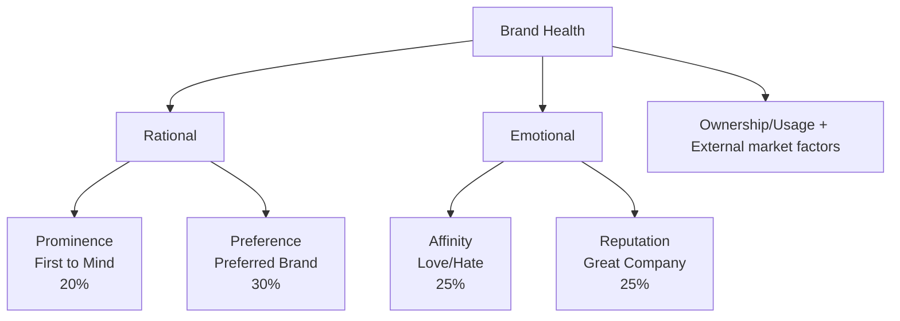

# Visa's Brand Health FY24 Report

PAKISTAN 🇵🇰

JULY 2024

[An illustration on the right side of the image depicts various icons related to finance and technology, including a clock, briefcase, bank building, globe, Bitcoin symbol, smartphone, shopping bag, cloud, and human profiles, all interconnected within an arrow shape.]

©2023 Visa. All rights reserved. Visa Confidential  1
# Background & Methodology

## Visa Brand Health

This report provides brand metrics on Visa and its competitors: consumer perceptions on brand imagery and key brand attributes

### Pakistan Sample

| Wave | Sample Size | Mode |
| - | - | - |
| FY24 | 405\* | CAPI |
| FY23 | 439 | CAPI |
| FY22 | 400 | CAPI |

### Key Segments (FY24)

| Segment Name | Segment Size |
| - | - |
| Gen Z (ages 18 – 26)\*\* | 143 |
| Trailing Millennials (ages 18-35) | 223 |
| International Travelers (Traveled internationally at least once in P12 M) | 80 |
| eComm Shoppers (P1M online purchasers) | 182 |

### Brands Included

#### Blue Brands

- VISA
- AMERICAN EXPRESS
- UnionPay
- mastercard
- PayPal
- JazzCash

All questions administered

#### Yellow Brands

- paypak
- PayMax
- easypaisa
- QISSTPAY
- keenu
- SADAPAY
- NAYAPAY

Funnel metrics administered (BHS not measured)

*We did additional 50 boosters for Gen Z

**In 2024, We have replaced Affluent with Gen Z across slides as Affluent does not have a reportable base
# Introduction to FY24 Brand Health Measurement

Pakistan

## Reporting

| Long Term Focus | • Reporting frequency for continuous markets is quarterly to maintain a longer-term focus on brand health; frequency for pulse countries is annual or biannual • Wave on wave testing (see below) identifies increases, decreases, stable trend lines |
| - | - |
| Key Measures | • Brand Health is a composite value derived from performance across four metrics – Prominence, Brand Preferred, Affinity, Reputation (Appendix 1) |
| Strategic Segments | • Results among strategic target segments (e.g., Gen Z, Trailing Millennials, International Travelers, eComm shoppers) are reported unless the base size is too small (<30) |

## Methodology

| Mobile Friendly | • Survey design is mobile-optimized to be more representative of the population:   • Brand Health components - Reputation, Affinity, Prominence – are scored on 5 – point scales   • Preference is a single choice question.   • The attributes are streamlined and align with the Brand Framework   • Payment brands are prioritized by country to represent key global and local competitive brands |
| - | - |
| Affluent Segments | • Affluent definitions are updated annually, if needed, to align with changing country environments |

## Wave on Wave testing

| Performance against previous wave | • In 2024, Visa seeks to maintain or improve its brand health scores achieved in year 2023 • In 2024, we have updated the brand list and hence we could observe some deviation from the past data. • Performance of each parameter against previous wave is measured using a statistical comparative analysis of scores. The current wave scores are statistically tested against the 2023 scores to identify whether two measures are statistically different – higher or lower – at the 90% confidence level. |
| - | - |

©2021 Visa. All rights reserved. Visa Confidential

# Key Highlights

[The rest of the slide appears to be blank, with no additional content provided.]

VISA

©2021 Visa. All rights reserved. Visa Confidential  4
Visa maintains its leadership in brand health metrics across key segments in Pakistan. However, there is a rise in competition from wallet brands.

| BHS | Funnel | Imagery | Card Types |
|-----|--------|---------|------------|
| Visa continues to dominate, outperforming competitors across all key components. Visa's solo preference saw a decline indicating areas for potential improvement. | Visa's strong performance across funnel highlights its dominance. However, mobile wallets are gaining on conversions to usage. | Visa differentiates on 'brand pride'. It needs to further strengthen its perception related to 'trust' and 'brand actions matching words'. | Strong growth in contactless card ownership, particularly among younger segments. Premium and travel card ownership and intent to use declined. |

| eCommerce | CoF & POS | Wallets | Events |
|-----------|-----------|---------|--------|
| While an increase in eCommerce transactions across segments is seen Visa declines on intent to use. | Visa shows strong presence in various app categories and maintains high visibility for both in-store and online payments. | Jazz Cash and Easy paisa both show a higher likelihood of Mastercard loading, | Visa enjoys highest association with FIFA World Cup. It's also the event which evokes highest interest. |
# Brand Health - Current Position

Despite facing stiff competition, Visa demonstrates category leadership across all key brand health components: Prominence, Preference, Affinity, and Reputation.

Jazz Cash ranks second to Visa among payment brands, with Mastercard following next.

| Brand | Overall Brand Health Score | Prominence (T2B) | Brand Preferred (Solo) | Affinity (T2B) | Reputation (T2B) |
| - | - | - | - | - | - |
| VISA | 72 (bcdef) | 84 (bcdef) | 18 (bcdef) | 86 (bcdef) | 87 (bcdef) |
| Mastercard | 45 | 59 | 7 | 58 | 62 |
| American Express | 2 | 3 | 0 | 4 | 4 |
| PayPal | 4 | 5 | 0 | 6 | 7 |
| UnionPay | 11 | 16 | 1 | 16 | 18 |
| JazzCash | 52 | 68 | 5 | 72 | 69 |

Brand Health Score (BHS) is a composite value derived from performance across four metrics – Prominence, Brand Preferred (Solo), Affinity and Reputation (see Appendix 1); For the Total Base, brands are tested for significant difference to Visa - an a/b/c, etc.

Base: All Respondents

©2021 Visa. All rights reserved. Visa Confidential
# Brand Health Market Trends

Visa's brand health score improves over previous waves, while competitors experience declines.
Visa's solo preference declined further, while its affinity increased directionally.

## BHS Trends

| Brand | FY22 | FY23 | FY24 |
| - | - | - | - |
| Visa | 63 | 67 | 72 ↑ |
| Mastercard | 46 | 53 ↑ | 45 ↓ |
| American Express | 12 | 17 ↑ | 11 ↓ |
| PayPal | 4 | 4 | 4 ↓ |
| UnionPay | 3 | 7 ↑ | 2 ↓ |
| Jazz Cash | - | - | - |

## VISA BHS Components

| Component | FY22 | FY23 | FY24 |
| - | - | - | - |
| Prominence (T2B) | 75 | 84 | 84 |
| Brand Preferred (Solo) | 31 | 26 | 18 ↓ |
| Affinity (T2B) | 80 | 83 | 86 |
| Reputation (T2B) | 78 | 85 | 87 |
| Overall Brand Health Score | 63 | 67 | 72 |

Brand Health Score (BHS) is a composite value derived from performance across four metrics – Prominence, Brand Preferred (Solo), Affinity and Reputation (see Appendix 1; BHS and component scores are statistically tested over previous quarter highlighting Positive ↑ / Negative ↓ trends at 90%.

Base: All Respondents

©2021 Visa. All rights reserved. Visa Confidential
# Brand Health Current Position Among Key Segments - Competitive Landscape

Visa's BHS remained stable across key segments. Most competitors had significantly lower BHS among Gen Z and trailing millennials. PayPal and Union Pay have higher BHS among eCommerce shoppers (vs non-eCommerce shoppers).

| Segment | | | | | | |
| - | - | - | - | - | - | - |
| TOTAL | 72 | 45 | 2 | 4 | 11 | 52 |
| Gen Z (GZ) \[Non Trailing Millennials (NGZ)] | 71 | 47 | 0NGZ | 2NGZ | 7NGZ | 47 |
| Trailing Millennials (ML) \[Non Trailing Millennials (NM)] | 70 | 41NTM | 1NTM | 4 | 9NTM | 52 |
| International Travelers (IT) \[Non-Travelers = (NIT)] | 68 | 46 | 3NIT | 11NIT | 19NIT | 52 |
| eComm Shoppers (ES) \[Non-eComm Shoppers (NES)] | 75 | 48 | 2 | 6NES | 15NES | 55 |

Brand Health Score (BHS) is a composite value derived from performance across four metrics – Prominence, Brand Preferred (Solo), Affinity and Reputation (see Appendix 1).; Where segments are shown, scores are tested against the segments in the category- notation next to a segment value (NM, NAF, NIT etc.) indicates that the noted segment value is significantly higher or lower than the segment value shown, so Millennials (ML) are tested against Non-Millennials (NM), Gen Z (GZ) are tested against Non-Gen Z (NGZ), International Travelers (IT) are tested against Non-Travelers (NIT), and eComm Shoppers (ES) are tested against Non-eComm Shoppers.

Base: All Respondents
Gen Z: Random + Booster

©2021 Visa. All rights reserved. Visa Confidential  8
# Brand Health Market Trends – By Segments

Visa shows a significant rise in brand health among international travelers, maintaining its dominance across all major segments.
Jazz Cash emerges as the closest competition across segments.

## Gen Z (18-26)

| | FY22 | FY23 | FY24 |
| - | - | - | - |
| Visa | NA | 67 | 71 |
| Mastercard | NA | 55 | 47 |
| American Express | NA | 15 | 7 |
| PayPal | NA | 11 | 2 |
| UnionPay | NA | 5 | 2 |
| Jazz Cash | NA | NA | 47 |

## Trailing Millennials (18-35)

| | FY22 | FY23 | FY24 |
| - | - | - | - |
| Visa | 63 | 66 | 70 |
| Mastercard | 48 | 51 | 52 |
| American Express | 13 | 15 | 9 |
| PayPal | 4 | 9 | 4 |
| UnionPay | 4 | 4 | 1 |
| Jazz Cash | NA | NA | 41 |

## International Traveler

| | FY22 | FY23 | FY24 |
| - | - | - | - |
| Visa | 53 | 69 | 75 |
| Mastercard | 43 | 59 | 55 |
| American Express | 6 | 17 | 15 |
| PayPal | 3 | 5 | 6 |
| UnionPay | 3 | 4 | 2 |
| Jazz Cash | NA | NA | 48 |

## eComm Shoppers

| | FY22 | FY23 | FY24 |
| - | - | - | - |
| Visa | 73 | 72 | 68 |
| Mastercard | 56 | 46 | 52 |
| American Express | 17 | 12 | 19 |
| PayPal | 9 | 5 | 11 |
| UnionPay | 2 | 3 | 3 |
| Jazz Cash | NA | NA | 46 |

Brand Health Score (BHS) is a composite value derived from performance across four metrics – Prominence, Brand Preferred (Solo), Affinity and Reputation (see Appendix 1; BHS and component scores are statistically tested over previous quarter highlighting Positive / Negative trends at 90%.

Base: All Respondents
Gen Z: Random + Booster
# Visa Brand Health Current Position by Components - Among Key Segments

Visa's prominence is strong across all key segments. Scope to improve brand preference exists.
Prominence of Visa is lower among Gen Z vs other age segment.

| Segment | Overall Brand Health Score | Prominence (T2B) | Brand Preferred (Solo) | Affinity (T2B) | Reputation (T2B) |
| - | - | - | - | - | - |
| TOTAL | 73 | 84 | 18 | 86 | 87 |
| Gen Z (GZ) \[Non Gen Z (NGZ)] | 71 | 80 NGZ | 17 | 84 | 85 |
| Trailing Millennials (ML) \[Non Trailing Millennials (NM)] | 70 | 82 | 19 | 85 | 85 |
| International Travelers (IT) \[Non-Travelers = (NIT)] | 68 | 80 | 17 | 85 | 81 |
| eCommerce Shoppers (ES) \[Non-eCommerce Shoppers (NES)] | 75 | 85 | 18 | 87 | 87 |

Brand Health Score (BHS) is a composite value derived from performance across four metrics – Prominence, Brand Preferred (Solo), Affinity and Reputation (see Appendix 1).; Where segments are shown, scores are tested against the segments in the category- notation next to a segment value (NM, NAF, NIT etc.) indicates that the noted segment value is significantly higher or lower than the segment value shown, so Millennials (ML) are tested against Non-Millennials (NM), Gen Z (GZ) are tested against Non-Gen Z (NGZ), International Travelers (IT) are tested against Non-Travelers (NIT), and eComm Shoppers (ES) are tested against Non-eComm Shoppers.

Base: All Respondents
Gen Z: Random + Booster

©2021 Visa. All rights reserved. Visa Confidential  10
# Deep Dive into VISA's BHS components
## Visa's Brand Health Components Trends – By Age Group

Visa's preference declined significantly across both age groups.
Visa's prominence declined among Gen Z.

| Age Group | Fiscal Year | Prominence (T2B) | Brand Preferred (Solo) | Affinity (T2B) | Reputation (T2B) | Brand Health |
| - | - | - | - | - | - | - |
| Gen Z (18-26) | FY22 | NA | NA | NA | NA | NA |
| | FY23 | 87 | 24 | 84 | 87 | 67 |
| | FY24 | 80 🔻 | 17 🔻 | 84 | 85 | 71 |
| Trailing Millennials (18-35) | FY22 | 75 | 29 | 81 | 78 | 63 |
| | FY23 | 84 🔼 | 25 | 82 | 87 | 66 🔼 |
| | FY24 | 82 | 17 🔻 | 85 | 85 | 70 |

Brand Health Score (BHS) is a composite value derived from performance across four metrics – Prominence, Brand Preferred (Solo), Affinity and Reputation (see Appendix 1; BHS and component scores are statistically tested over previous quarter highlighting Positive 🔼 / Negative 🔻 trends at 90%.

Base: All Respondents
Gen Z: Random + Booster
# Deep Dive into VISA's BHS components
## Visa's Brand Health Components Trends – By International Travelers & eCommerce Shoppers

While Visa's brand health components remain stable, significant declines in preference are noted among international travelers and eCommerce shoppers.

| International Traveler | | | | | | | | | | | | Prominence (T2B) Brand Preferred (Solo) Affinity (T2B) Reputation (T2B) Brand Health |
| - | - | - | - | - | - | - | - | - | - | - | - | - |
| 61 | 23 | 70 | 66 | 86 | 30 | 84 | 86 | 80 | 18 | 85 | 81 | |
| FY22 | | | | FY23 | | | | FY24 | | | | |
| Brand Health: 53 (FY22) → 69 (FY23) → 68 (FY24) | | | | | | | | | | | | |

| eComm Shoppers | | | | | | | | | | | |
| - | - | - | - | - | - | - | - | - | - | - | - |
| 91 | 26 | 93 | 94 | 90 | 32 | 88 | 90 | 85 | 18 | 87 | 87 |
| FY22 | | | | FY23 | | | | FY24 | | | |
| Brand Health: 73 (FY22) → 72 (FY23) → 75 (FY24) | | | | | | | | | | | |

Brand Health Score (BHS) is a composite value derived from performance across four metrics – Prominence, Brand Preferred (Solo), Affinity and Reputation (see Appendix 1; BHS and component scores are statistically tested over previous quarter highlighting Positive / Negative trends at 90%.

Base: All Respondents
# Key Indicators, Imagery and Prominence

VISA

©2021 Visa. All rights reserved. Visa Confidential  13
# Funnel Measures

Visa has strong awareness and usage metrics, with potential growth from targeting cash-spending customers (40%) as wallets gain traction.

Along with Mastercard, Jazz Cash enjoys healthy conversions.

| Metric | VISA | | Mastercard | | American Express | | Jazz Cash | |
| - | - | - | - | - | - | - | - | - |
| Awareness (Total) | 97 | | 77 | | 12 | | 92 | |
| Ownership | 85 | 55% | 36 | 45% | 1 | 0% | 64 | 57% |
| Usage (p1m) | 47 | 46% | 16 | 40% | 0 | 0% | 37 | 31% |
| SOW | 21 | | 6 | | 0 | | 11 | |

| Metric | PayPal | | UnionPay | | Easypaisa | |
| - | - | - | - | - | - | - |
| Awareness (Total) | 15 | | 36 | | 95 | |
| Ownership | 1 | 0% | 6 | 48% | 71 | 60% |
| Usage (p1m) | 0 | 0% | 3 | 41% | 43 | 35% |
| SOW | 0 | | 1 | | 15 | |

Pakistan SOW for the total base also includes Cash (40), Cheque (1), Others (2)

Base: All Respondents

Colors of bars indicate competitive standing in the market - Lead, Above Average, Average or Below Average
# Key Imagery Performance Index - Total

Visa differentiates on 'brand pride' while Mastercard is stronger on 'helps build financial well being'. Consumers associate PayPal strongly with 'Is a brand for me'.

| Attribute | Base: 391 | Base: 313 | Base: 60 | Base: 47 | Base: 147 | Base: 374 |
| - | - | - | - | - | - | - |
| I'm proud to be seen using this brand | 4 | 2 | -7 | 3 | 0 | -2 |
| Is a brand for someone like me | -1 | -1 | 8 | 2 | -1 | -6 |
| Helps me build financial well-being | 3 | 5 | -2 | -5 | -1 | 1 |
| Helps me make progress in life | -3 | -2 | 3 | 2 | -2 | 2 |
| I feel connected to the brand | -2 | -1 | 2 | 4 | -1 | -2 |
| Understands my needs | 1 | -2 | -8 | 6 | -1 | 2 |
| Is a brand I trust | 3 | 0 | -3 | 2 | -1 | -2 |
| The brands actions match its words | 3 | 2 | -4 | -3 | -1 | 3 |
| Shares values that inspire me | -1 | -1 | 2 | 6 | 1 | -6 |
| Helps the communities that matter to me | 1 | 0 | -1 | 0 | -2 | 3 |

Base: Brand Aware

  

  Relative Strength of the Brand (>3)

  

  Relative Weakness of the Brand (<-3)

Values indicate observed associations minus expected associations.
The relative strength threshold is basis the standard deviation.

©2021 Visa. All rights reserved. Visa Confidential
# Key Imagery Performance (Absolutes) – Overall and Gen Z

Visa outperforms its key competitors both overall and among Gen Z.

| | Overall\ VISA | Overall\ Gen Z\ mastercard | Overall\ Gen Z\ easypaisa | Gen Z\ VISA | mastercard | easypaisa |
| - | - | - | - | - | - | - |
| Base | 391 | 313 | 374 | 132 | 110 | 132 |
| I'm proud to be seen using this brand | 60 | 33 | 37 | 55 | 35 | 39 |
| Is a brand for someone like me | 61 | 33 | 37 | 58 | 38 | 33 |
| Helps me build financial well-being | 50 | 31 | 34 | 49 | 35 | 36 |
| Helps me make progress in life | 53 | 29 | 41 | 51 | 36 | 43 |
| I feel connected to the brand | 59 | 33 | 40 | 52 | 35 | 40 |
| Understands my needs | 59 | 30 | 43 | 52 | 28 | 42 |
| Is a brand I trust | 63 | 34 | 40 | 57 | 36 | 41 |
| The brands actions match its words | 58 | 32 | 41 | 54 | 37 | 36 |
| Shares values that inspire me | 59 | 31 | 36 | 52 | 38 | 36 |
| Helps the communities that matter to me | 52 | 28 | 39 | 55 | 34 | 35 |

Base: Brand Aware

Refer to the appendix for complete Brand Imagery across different segments

Values indicate observed associations minus expected associations.
The relative strength threshold is basis the standard deviation.

©2021 Visa. All rights reserved. Visa Confidential
# Category Level Brand Prominence

Visa showing the strongest immediate brand recall in key payment scenarios.
Mastercard and Jazz Cash remains a distant competitor.

## Brand comes to mind immediately when think of ...

| Payment Scenario | VISA FY24 | vs. Competition in FY24 | vs. Competition in FY24 | vs. Competition in FY24 | vs. Competition in FY24 | vs. Competition in FY24 |
| - | - | - | - | - | - | - |
| ...everyday spend payments | 51% | 31% ↓ | 1% ↓ | 1% ↓ | 9% ↓ | 40% ↓ |
| ...eComm Payments | 51% | 36% ↓ | 1% ↓ | 2% ↓ | 7% ↓ | 25% ↓ |
| ...relevant benefits & offers on debit / credit cards | 50% | 33% ↓ | 0% ↓ | 2% ↓ | 7% ↓ | 25% ↓ |
| ...XB Travel Payments | 48% | 34% ↓ | 2% ↓ | 3% ↓ | 10% ↓ | 20% ↓ |
| ...acquiring new debit or credit Card | 48% | 34% ↓ | 1% ↓ | 1% ↓ | 7% ↓ | 21% ↓ |
| .. contactless Payments | 47% | 30% ↓ | 1% ↓ | 3% ↓ | 8% ↓ | 30% ↓ |
| ...XB eComm Payments | 46% | 38% ↓ | 2% ↓ | 3% ↓ | 8% ↓ | 25% ↓ |

↑ Brand Trending higher than Visa
↓ Brand Trending lower than Visa

Base: All Respondents

©2021 Visa. All rights reserved. Visa Confidential
# Visa's standing Vs. competition across different card types

Contactless, Premium and Travel

©2023 Visa. All rights reserved. Visa Confidential 18

# Contactless Cards

Visa contactless card ownership grew significantly in FY24. Mastercard witnessed directional gains. Ownership grew strongly among trailing millennials and directionally among Gen Z.

Intention to use for both the card brands has declined significantly.

## Contactless Card Ownership – Overall

| Brand | FY22 | FY23 | FY24 |
| - | - | - | - |
| VISA | 51% | 56% | 76% ↑ |
| Mastercard | 22% | 29% ↑ | 34% |
| American Express | 0% | 0% | 0% |
| UnionPay | 0% | 2% ↑ | 4% |

Base: All Respondents

## Visa Contactless Card Ownership – Among Target Group

| Target Group | FY22 | FY23 | FY24 |
| - | - | - | - |
| Gen Z | - | 66% | 69% |
| Trailing Millennials | 50% | 60% ↑ | 73% ↑ |
| International Travelers | 77% | 65% ↓ | 64% |
| eComm Shoppers | 38% | 73% ↑ | 74% |

Base: All Respondents
Gen Z: Random + Boosters

## Contactless Cards: Intent to use (among brand holders)

T2B Scores: Very Likely + Somewhat likely

| Brand | FY22 | FY23 | FY24 |
| - | - | - | - |
| VISA | 72% | 87% ↑ | 60% ↓ |
| Mastercard | 72% | 81% | 31% ↓ |
| American Express | Low Base | Low Base | 0% |
| UnionPay | Low Base | Low Base | 3% |

Base: Brand owned

Scores are statistically tested over previous wave highlighting Positive ↑ / Negative ↓ trends at 90%.

©2021 Visa. All rights reserved. Visa Confidential
# Premium Cards – Visa vs. MasterCard

While awareness and ownership of premium cards dropped significantly for both Visa and Mastercard...
Future intention to acquire and use premium cards has improved significantly.

## VISA Premium Card KPI – Overall

| | FY22 | FY23 | FY24 |
| - | - | - | - |
| Awareness NET | 73% | 69% | 56% ↓ |
| Ownership NET | 43% | 49% ↑ | 27% ↓ |

Base: All Respondents

### Intent to use (among brand holders)
T2B Scores: Very Likely + Somewhat likely

| | FY22 | FY23 | FY24 |
| - | - | - | - |
| Platinum | NA | NA | 98% |
| Infinite | NA | NA | Low Base |
| Signature | NA | NA | 95% |

### Intent to acquire (among non-brand holders)
T2B Scores: Very Likely + Somewhat likely

| | FY22 | FY23 | FY24 |
| - | - | - | - |
| Platinum | 23% | 33% | 54% ↑ |
| Infinite | 27% | 28% | Low Base |
| Signature | 37% | 31% | 67% ↑ |

Base: Answering base

## MasterCard Premium Card KPI – Overall

| | FY22 | FY23 | FY24 |
| - | - | - | - |
| Awareness NET | 69% | 53% ↓ | 41% ↓ |
| Ownership NET | 32% | 22% ↓ | 17% ↓ |

Base: All Respondents

### Intent to use (among brand holders)
T2B Scores: Very Likely + Somewhat likely

| | FY22 | FY23 | FY24 |
| - | - | - | - |
| Platinum | 13% | 34% ↑ | 84% ↑ |
| World | 8% | 28% ↑ | 89% ↑ |
| World Elite | Low Base | Low Base | Low Base |

### Intent to acquire (among non-brand holders)
T2B Scores: Very Likely + Somewhat likely

| | FY22 | FY23 | FY24 |
| - | - | - | - |
| Platinum | 31% | 22% | 58% ↑ |
| World | 30% | 22% | 62% ↑ |
| World Elite | 36% | 46% | Low Base |

Base: Answering base

Base: Card owned

Scores are statistically tested over previous wave highlighting Positive / Negative trends at 90%.

©2021 Visa. All rights reserved. Visa Confidential
# Travel Cards – Visa vs. MasterCard

Visa Travel Card ownership has significantly declined, driven by Gen Z — the same segments contributing to Mastercard's gain in ownership. However, intention to use Visa dipped significantly while it increased for Mastercard.

## Travel Card Ownership – Overall

| | VISA\ FY22 | VISA\ MasterCard\ FY23 | VISA\ MasterCard\ FY24 | MasterCard\ FY22 | FY23 | FY24 |
| - | - | - | - | - | - | - |
| Overall | 55% | 54% | 46% ↓ | 26% | 27% | 31% |
| Gen Z | - | 57% | 45% ↓ | - | 25% | 35% ↑ |
| Trailing Millennials | 55% | 53% | 48% | 25% | 26% | 29% |
| International Travelers | 76% | 55% ↓ | 58% | 41% | 34% | 39% |
| eComm Shoppers | 45% | 59% ↑ | 48% ↓ | 21% | 15% | 21% |

## Intent to use (among brand holders)
T2B Scores: Very Likely + Somewhat likely

| | FY22 | FY23 | FY24 |
| - | - | - | - |
| VISA | 73% | 96% ↑ | 91% ↓ |
| MasterCard | 71% | 87% ↑ | 92% ↑ |

## Intent to acquire (among non-brand holders)
T2B Scores: Very Likely + Somewhat likely

| | FY22 | FY23 | FY24 |
| - | - | - | - |
| VISA | 73% | 73% | 29% ↓ |
| MasterCard | 85% | 70% ↓ | Low base |

Owing to a decline in international travelers, the intent to acquire was low among non-international travelers and non-affluent consumers.

Base: All Respondents
Gen Z: Random + Boosters

Scores are statistically tested over previous wave highlighting Positive ↑ / Negative ↓ trends at 90%.

©2021 Visa. All rights reserved. Visa Confidential
# Specific Insights - Pakistan

[The rest of the page is blank, with only the Visa logo and copyright information at the bottom]

©2023 Visa. All rights reserved. Visa Confidential 22
# eCommerce/ Online shopping

Growth in online shopping is observed, but Visa's extent and intent to use drops.
Mobile wallets emerging as a key competition in eCommerce.

## P1M eComm Purchase – Overall

| | FY22 | FY23 | FY24 |
| - | - | - | - |
| Overall | 21% | 33% ↑ | 45% ↑ |
| # of times | 4.0 | 3.0 | 2.3 |

Base: All Respondents

## Intent to Use (Among brand owners)
T2B Scores: Very Likely + Somewhat likely

| | FY22 | FY23 | FY24 |
| - | - | - | - |
| Visa | 72 | 79 ↑ | 73 ↓ |
| Mastercard | 66 | 76 ↑ | 53 ↓ |
| American express | 11 | 15 | 11 ↓ |
| PayPal | 3 | 31 ↑ | 38 ↑ |
| Union pay | 30 | 50 ↑ | 27 ↓ |
| Jazz Cash | NA | NA | 56 |

Base: Brand Aware

## P1M eComm Purchase – Among Target Group

| | FY22 | FY23 | FY24 |
| - | - | - | - |
| Gen Z | - | 33% | 52% ↑ |
| Trailing Millennials | 18% | 40% ↑ | 47% ↑ |
| International Travelers | 13% | 33% ↑ | 75% ↑ |

Base: All Respondents
Gen Z: Random + Boosters

## Extent of Use – Total

| | FY22 | FY23 | FY24 |
| - | - | - | - |
| Visa | 38 | 40 | 27 ↓ |
| Mastercard | 22 | 21 | 10 ↓ |
| American express | 0 | 1 | 1 |
| PayPal | 0 | 1 | 1 |
| Union pay | 1 | 4 ↑ | 3 |
| Jazz Cash | NA | NA | 15 |
| Others | 24 | 30 ↑ | 38 ↑ |

Scores are statistically tested over previous wave highlighting Positive ↑ / Negative ↓ trends at 90%.
# Merchant Category: App Ownership and Card on File

The predominant app categories in ownership include food delivery, grocery and taxi/ ride hailing apps. Visa shows high penetration across various app categories.

## App Ownership in the Market

| App Category | Ownership % | VISA | Mastercard | AMERICAN EXPRESS | UnionPay |
| - | - | - | - | - | - |
| Food delivery/ pick up apps | 97% | 55% ↑ | 28% | - | 4% |
| Grocery delivery apps | 97% | 59% ↑ | 23% | 0% | 3% |
| Taxi/ ride-hailing apps | 87% | 44% ↑ | 18% | - | 2% |
| e-Commerce marketplace shopping/ Brand Official apps/ websites | 85% | 47% ↑ | 18% | 0% | 2% |
| Online travel agencies/ apps/ websites | 80% | 39% ↑ | 18% | 0% | 2% |
| Video or music streaming services/ video on demand | 77% | 32% ↑ | 17% | - | 1% |

Base: All Respondents | Base: Cards owned

Scores are statistically tested over Visa highlighting Positive ↑ / Negative ↓ trends at 90%.

©2021 Visa. All rights reserved. Visa Confidential
# Brand Visibility at Point of Sale

Visa enjoys strong in-store and online visibility, with Jazz Cash emerging as a key digital wallet competitor.

| Brand | Cashier counter / in-store(retail, dining and services, etc.) | When you made a paymentonline (e.g. websites and apps etc.) | Payment via digital wallets\* |
| - | - | - | - |
| !VISA logo | 55% | 49% | 45% |
| !Mastercard logo | 21% | 20% | 22% |
| !American Express logo | 0% | 0% | 0% |
| !PayPal logo | 1% | 1% | NA |
| !UnionPay logo | 4% | 3% | 3% |
| !Jazz Cash logo | 25% | 25% | NA |

Base: All Respondents

*[Small Visa logo]*

©2021 Visa. All rights reserved. Visa Confidential
# Digital Wallets

Jazz Cash and easypaisa users indicate higher preference for Mastercard.

## Brands/ accounts currently loaded

| Brand | Visa | MasterCard |
| - | - | - |
| Jazz Cash | 34 | 52 |
| easypaisa | 35 | 43 |

*The figures above represents those who said that they have loaded Visa/ Mastercard in the wallet brand owned.*

## Likelihood of uploading the current Visa card (T2B Score)

| Brand | Percentage | Number |
| - | - | - |
| Jazz Cash | 52% | 154 |
| easypaisa | 48% | 48 |

*Base: Those wallet owners who currently don't have Visa loaded in their wallet*

Base: Wallet/ card owned

©2021 Visa. All rights reserved. Visa Confidential
# Events Interested vs. Sponsorship - Association

Visa enjoys highest association with FIFA World Cup given its long association with the event. It's also an event that evokes highest interest.

Association of most card brands including Visa declined for FIFA World Cup.

| Events | Last season date | Interested (% of consumers) | VISA | Mastercard | American Express | PayPal | UnionPay | EasyQash |
| - | - | - | - | - | - | - | - | - |
| FIFA World Cup | Nov 2022 | 49% | 42% ↓ | 34% ↓ | 4% ↓ | 4% | 18% | 28% |
| FIFA Women's World Cup | July 2023 | 17% ↑ | 19% | 18% | 2% ↓ | 3% | 5% | 12% |
| Summer Olympics | July 2021 | 15% ↑ | 9% ↓ | 13% | 2% ↓ | 3% | 4% | 9% |
| Winter Olympics | Feb 2022 | 11% ↑ | 8% ↓ | 10% | 2% ↓ | 4% | 3% | 8% ↓ |
| UEFA Champions League | Jun 2023 | 9% ↓ | 13% | 12% | 2% | 3% | 4% | 5% |

Base: All respondents

Scores are statistically tested over previous wave highlighting Positive ↑ / Negative ↓ trends at 90%.

©2021 Visa. All rights reserved. Visa Confidential
VISA

Thank you

©2023 Visa. All rights reserved. Visa Confidential
# Appendix

©2023 Visa. All rights reserved. Visa Confidential 29
# Awareness of Payment Brands

| | Brand | TOM | Unaided | Total |
| - | - | - | - | - |
| Cards | Visa | 22% | 50% | 97% |
| | MasterCard | 6% | 13% | 77% |
| | UnionPay | 1% | 2% | 36% |
| | American Express | 0% | 1% | 12% |
| Wallets | PayPal | 0% | 1% | 15% |
| | Easy Paisa | 7% | 59% | 95% |
| | JazzCash | 16% | 61% | 92% |
| | PayPak | 1% | 3% | 22% |
| | PayMax | 0% | 0% | 21% |
| | SadaPay | 1% | 2% | 18% |
| | NayaPay | 0% | 0% | 9% |
| | Keenu Wallet | 0% | 0% | 3% |
| | QisstPay | 0% | 0% | 0% |

Base: All Respondents

Note: Brands in bold fonts are Blue Brands

©2021 Visa. All rights reserved. Visa Confidential
# Funnel Measures

Both, Jazz Cash and Easypaisa show higher awareness and usage, posing a competitive threat to Visa's market share.

| Metric | Paypak | PayMax | Keenu |
| - | - | - | - |
| Awareness (Total) | 22 | 22 | 3 |
| Ownership | 3 | 0 | 0 |
| Usage (p1m) | 1 | 0 | 0 |
| SOW | 1 | 0 | 0 |
| Ownership % | 50% | 0% | 0% |
| SOW % | 38% | 0% | 0% |

| Metric | SADAPAY | QISSTPAY | NAYAPAY |
| - | - | - | - |
| Awareness (Total) | 18 | 0 | 9 |
| Ownership | 3 | 0 | 1 |
| Usage (p1m) | 1 | 0 | 0 |
| SOW | 0 | 0 | 0 |
| Ownership % | 36% | 0% | 0% |
| SOW % | 0% | 0% | 0% |

Pakistan SOW for the total base also includes Cash (40), Cheque (1), Others (2)

Base: All Respondents

Colors of bars indicate competitive standing in the market - Lead, Above Average, Average or Below Average

©2021 Visa. All rights reserved. Visa Confidential
# Index Equity - Total

Visa stands out on controlled spends, seamless payment brands, opening opportunities for everyone and consumers feeling proud of being associated. Jazz Cash performs better on convenience while Union Pay & PayPal on security related aspects.

| | VISA | Mastercard | PayPal | American Express | UnionPay | Jazz Cash |
| - | - | - | - | - | - | - |
| Security | Data: 3 | 1 | 0 | -2 | 4 | -6 |
| | Personal data: 0 | -2 | 4 | 3 | -1 | -4 |
| | Secure: -2 | -2 | 6 | 3 | -6 | 0 |
| | Alert: 2 | 0 | -1 | -7 | 6 | 0 |
| | Protection: 3 | 1 | -4 | 3 | -2 | -1 |
| Convenience | Acceptance: 0 | 0 | 3 | 2 | 1 | -4 |
| | Experience: 4 | 4 | -4 | -1 | -1 | -1 |
| | Receive: 0 | 0 | -1 | 2 | 0 | -1 |
| | Retailer: 1 | -3 | -2 | -5 | 0 | 9 |
| | I Travel: 3 | 2 | 4 | 3 | 2 | -14 |
| | Online: 0 | 4 | 3 | -9 | 4 | -2 |
| | Wallet: -5 | -1 | 0 | 2 | -2 | 5 |
| | Budget: 4 | -3 | -1 | 0 | -2 | 2 |
| | Gaming: 0 | 0 | 5 | -4 | 3 | -4 |
| | Everyday Payments: -1 | -1 | -3 | -4 | 1 | 7 |
| | Small business: -7 | -3 | 1 | 1 | 0 | 9 |
| | No cost: -6 | 1 | -1 | 5 | 4 | -3 |
| Lifestyle | Like: -1 | -1 | 8 | 2 | -1 | -6 |
| | Proud: 4 | 2 | -7 | 3 | 0 | -2 |
| | Family: 0 | -3 | -1 | 2 | -3 | 5 |
| | Needs: 1 | -2 | -8 | 6 | -1 | 2 |
| | Connected: -2 | -1 | 2 | 4 | -1 | -2 |
| | Personalized: 2 | 1 | 3 | 1 | 2 | -8 |
| | Progress: -3 | -2 | 3 | 2 | -2 | 2 |
| | Well-being: 3 | 5 | -2 | -5 | -1 | 1 |
| Reliability | Trust: 3 | 0 | -3 | 2 | -1 | -2 |
| | Technology: 3 | 3 | -3 | -5 | 2 | 1 |
| | Brands: -1 | 2 | 1 | 1 | -1 | -2 |
| | Values: -1 | -1 | 2 | 6 | 1 | -6 |
| Brand values | Everyone: 5 | 0 | 0 | -8 | 2 | 1 |
| | Action: 3 | 2 | -4 | -3 | -1 | 3 |
| | Uplifting: -2 | -1 | 7 | 0 | -4 | 0 |
| | Community: 1 | 0 | -1 | 0 | -2 | 3 |
| | Empower: -4 | -1 | -5 | 6 | 2 | 3 |
| | Support: -2 | 2 | -1 | -2 | -3 | 8 |
| | Growth: -6 | -3 | -1 | -1 | 1 | 9 |

Base: Brand Aware

Relative Strength of the Brand (>3)
Relative Weakness of the Brand (<-3)

Values indicate observed associations minus expected associations
The relative strength threshold is basis the standard deviation.

©2021 Visa. All rights reserved. Visa Confidential
# Brand Image Attributes – Total

Visa enjoys strong brand imagery in the competitive landscape, with Jazz Cash and Mastercard being its closest competitor.

| Category | Attribute | VISA | | | | | |
| - | - | - | - | - | - | - | - |
| Security | Data | 63 | 34 | 6 | 15 | 20 | 37 |
| | Personal data | 63 | 33 | 15 | 20 | 15 | 41 |
| | Secure | 61 | 33 | 15 | 22 | 11 | 44 |
| | Alert | 59 | 31 | 2 | 13 | 20 | 40 |
| | Protection | 58 | 32 | 13 | 10 | 12 | 37 |
| Convenience | Acceptance | 62 | 34 | 9 | 18 | 17 | 40 |
| | Experience | 62 | 35 | 4 | 10 | 14 | 39 |
| | Receive | 59 | 32 | 13 | 13 | 16 | 41 |
| | Retailer | 57 | 27 | 4 | 12 | 14 | 48 |
| | I travel | 57 | 32 | 11 | 17 | 16 | 24 |
| | Online | 56 | 35 | 0 | 17 | 19 | 37 |
| | Wallet | 54 | 31 | 11 | 15 | 14 | 47 |
| | Budget | 53 | 24 | 6 | 12 | 11 | 37 |
| | Gaming | 52 | 29 | 4 | 18 | 16 | 33 |
| | Everyday payments | 50 | 28 | 4 | 10 | 15 | 44 |
| Small business | | 50 | 28 | 9 | 15 | 14 | 49 |
| No cost | | 46 | 30 | 11 | 12 | 18 | 34 |
| Lifestyle | Like | 61 | 33 | 11 | 23 | 15 | 37 |
| | Proud | 60 | 33 | 11 | 7 | 15 | 37 |
| | Family | 60 | 30 | 11 | 13 | 12 | 48 |
| | Needs | 59 | 30 | 11 | 7 | 14 | 43 |
| | Connected | 59 | 33 | 11 | 17 | 14 | 40 |
| | Personalized | 59 | 32 | 6 | 17 | 17 | 32 |
| | Progress | 53 | 29 | 13 | 17 | 12 | 41 |
| | Well-being | 50 | 31 | 2 | 10 | 11 | 34 |
| Reliability | Trust | 63 | 34 | 13 | 12 | 16 | 40 |
| | Technology | 58 | 33 | 4 | 10 | 16 | 39 |
| | Brands | 54 | 32 | 6 | 15 | 13 | 37 |
| Brand values | Values | 59 | 31 | 15 | 17 | 16 | 36 |
| | Everyone | 59 | 30 | 0 | 13 | 16 | 38 |
| | Action | 58 | 32 | 6 | 10 | 14 | 41 |
| | Uplifting | 56 | 31 | 9 | 22 | 11 | 41 |
| | Community | 52 | 28 | 9 | 12 | 12 | 39 |
| | Empower | 52 | 29 | 13 | 8 | 16 | 42 |
| | Support | 50 | 30 | 6 | 12 | 10 | 44 |
| | Growth | 48 | 26 | 4 | 12 | 15 | 47 |

Base: Brand Aware
# Brand Image Attributes – Total (Key Competition)

Visa enjoys stronger brand imagery compared to its closest competitors, Jazz Cash and Mastercard.

| Category | Attribute | | | |
| - | - | - | - | - |
| Security | Data | 63 | 34 | 37 |
| | Personal data | 63 | 33 | 41 |
| | Secure | 61 | 33 | 44 |
| | Alert | 59 | 31 | 40 |
| | Protection | 58 | 32 | 37 |
| Convenience | Acceptance | 62 | 34 | 40 |
| | Experience | 62 | 35 | 39 |
| | Receive | 59 | 32 | 41 |
| | Retailer | 57 | 27 | 48 |
| | I travel | 57 | 32 | 24 |
| | Online | 56 | 35 | 37 |
| | Wallet | 54 | 31 | 47 |
| | Budget | 53 | 24 | 37 |
| | Gaming | 52 | 29 | 33 |
| | Everyday payments | 50 | 28 | 44 |
| | Small business | 50 | 28 | 49 |
| | No cost | 46 | 30 | 34 |
| Lifestyle | Like | 61 | 33 | 37 |
| | Proud | 60 | 33 | 37 |
| | Family | 60 | 30 | 48 |
| | Needs | 59 | 30 | 43 |
| | Connected | 59 | 33 | 40 |
| | Personalized | 59 | 32 | 32 |
| | Progress | 53 | 29 | 41 |
| | Well-being | 50 | 31 | 34 |
| Reliability | Trust | 63 | 34 | 40 |
| | Technology | 58 | 33 | 39 |
| | Brands | 54 | 32 | 37 |
| Brand values | Values | 59 | 31 | 36 |
| | Everyone | 59 | 30 | 38 |
| | Action | 58 | 32 | 41 |
| | Uplifting | 56 | 31 | 41 |
| | Community | 52 | 28 | 39 |
| | Empower | 52 | 29 | 42 |
| | Support | 50 | 30 | 44 |
| | Growth | 48 | 26 | 47 |

Base: Brand Aware
# Brand Image Attributes – Gen Z (18-26) (Key Competition)

Jazz Cash competes with Visa on 'everyday payments' and 'supporting & promoting small businesses,' while Visa leads in all other attributes.

| Attribute | | | |
| - | - | - | - |
| **Security** | | | |
| Data | 62 | 33 | 30 |
| Personal data | 54 | 37 | 47 |
| Secure | 58 | 33 | 40 |
| Alert | 59 | 38 | 37 |
| Protection | 55 | 36 | 39 |
| **Convenience** | | | |
| Acceptance | 59 | 38 | 39 |
| Experience | 52 | 35 | 39 |
| Receive | 52 | 41 | 39 |
| Retailer | 54 | 36 | 42 |
| I travel | 48 | 35 | 20 |
| Online | 54 | 35 | 34 |
| Wallet | 44 | 37 | 51 |
| Budget | 57 | 25 | 33 |
| Gaming | 47 | 31 | 26 |
| Everyday payments | 42 | 35 | 41 |
| Small business | 44 | 25 | 47 |
| No cost | 46 | 32 | 36 |
| **Lifestyle** | | | |
| Like | 58 | 38 | 33 |
| Proud | 55 | 35 | 39 |
| Family | 49 | 40 | 45 |
| Needs | 52 | 28 | 42 |
| Connected | 52 | 35 | 40 |
| Personalized | 57 | 33 | 31 |
| Progress | 51 | 36 | 43 |
| Well-being | 49 | 35 | 36 |
| **Reliability** | | | |
| Trust | 57 | 36 | 41 |
| Technology | 50 | 39 | 33 |
| Brands | 48 | 33 | 28 |
| **Brand values** | | | |
| Values | 52 | 38 | 36 |
| Everyone | 52 | 32 | 42 |
| Action | 54 | 37 | 36 |
| Uplifting | 49 | 39 | 36 |
| Community | 55 | 34 | 35 |
| Empower | 45 | 32 | 41 |
| Support | 51 | 32 | 37 |
| Growth | 45 | 30 | 45 |

Base: Brand Aware
Grey = Small base (<30)

©2021 Visa. All rights reserved. Visa Confidential
# Brand Image Attributes – Gen Z (18-26)

Jazz Cash competes with Visa on 'everyday payments', 'payments made using smartphones' and 'supporting & promoting small businesses,' while Visa leads in all other attributes.

| | | | | | | | |
| - | - | - | - | - | - | - | - |
| Security | Data | 62 | 33 | 6 | 6 | 31 | 30 |
| | Personal data | 54 | 37 | 12 | 22 | 10 | 47 |
| | Secure | 58 | 33 | 0 | 11 | 17 | 40 |
| | Alert | 59 | 38 | 0 | 11 | 21 | 37 |
| | Protection | 55 | 36 | 12 | 11 | 8 | 39 |
| Convenience | Acceptance | 59 | 38 | 18 | 6 | 6 | 39 |
| | Experience | 52 | 35 | 12 | 0 | 17 | 39 |
| | Receive | 52 | 41 | 18 | 6 | 13 | 39 |
| | Retailer | 54 | 36 | 0 | 11 | 8 | 42 |
| | I travel | 48 | 35 | 12 | 11 | 17 | 20 |
| | Online | 54 | 35 | 0 | 11 | 23 | 34 |
| | Wallet | 44 | 37 | 12 | 11 | 21 | 51 |
| | Budget | 57 | 25 | 6 | 17 | 8 | 33 |
| | Gaming | 47 | 31 | 0 | 6 | 8 | 26 |
| Everyday payments | | 42 | 35 | 0 | 6 | 23 | 41 |
| Small business | | 44 | 25 | 6 | 17 | 23 | 47 |
| No cost | | 46 | 32 | 18 | 11 | 13 | 36 |

| | | | | | | | |
| - | - | - | - | - | - | - | - |
| Lifestyle | Like | 58 | 38 | 6 | 6 | 15 | 33 |
| | Proud | 55 | 35 | 6 | 0 | 13 | 39 |
| | Family | 49 | 40 | 6 | 17 | 13 | 45 |
| | Needs | 52 | 28 | 24 | 6 | 23 | 42 |
| | Connected | 52 | 35 | 29 | 11 | 15 | 40 |
| | Personalized | 57 | 33 | 18 | 6 | 17 | 31 |
| | Progress | 51 | 36 | 6 | 11 | 15 | 43 |
| | Well-being | 49 | 35 | 0 | 0 | 19 | 36 |
| Reliability | Trust | 57 | 36 | 0 | 11 | 25 | 41 |
| | Technology | 50 | 39 | 0 | 11 | 17 | 33 |
| | Brands | 48 | 33 | 18 | 11 | 27 | 28 |
| Brand values | Values | 52 | 38 | 6 | 0 | 15 | 36 |
| | Everyone | 52 | 32 | 0 | 11 | 17 | 42 |
| | Action | 54 | 37 | 6 | 11 | 17 | 36 |
| | Uplifting | 49 | 39 | 12 | 17 | 15 | 36 |
| | Community | 55 | 34 | 0 | 22 | 13 | 35 |
| | Empower | 45 | 32 | 18 | 6 | 19 | 41 |
| | Support | 51 | 32 | 6 | 17 | 10 | 37 |
| | Growth | 45 | 30 | 12 | 11 | 13 | 45 |

Base: Brand Aware
Grey = Small base (<30)
# Brand Image Attributes – Trailing Millennials (18-35)

| Category | Attribute | | | | | | |
| - | - | - | - | - | - | - | - |
| Security | Data | 63 | 30 | 0 | 18 | 27 | 37 |
| | Personal data | 64 | 33 | 16 | 27 | 12 | 39 |
| | Secure | 62 | 31 | 8 | 21 | 14 | 46 |
| | Alert | 60 | 31 | 0 | 12 | 23 | 41 |
| | Protection | 57 | 33 | 16 | 12 | 14 | 37 |
| Convenience | Acceptance | 66 | 33 | 4 | 21 | 18 | 39 |
| | Experience | 64 | 34 | 0 | 9 | 16 | 39 |
| | Receive | 58 | 33 | 20 | 12 | 12 | 39 |
| | Retailer | 57 | 27 | 4 | 9 | 14 | 50 |
| | I travel | 59 | 32 | 8 | 9 | 16 | 24 |
| | Online | 58 | 34 | 0 | 12 | 20 | 37 |
| | Wallet | 55 | 33 | 8 | 18 | 18 | 47 |
| | Budget | 53 | 27 | 8 | 18 | 8 | 38 |
| | Gaming | 56 | 30 | 4 | 18 | 15 | 30 |
| | Everyday payments | 54 | 30 | 4 | 9 | 19 | 44 |
| Small business | | 52 | 28 | 0 | 12 | 15 | 51 |
| No cost | | 51 | 30 | 8 | 9 | 18 | 30 |
| Lifestyle | Like | 59 | 37 | 8 | 30 | 15 | 35 |
| | Proud | 60 | 33 | 0 | 6 | 15 | 39 |
| | Family | 59 | 31 | 8 | 15 | 11 | 49 |
| | Needs | 58 | 30 | 12 | 9 | 16 | 46 |
| | Connected | 59 | 34 | 12 | 18 | 11 | 40 |
| | Personalized | 58 | 33 | 8 | 15 | 15 | 33 |
| | Progress | 55 | 30 | 8 | 18 | 12 | 43 |
| | Well-being | 54 | 31 | 4 | 9 | 9 | 37 |
| Reliability | Trust | 65 | 37 | 12 | 12 | 22 | 40 |
| | Technology | 59 | 33 | 0 | 6 | 15 | 39 |
| | Brands | 55 | 32 | 4 | 15 | 16 | 37 |
| Brand values | Values | 60 | 30 | 8 | 15 | 16 | 36 |
| | Everyone | 60 | 29 | 0 | 9 | 18 | 40 |
| | Action | 57 | 33 | 4 | 12 | 12 | 41 |
| | Uplifting | 57 | 32 | 8 | 24 | 14 | 42 |
| | Community | 56 | 28 | 4 | 15 | 11 | 38 |
| | Empower | 50 | 31 | 8 | 12 | 19 | 42 |
| | Support | 53 | 27 | 4 | 9 | 8 | 45 |
| Growth | | 47 | 28 | 0 | 12 | 12 | 48 |

Base: Brand Aware
Grey = Small base (<30)

©2021 Visa. All rights reserved. Visa Confidential
# Brand Image Attributes – International Travelers

| Security | | | | | | |
| - | - | - | - | - | - | - |
| Data | 60 | 43 | 9 | 14 | 21 | 44 |
| Personal data | 65 | 40 | 14 | 18 | 19 | 49 |
| Secure | 60 | 38 | 14 | 29 | 19 | 54 |
| Alert | 64 | 35 | 5 | 14 | 33 | 46 |
| Protection | 56 | 38 | 14 | 14 | 26 | 44 |

| Convenience | | | | | | |
| - | - | - | - | - | - | - |
| Acceptance | 55 | 48 | 14 | 18 | 33 | 43 |
| Experience | 63 | 44 | 0 | 11 | 14 | 47 |
| Receive | 56 | 44 | 18 | 14 | 21 | 50 |
| Retailer | 62 | 40 | 5 | 18 | 23 | 50 |
| I travel | 65 | 41 | 14 | 21 | 23 | 33 |
| Online | 54 | 51 | 0 | 21 | 30 | 40 |
| Wallet | 59 | 32 | 0 | 14 | 26 | 50 |
| Budget | 49 | 33 | 5 | 7 | 23 | 54 |
| Gaming | 60 | 30 | 5 | 25 | 28 | 49 |
| Everyday payments | 56 | 32 | 5 | 14 | 21 | 49 |
| Small business | 49 | 33 | 9 | 18 | 23 | 58 |
| No cost | 53 | 41 | 14 | 11 | 26 | 42 |

| Lifestyle | | | | | | |
| - | - | - | - | - | - | - |
| Like | 60 | 48 | 14 | 21 | 19 | 42 |
| Proud | 62 | 44 | 9 | 0 | 23 | 39 |
| Family | 56 | 43 | 9 | 11 | 23 | 51 |
| Needs | 58 | 51 | 9 | 4 | 21 | 47 |
| Connected | 62 | 44 | 5 | 14 | 28 | 43 |
| Personalized | 51 | 46 | 0 | 18 | 35 | 40 |
| Progress | 50 | 44 | 9 | 18 | 21 | 42 |
| Well-being | 49 | 38 | 0 | 14 | 21 | 46 |

| Reliability | | | | | | |
| - | - | - | - | - | - | - |
| Trust | 60 | 43 | 23 | 21 | 14 | 44 |
| Technology | 56 | 44 | 9 | 7 | 30 | 43 |
| Brands | 62 | 44 | 5 | 14 | 23 | 39 |

| Brand values | | | | | | |
| - | - | - | - | - | - | - |
| Values | 60 | 43 | 14 | 18 | 23 | 47 |
| Everyone | 62 | 32 | 0 | 14 | 26 | 40 |
| Action | 58 | 48 | 5 | 7 | 26 | 40 |
| Uplifting | 56 | 43 | 9 | 29 | 16 | 47 |
| Community | 55 | 35 | 9 | 7 | 21 | 47 |
| Empower | 56 | 40 | 18 | 7 | 28 | 43 |
| Support | 45 | 41 | 9 | 7 | 28 | 51 |
| Growth | 54 | 30 | 5 | 11 | 26 | 49 |

Base: Brand Aware

Grey = Small base (<30)

©2021 Visa. All rights reserved. Visa Confidential
# Brand Image Attributes – eCommerce Shoppers

| Category | Attribute | | | | | | |
| - | - | - | - | - | - | - | - |
| Security | Data | 67 | 26 | 9 | 15 | 20 | 34 |
| | Personal data | 68 | 29 | 12 | 20 | 12 | 40 |
| | Secure | 65 | 25 | 12 | 23 | 14 | 40 |
| | Alert | 61 | 26 | 0 | 15 | 21 | 37 |
| | Protection | 66 | 31 | 9 | 13 | 14 | 32 |
| Convenience | Acceptance | 68 | 28 | 12 | 20 | 17 | 33 |
| | Experience | 65 | 33 | 3 | 8 | 13 | 37 |
| | Receive | 63 | 28 | 15 | 13 | 14 | 36 |
| | Retailer | 61 | 29 | 3 | 15 | 9 | 47 |
| | I travel | 67 | 28 | 12 | 18 | 15 | 26 |
| | Online | 60 | 31 | 0 | 18 | 21 | 35 |
| | Wallet | 58 | 26 | 9 | 13 | 14 | 43 |
| | Budget | 55 | 19 | 6 | 10 | 9 | 38 |
| | Gaming | 65 | 25 | 3 | 23 | 17 | 34 |
| | Everyday payments | 54 | 24 | 6 | 10 | 13 | 46 |
| Small business | | 50 | 23 | 9 | 18 | 12 | 50 |
| No cost | | 55 | 26 | 15 | 15 | 16 | 33 |
| Lifestyle | Like | 68 | 32 | 12 | 20 | 15 | 30 |
| | Proud | 68 | 29 | 12 | 3 | 13 | 35 |
| | Family | 64 | 24 | 9 | 13 | 12 | 41 |
| | Needs | 64 | 31 | 9 | 5 | 16 | 38 |
| | Connected | 65 | 31 | 12 | 15 | 14 | 33 |
| | Personalized | 63 | 29 | 6 | 13 | 17 | 28 |
| | Progress | 60 | 29 | 12 | 23 | 11 | 36 |
| | Well-being | 55 | 25 | 0 | 10 | 10 | 34 |
| Reliability | Trust | 67 | 30 | 12 | 8 | 15 | 35 |
| | Technology | 65 | 26 | 6 | 8 | 14 | 34 |
| | Brands | 64 | 31 | 6 | 15 | 11 | 33 |
| | Values | 62 | 28 | 12 | 10 | 14 | 34 |
| | Everyone | 61 | 25 | 0 | 8 | 14 | 38 |
| Brand values | Action | 62 | 30 | 9 | 10 | 14 | 40 |
| | Uplifting | 60 | 28 | 12 | 25 | 9 | 41 |
| | Community | 57 | 23 | 9 | 10 | 12 | 35 |
| | Empower | 54 | 26 | 15 | 10 | 16 | 45 |
| | Support | 49 | 26 | 9 | 18 | 11 | 49 |
| | Growth | 50 | 23 | 3 | 13 | 14 | 49 |

Base: Brand Aware

©2021 Visa. All rights reserved. Visa Confidential
# Brand Image Attributes – Definition

| Security | | Lifestyle | |
| - | - | - | - |
| Alert | Actively alerts me about potential fraudulent transactions | Connected | I feel connected to the brand |
| Data | Actively protects my personal data | Family | Is what my friends / families are using |
| Personal data | Never sells my personal data | Like | Is a brand for someone like me |
| Protection | Proactively protects my payments | Needs | Understands my needs |
| Secure | Is a secure way to pay | Personalized | Offers me relevant benefits, privileges, and personalized features |
| | | Progress | Helps me make progress in life |
| Convenience | | Proud | I'm proud to be seen using this brand |
| Acceptance | Is accepted wherever and whenever I need it | Well-being | Helps me build financial well-being |
| Budget | Helps me feel in control of my spending | | |
| Everyday | Is best for paying everyday small amounts | Reliability | |
| Experience | Enables a seamless payment experience | Brands | Is distinct from other payment brands |
| Gaming | Is easy to make purchases while gaming | Technology | Is always improving the technology behind my payments |
| I Travel | Is the best way to make purchases while traveling internationally | Trust | Is a brand I trust |
| No cost | There is no cost to use | | |
| Online | Is best for online transactions | Brand values | |
| Receive | Is the best way to get paid | Action | The brands actions match its words |
| Retailer | Is a brand that retailers prefer I use | Community | Helps the communities that matter to me make progress |
| Small business | Is best for sending and receiving money between people, small businesses | Empower | Is a brand that empowers small and micro businesses |
| Wallet | Easy to use with my smartphone or digital wallets | Everyone | Opens doors to opportunities for everyone |
| | | Growth | Supports small business growth |
| | | Support | Is a brand that supports small business |
| | | Uplifting | Cares about uplifting people |
| | | Values | Shares values that inspire me |

# Our Brand Health Score is a derived metric

Rational | Emotional
---------|----------
Prominence First to Mind 20% | Affinity Love/Hate 25%
Preference Preferred Brand 30% | Reputation Great Company 25%

Ownership/Usage + External market factors

©2021 Visa. All rights reserved. Visa Confidential  41
# Calculating Brand Health Score

The Brand Health Score is a composite score of four individual questions.

| Question Wording | 4 Questions | 2 Dimensions | 1 Metric |
| - | - | - | - |
| Which payment brand(s) do you prefer? | Preference 60% | Rational 50% | Brand Health Score |
| When I think about ways to pay, this brand comes to my mind immediately. | Prominence 40% | | |
| Is a great company in all respects. | Reputation 50% | Emotional 50% | |
| How do you feel about each brand? | Affinity 50% | | |

Brand Health Score is calculated at the respondent level
# Components of the Brand & Campaign Survey

Each consumer asked to answer questions below

## Brand Health Score

- Brand Preference
- Brand Affinity
- Prominence
- Reputation

The Brand Health Score is connected to four main components:

### Funnel Measures

- Awareness
- Ownership
- Usage
- Share of wallet

### Brand Attributes

- 20+ brand attributes
  - Brand Image
  - Brand Experience
  - Brand Purpose
  - Product Experience
  - Product Benefits
  - Payment Occasions

### Advertising Effectiveness

- All media formats
- Recall
- Brand Linkage
- Ad Diagnostics
- Custom Message Perf.
- Monthly & Qrtly
- Rptg: 14 audiences

### Global & Market KPIs

- Cross Border
- eCommerce
- Contactless
- SMB
- Cash Conversion
- Market-specific KPIs
- Quarterly Reporting

The components are further categorized into:

**Brand Performance** (includes Funnel Measures and Brand Attributes)

**Campaign Performance** (includes Advertising Effectiveness and Global & Market KPIs)

©2021 Visa. All rights reserved. Visa Confidential

# CEMEA Coverage & frequency

## Brand Health Study

| Global Managed & Funded | Regional Managed & Funded (FY21+) |
| - | - |
| **Continues/Quarterly** 1. UAE 2. KSA (FY22 & Prior was Annual) **Annual:** 1. Ukraine 2. South Africa 3. Nigeria 4. Saudi Arabia | 1. Belarus, 2. Kazakhstan 3. Serbia 4. Pakistan 5. Qatar, 6. Egypt, 7. Ethiopia, 8. Morocco, 9. Ivory Coast, 10. Kenya, 11. Cameroon, 12. DR Congo |
