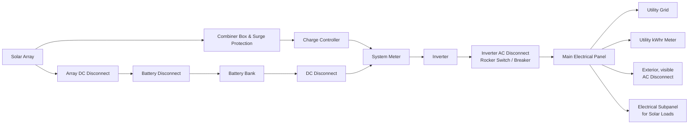

# Solar Electric System Design, Operation and Installation

An Overview for Builders in the U.S. Pacific Northwest

October 2009

WASHINGTON STATE UNIVERSITY
EXTENSION ENERGY PROGRAM

www.energy.wsu.edu
NO_CONTENT_HERE
# Solar Electric System
## Design, Operation and Installation

### An Overview for Builders in the Pacific Northwest

October 2009

© 2009 Washington State University Extension Energy Program
905 Plum Street SE, Bldg 3
Olympia, WA 98504-3165
www.energy.wsu.edu

This publication contains material written and produced for public distribution. Permission to copy or disseminate all or part of this material is granted, provided that the copies are not made or distributed for commercial advantage and that they are referenced by title with credit to the Washington State University Extension Energy Program.

WSUEEP09-013
NO_CONTENT_HERE
# Acknowledgments

The primary author of this overview was Carolyn Roos, Ph.D., of the Washington State University Extension Energy Program. Mike Nelson of the Northwest Solar Center provided very helpful consultation and a detailed review of several drafts. Kacia Brockman of the Energy Trust of Oregon also provided very insightful review comments.

This publication was adapted and updated from one prepared for the Energy Trust of Oregon, Inc. in 2005.

# Disclaimer

While the information included in this guide may be used to begin a preliminary analysis, a professional engineer and other professionals with experience in solar photovoltaic systems should be consulted for the design of a particular project.

Neither Washington State University nor its cooperating agencies, nor any of their employees, makes any warranty, express or implied, or assumes any legal liability or responsibility for the accuracy, completeness or usefulness of any information, apparatus, product, or process disclosed, or represents that its use would not infringe privately owned rights. Reference herein to any specific commercial product, process, or service by trade name, trademark, manufacturer, or otherwise does not necessarily constitute or imply its endorsement, recommendation, or favoring by Washington State University or its cooperating agencies.
# Contents

## Introduction 1
## Evaluating a Site for Solar PV Potential 2
## Photovoltaic System Types 5
## System Components 8
- Solar Modules 8
- Array Mounting Racks 11
- Grounding Equipment 12
- Combiner Box 13
- Surge Protection 13
- Meters and Instrumentation 13
- Inverter 14
- Disconnects 16
- Battery Bank 17
- Charge Controller 18
## Putting the System Together 20
- The Project Team 20
- The NEC and PV Systems 21
- Safety During the Installation 21
- Special Considerations in Wiring PV Systems 22
## System Design Considerations 23
- System Considerations 23
- Design Resources 23
## Cost Considerations 25
## For More Information – References 26
## Acronyms and Abbreviations 29

# List of Figures

Figure 1. One common configuration of a grid-connected AC photovoltaic system without battery back-up 6

Figure 2. One common configuration of a grid-connected AC photovoltaic system with battery back-up 7
# Introduction

As the demand for solar electric systems grows, progressive builders are adding solar photovoltaics (PV) as an option for their customers. This overview of solar photovoltaic systems will give the builder a basic understanding of:

- Evaluating a building site for its solar potential
- Common grid-connected PV system configurations and components
- Considerations in selecting components
- Considerations in design and installation of a PV system
- Typical costs and the labor required to install a PV system
- Building and electric code requirements
- Where to find more information

Emphasis will be placed on information that will be useful in including a grid-connected PV system in a bid for a residential or small commercial building. We will also cover those details of the technology and installation that may be helpful in selecting subcontractors to perform the work, working with a designer, and directing work as it proceeds. A summary of system types and components is given so the builder will know what to expect to see in a design submitted by a subcontractor or PV designer.

In 2008, the installed cost of a residential PV system in the United States typically ranged from $8 to $10 per installed watt before government or utility incentives. For more detail on costs, see the section titled "Cost Considerations." For information on putting together your installation team, refer to the section "The Project Team."
# Evaluating a Site for Solar PV Potential

## Does the Pacific Northwest Have Good Solar Potential?

This is a very common question and the answer is, yes, the Pacific Northwest gets enough sun for grid-connected photovoltaic systems to operate well. The Northwest's highest solar potential is east of the Cascades. But even west of the Cascades, the Oregon's Willamette Valley receives as much solar energy annually as the U.S. average – as much over the course of the year as southern France and more than Germany, the current leader in solar electric installations. Under cloudy conditions, it is true that photovoltaics produce only 5 to 30 percent of their maximum output. However, because solar photovoltaics become less efficient when hot, our cooler climate and our long summer days help make up for the cloudy days.

## Evaluating a Building Site

While the Pacific Northwest may have good to excellent solar potential, not every building site will be suitable for a solar installation. The first step in the design of a photovoltaic system is determining if the site you are considering has good solar potential. Some questions you should ask are:

- Is the installation site free from shading by nearby trees, buildings or other obstructions?
- Can the PV system be oriented for good performance?
- Does the roof or property have enough area to accommodate the solar array?
- If the array will be roof-mounted, what kind of roof is it and what is its condition?

## Mounting Location

Solar modules are usually mounted on roofs. If roof area is not available, PV modules can be pole-mounted, ground-mounted, wall-mounted or installed as part of a shade structure (refer to the section "System Components/Array Mounting Racks" below).

## Shading

Photovoltaic arrays are adversely affected by shading. A well-designed PV system needs clear and unobstructed access to the sun's rays from about 9 a.m. to 3 p.m., throughout the year. Even small shadows, such as the shadow of a single branch of a leafless tree can significantly reduce the power output of a solar module.¹ Shading from the building itself – due to vents, attic fans, skylights, gables or overhangs – must also be avoided. Keep in mind that an area may be unshaded during one part of the day, but shaded at another part of the day. Also, a site that is unshaded in the summer may be shaded in the winter due to longer winter shadows.²

## Orientation

In northern latitudes, by conventional wisdom PV modules are ideally oriented towards true south.³ But the tilt or orientation of a roof does not need to be

----

¹ This is because when manufacturers assemble solar modules from cells, they wire groups of cells in series with each other. Shading one cell will essentially turn off all the cells in its group.

² Shading can be evaluated using tools such as the "Solar Path Finder" (www.solarpathfinder.com).

³ Deviations between magnetic and true south, referred to as magnetic declination, vary by location. Magnetic declination changes slowly over time, so be sure to use data within the last decade or so. Obtain
perfect because solar modules produce 95 percent of their full power when within 20 degrees of the sun's direction. Roofs that face east or west may also be acceptable. As an example, a due west facing rooftop solar PV system, tilted at 20 degrees in Salem, Oregon, will produce about 88 percent as much power as one pointing true south at the same location. Flat roofs work well because the PV modules can be mounted on frames and tilted up toward true south.

Optimum orientation can be influenced by typical local weather patterns. For example, western Washington and Oregon frequently have a marine layer of fog that burns off by late morning and so have better solar resource after noon than before noon. Thus, west of the Cascades, the maximum power is generated with a southwest orientation.

## Tilt

Generally the optimum tilt of a PV array in the Pacific Northwest equals the geographic latitude minus about 15 degrees to achieve yearly maximum output of power. An increased tilt favors power output in the winter and a decreased tilt favors output in the summer. In western Washington and Oregon, with their cloudier winters, the optimum angle is less than the optimum east of the Cascades.

Nevertheless, it is recommended that modules be installed at the same pitch as a sloping roof, whatever that slope is, primarily for aesthetic reasons, but also because the tilt is very forgiving. In Salem, Oregon, for example, tilts from 20 degrees to 45 degrees will result in approximately the same power production over the course of the year. This is because tilts that are less than the latitude of the site increase summer production when the solar resource is most available here, but reduce winter production when it tends to be cloudy anyway.

## Required Area

Residential and small commercial systems require as little as 50 square feet for a small system up to as much as 1,000 square feet. As a general rule for the Pacific Northwest, every 1,000 watts of PV modules requires 100 square feet of collector area for modules using crystalline silicon (currently the most common PV cell type). Each 1,000 watts of PV modules can generate about 1,000 kilowatt-hours (kWh) per year in locations west of the Cascades and about 1,250 kWh per year east of the Cascades. When using less efficient modules, such as amorphous silicon or other thin-film types, the area will need to be approximately doubled. If your location limits the physical size of your system, you may want to install a system that uses more-efficient PV modules. Keep in mind that access space around the modules can add up to 20 percent to the required area.

## Roof Types

For roof-mounted systems, typically composition shingles are easiest to work with and slate and tile roofs are the most difficult. Nevertheless, it is possible to install PV modules on all roof types. If the roof will need replacing within 5 to 10 years, it should be replaced at the time the PV system is installed to avoid the cost of removing and reinstalling the PV system.

maps of magnetic declination at http://www.ngdc.noaa.gov/geomag/declination.shtml. In Oregon, magnetic declinations range from about 17 to 22 degrees east.
Building integrated PV (BIPV) modules, which can be integrated into the roof itself, might be considered for new construction or for an older roof in need of replacing. While BIPV products currently have a premium price, costs are expected to decrease.
# Photovoltaic System Types

Photovoltaic system types can be broadly classified by answers to the following questions:

- Will it be connected to the utility's transmission grid?
- Will it produce alternating current (AC) or direct current (DC) electricity, or both?
- Will it have battery back-up?
- Will it have back-up by a diesel, gasoline or propane generator set?

Here we will focus on systems that are connected to the utility transmission grid, variously referred to as utility-connected, grid-connected, grid-interconnected, grid-tied or grid-intertied systems. These systems generate the same quality of alternating current (AC) electricity as is provided by your utility. The energy generated by a grid-connected system is used first to power the AC electrical needs of the home or business. Any surplus power that is generated is fed or "pushed" onto the electric utility's transmission grid. Any of the building's power requirements that are not met by the PV system are powered by the transmission grid. In this way, the grid can be thought of as a virtual battery bank for the building.

## Common System Types

Most new PV systems being installed in the United States are grid-connected residential systems without battery back-up. Many grid-connected AC systems are also being installed in commercial or public facilities.

The grid-connected systems we will be examining here are of two types, although others exist. These are:

- Grid-connected AC system with no battery or generator back-up.
- Grid-connected AC system with battery back-up.

Example configurations of systems with and without batteries are shown in Figures 1 and 2. Note there are common variations on the configurations shown, although the essential functions and general arrangement will be similar.⁴

## Is a Battery Bank Really Needed?

The simplest, most reliable, and least expensive configuration does not have battery back-up. Without batteries, a grid-connected PV system will shut down when a utility power outage occurs. Battery back-up maintains power to some or all of the electric equipment, such as lighting, refrigeration, or fans, even when a utility power outage occurs. A grid-connected system may also have generator back-up if the facility cannot tolerate power outages.

----

⁴ As an example of a variation on the configuration shown in Figure 1, the inverter has been shown in an interior location, while very often it is installed outside. If located outside, there may not be a need for a separate Array Disconnect and Inverter DC Disconnect, as a single DC Disconnect can serve both functions. In Figure 2, system meter functions are often included in charge controllers and so a separate System Meter may not be required.
With battery back-up, power outages may not even be noticed. However, adding batteries to a system comes with several disadvantages that must be weighed against the advantage of power back-up. These disadvantages are:

- Batteries consume energy during charging and discharging, reducing the efficiency and output of the PV system by about 10 percent for lead-acid batteries.
- Batteries increase the complexity of the system. Both first cost and installation costs are increased.
- Most lower cost batteries require maintenance.
- Batteries will usually need to be replaced before other parts of the system and at considerable expense.

## Figure 1. One common configuration of a grid-connected AC photovoltaic system without battery back-up

```
Solar Array --> Combiner Box & Surge Protection --> Array DC Disconnect --> Inverter --> 
Inverter DC Disconnect --> AC Disconnect (near Inverter) --> Electrical Panel --> 
Utility kWh Meter --> Utility Grid
                   |
                   v
            Exterior, visible
            AC Disconnect
```
Figure 2. One common configuration of a grid-connected AC photovoltaic system with battery back-up



This diagram illustrates the components and connections in a typical grid-connected AC photovoltaic system with battery backup. The system includes:

1. Solar Array
2. Combiner Box & Surge Protection
3. Array DC Disconnect
4. Charge Controller
5. Battery Disconnect
6. Battery Bank
7. System Meter
8. Inverter
9. Inverter AC Disconnect (Rocker Switch / Breaker)
10. Main Electrical Panel
11. Utility Grid connection
12. Utility kWhr Meter
13. Exterior, visible AC Disconnect
14. Electrical Subpanel for Solar Loads
15. DC Disconnect (between Battery Bank and System Meter)

The components are arranged in a logical flow from the solar array through various safety and control mechanisms, ultimately connecting to the utility grid and household electrical system.
# System Components

Pre-engineered photovoltaic systems can be purchased that come with all the components you will need, right down to the nuts and bolts. Any good dealer can size and specify systems for you, given a description of your site and needs. Nevertheless, familiarity with system components, the different types that are available, and criteria for making a selection is important.

Basic components of grid-connected PV systems with and without batteries are:

- Solar photovoltaic modules
- Array mounting racks
- Grounding equipment
- Combiner box
- Surge protection (often part of the combiner box)
- Inverter
- Meters – system meter and kilowatt-hour meter
- Disconnects:
  - Array DC disconnect
  - Inverter DC disconnect
  - Inverter AC disconnect
  - Exterior AC disconnect

If the system includes batteries, it will also require:

- Battery bank with cabling and housing structure
- Charge controller
- Battery disconnect

## Solar Modules

The heart of a photovoltaic system is the solar module. Many photovoltaic cells are wired together by the manufacturer to produce a solar module. When installed at a site, solar modules are wired together in series to form strings. Strings of modules are connected in parallel to form an array.

Module Types – Rigid flat framed modules are currently most common and most of these are composed of silicon. Silicon cells have atomic structures that are single-crystalline (a.k.a. mono-crystalline), poly-crystalline (a.k.a. multi-crystalline) or amorphous (a.k.a. thin film silicon). Other cell materials used in solar modules are cadmium telluride (CdTe, commonly pronounced "CadTel") and copper indium diselenide (CIS). Some modules are manufactured using combinations of these materials. An example is a thin film of amorphous silicon deposited onto a substrate of single-crystalline silicon.
In 2005 approximately 90 percent of modules sold in the United States were composed of crystalline silicon, either single-crystalline or poly-crystalline. The market share of crystalline silicon is down from previous years, however, and continues to drop as sales of amorphous silicon, CdTe and CIS modules are growing.

## Building Integrated Photovoltaic Products

PV technology has been integrated into roofing tiles, flexible roofing shingles, roofing membranes, adhesive laminates for metal standing-seam roofs, windows, and other building integrated photovoltaic (BIPV) products. BIPV modules are generally more expensive than rigid flat modules, but are anticipated to eventually reduce overall costs of a PV system because of their dual purpose. For more information on BIPV products, refer to the National Institute of Building Sciences' Whole Building Design Guide: Building Integrated Photovoltaics at http://www.wbdg.org/resources/bipv.php.

## Rated Power

Grid-connected residential PV systems use modules with rated power output ranging from 100-300 watts. Modules as small as 10 watts are used for other applications. Rated power is the maximum power the panel can produce with 1,000 watts of sunlight per square meter at a module temperature of 25°C or 77°F in still air. Actual conditions will rarely match rated conditions and so actual power output will almost always be less.

## PV System Voltage

Modern systems without batteries are typically wired to provide from 235V to 600V. In battery-based systems, the trend is also toward use of higher array voltages, although many charge controllers still require lower voltages of 12V, 24V or 48V to match the voltage of the battery string.

## Using Manufacturer's Product Information to Compare Modules

Since module costs and efficiencies continue to change as technology and manufacturing methods improve, it is difficult to provide general recommendations that will be true into the future regarding, for example, which type of module is cheapest or the best overall choice. It is best to make comparisons based on current information provided by manufacturers, combined with the specific requirements of your application.

Two figures that are useful in comparing modules are the modules' price per watt and the rated power output per area (or efficiency). When looking through a manufacturer's catalog of solar modules, you will often find the rated power, the overall dimensions of the module, and its price. Find the cost per watt by dividing the module's price by its rated output in watts. Find the watts per area, by dividing its rated output by its area.

## Module Cost per Watt

As a general rule, thin film modules have lower costs than crystalline silicon modules for modules of similar powers. For updates on module prices refer to the Solarbuzz website at http://www.solarbuzz.com/ModulePrices.htm.

## Module Efficiency (Watts per Area)

Modules with higher efficiency will have a higher ratio of watts to area. The higher the efficiency, the smaller the area (i.e. fewer modules) will be required to achieve the same power output of an array. Installation and racking
costs will be less with more efficient modules, but this must be weighed against the higher cost of the modules. Amorphous silicon, thin film CdTe and CIS modules have rated efficiencies that are lower than crystalline silicon modules, but improvements in efficiency continue.

## Amorphous Silicon in Cloudy Climates

Of importance to the Pacific Northwest, amorphous silicon modules have higher efficiency than crystalline silicon under overcast conditions. In cloudy weather, all types of amorphous silicon modules tend to perform better than crystalline silicon, with multi-junction (i.e. double- and triple-junction) amorphous silicon modules performing as much as 15 percent better. In Britain, which has a similar climate to ours, multi-junction amorphous silicon modules have been shown to produce more power over the course of the year than crystalline silicon modules.

Note that because the power ratings of modules are determined under high light, their rated efficiency (or rated watts per area), will not reflect performance in overcast weather.

## Poly-crystalline or Single-crystalline Silicon?

The power output of single-crystalline and poly-crystalline modules of the same area is quite similar.⁵ Both types of crystalline silicon are very durable and have stable power output over time. Therefore, do not be too concerned about the distinction between single-crystalline and poly-crystalline silicon in selecting a module.

On the other hand, higher module efficiencies can be achieved by some combination products that have recently appeared on the market, such as amorphous silicon deposited on a single-crystalline substrate. These high efficiency modules may be a good choice particularly if the area available for the installation is limited.

## Silicon Modules versus Other Module Types?

The power output of CdTe modules has been less stable than silicon modules,⁶ although improvements are being made. For the time being, as for modules of any type, check manufacturer's warranties. A warranty guaranteeing high power output over 20 to 25 years is an indication of the longevity of the cell material.

## Warranty

It is important to verify warranty periods of all components of the system, including solar modules. Most modules are very durable, long lasting and can withstand

----

⁵ Either single-crystalline or poly-crystalline modules may have a higher output for the same size module, depending on how the manufacturer lays out the cells. Single-crystalline silicon cells have a higher efficiency (i.e. higher power output for a given cell area) compared to poly-crystalline. But this refers to the efficiency of the material not the module, and does not account for lost area due to the spaces between cells. Single-crystalline cells can be more difficult to lay out compactly on a module because it is most typically manufactured in circular sections. So while the poly-crystalline material itself is less efficient, it often is more compactly laid out on a module.

⁶ Amorphous silicon suffers an initial decline in power, but its power output stabilizes and long term losses are low. Manufacturers of amorphous silicon modules account for the initial loss in their power ratings and so this does not represent a long term stability problem.
severe weather, including extreme heat, cold and hailstorms. Reflecting this longevity, most silicon modules carry 20- or 25-year manufacturer warranties.

## Array Mounting Racks

Arrays are most commonly mounted on roofs or on steel poles set in concrete. In certain applications, they may be mounted at ground level or on building walls. Solar modules can also be mounted to serve as part or all of a shade structure such as a patio cover. On roof-mounted systems, the PV array is typically mounted on fixed racks, parallel to the roof for aesthetic reasons and stood off several inches above the roof surface to allow airflow that will keep them as cool as practical.

### Adjustability
The tilt of sloped rooftop arrays is usually not changed, since this is inconvenient in many cases and sometimes dangerous. However, many mounting racks are adjustable, allowing resetting of the angle of the PV modules seasonally.

### Tracking
Pole-mounted PV arrays can incorporate tracking devices that allow the array to automatically follow the sun. Tracked PV arrays can increase the system's daily energy output by 25 percent to 40 percent. Despite the increased power output, tracking systems usually are not justified by the increased cost and complexity of the system.

### General Installation Notes
Proper roof mounting can be labor intensive, depending largely on the type of roof and how the mounting brackets are installed and sealed. It is best to follow the recommendations of the roofing contractor, racking system suppliers and module manufacturers. Module manufacturers will provide details of support requirements for their modules. A good racking supplier will provide code-compliant engineering specifications with their product. As a general rule for bidding purposes, however, it is typical to have one support bracket for every 100 watts of PV modules.

Particular attention must be given to securing the array directly to the structural members of the roof and to weather sealing of roof penetrations. All details regarding attaching the mounting brackets to the roof and sealing around them are best approved and carried out by the roofing contractor so that the roof warranty will not be voided.

### Asphalt Composition Roofs
For asphalt composition roofs, all mounts need to be secured to the roof with stainless steel lag bolts, bolted into the rafters. Mount types include support posts and L-brackets. Support posts are preferred because they are designed to give a good seal on boots. Support posts are best mounted after the roof decking is applied and before the roof material is installed. Support posts and roof jacks may be installed by either the roofing contractor or the crew in charge of laying out the array mounting system. The roofing contractor then flashes around the posts as they install the roof.

It is very common to install mounts after the roof is installed, drilling through the asphalt composition roofing to install the bolts. Sealant is then applied around the bolts without flashing. As well, the top layer of roofing should be carefully lifted back to inject sealant
under the roofing. While this is much less labor intensive than when flashed, unless performed by the roofing contractor, this method may void the warranty on the roof.

## Metal Roofs

There are several types of standing seam metal roof products, including vertical seam, horizontal seam and delta seam products. Currently, special clamps, referred to as S-5 clamps, are available to attach arrays without any penetrations to vertical and horizontal seam roofs and certain other standing seam roof profiles. These clamps make installation of the solar array a relatively easy matter compared to any other roof type. In contrast, clamps for delta seam metal roofs are not available. For these roofs, it is necessary to cut into the roofing, install boots around the mounting posts, and then seal the penetration. This being undesirable and labor intensive, it is best to clearly specify in advance a vertical or horizontal seam metal roof or other roof type compatible with S-5 clamps.

## Other Roof Types

While it is possible to install a PV array on shake, tile and slate roofs, these roof types pose certain problems. Contact the racking system supplier for information on products and installation methods for these roof types. Work directly with the roofing contractor before ordering the racking system. Also look for roof-integrated modules that can be used with tile or slate roofs.

## Roof Vents and Fans

We suggest installing roof vents, plumbing vents, and fans on the north side of the roof to avoid interference with the solar array. This will also reduce the potential for inadvertent shading of the array.

## For More Information

Refer to Energy Trust of Oregon array mounting requirements in their Solar Electric System Installation Requirements available at http://energytrust.org/library/forms/SLE_RQ_PV_SysReq.pdf. Also, refer to "A Guide to Photovoltaic System Design and Installation" (California Energy Commission 2001).

## Grounding Equipment

Grounding equipment provides a well-defined, low-resistance path from your system to the ground to protect your system from current surges from lightning strikes or equipment malfunctions. Grounding also stabilizes voltages and provides a common reference point. The grounding harness is usually located on the roof.

### Check with the AHJ

Grounding can be a particularly problematic issue. Be sure to check with the Authority Having Jurisdiction (AHJ) – typically the building department's electrical inspector – concerning local code requirements.

### Equipment Grounding

Equipment grounding provides protection from shock caused by a ground fault. A ground fault occurs when a current-carrying conductor comes into contact with the frame or chassis of an appliance or electrical box. All system components and any exposed metal, including equipment boxes, receptacles, appliance frames and PV mounting equipment, should be grounded.
System Grounding – System grounding requires taking one conductor from a two-wire system and connecting it to ground. In a DC system, this means bonding the negative conductor to ground at one single point in the system. This must be accomplished inside the inverter, not at the PV array.

NEC 2005 and System Grounding – In 2005, the National Electrical Code (NEC) was modified to remove the requirement for system grounding, although your local jurisdiction may not have adopted this revision. The requirement for system grounding was removed to permit transformerless utility-interactive inverters, which have higher efficiency. There are several additional NEC requirements intended to ensure that ungrounded arrays are as safe as grounded arrays, although this is still a point of controversy. Refer to NEC 690 (2005) for details, and to the IAEI News article "Photovoltaic Power Systems and 2005 NEC" by John Wiles at http://www.iaei.org/magazine/?p=2081 for a brief summary of these requirements.

## Combiner Box

Wires from individual PV modules or strings are run to the combiner box, typically located on the roof. These wires may be single conductor pigtails with connectors that are pre-wired onto the PV modules. The output of the combiner box is one larger two-wire conductor in conduit. A combiner box typically includes a safety fuse or breaker for each string and may include a surge protector.

## Surge Protection

Surge protectors help to protect your system from power surges that may occur if the PV system or nearby power lines are struck by lightning. A power surge is an increase in voltage significantly above the design voltage.

## Meters and Instrumentation

Essentially two types of meters are used in PV systems:

- Utility Kilowatt-hour Meter
- System Meter

Utility Kilowatt-Hour Meter – The utility kilowatt-hour meter measures energy delivered to or from the grid. On homes with solar electric systems, utilities typically install bidirectional meters with a digital display that keeps separate track of energy in both directions. Some utilities will allow you to use a conventional meter that can spin in reverse. In this case, the utility meter spins forward when you are drawing electricity from the grid and backwards when your system is feeding or "pushing" electricity onto the grid.

System Meter – The system meter measures and displays system performance and status. Monitored points may include power production by modules, electricity used, and battery
charge. It is possible to operate a system without a system meter, though meters are
strongly recommended. Modern charge controllers incorporate system monitoring
functions and so a separate system meter may not be necessary.

## Inverter

Inverters take care of four basic tasks of power conditioning:

- Converting the DC power coming from the PV modules or battery bank to AC
  power
- Ensuring that the frequency of the AC cycles is 60 cycles per second
- Reducing voltage fluctuations
- Ensuring that the shape of the AC wave is appropriate for the application, i.e. a
  pure sine wave for grid-connected systems

### Criteria for Selecting a Grid-Connected Inverter

The following factors should be considered for a grid-connected inverter:

- A UL1741 listing of the inverter for use in a grid-interactive application
- The voltage of the incoming DC current from the solar array or battery bank.
- The DC power window of the PV array
- Characteristics indicating the quality of the inverter, such as high efficiency and
  good frequency and voltage regulation
- Additional inverter features such as meters, indicator lights, and integral safety
  disconnects
- Manufacturer warranty, which is typically 5-10 years
- Maximum Power Point Tracking (MPPT) capability, which maximizes power
  output

Most grid-connected inverters can be installed outdoors, while most off-grid inverters are
not weatherproof. There are essentially two types of grid-interactive inverters: those
designed for use with batteries and those designed for a system without batteries.

### Power Quality

Inverters for grid-connected systems produce better than utility-quality
power. For grid-connection, the inverter must have the words "Utility-Interactive"
printed directly on the listing label.

### Voltage Input

The inverter's DC voltage input window must match the nominal
voltage of the solar array, usually 235V to 600V for systems without batteries and 12, 24
or 48 volts for battery-based systems.

### AC Power Output

Grid-connected systems are sized according to the power output of
the PV array, rather than the load requirements of the building. This is because any
power requirements above what a grid-connected PV system can provide is automatically
drawn from the grid.
Surge Capacity – The starting surge of equipment such as motors is not a consideration in sizing grid-connected inverters. When starting, a motor may draw as much as seven times its rated wattage. For grid-connected systems, this start-up surge is automatically drawn from the grid.

Frequency and Voltage Regulation – Better quality inverters will produce near constant output voltage and frequency.

Efficiency – Modern inverters commonly used in residential and small commercial systems have peak efficiencies of 92 percent to 94 percent, as rated by their manufacturers. Actual field conditions usually result in overall efficiencies of about 88 percent to 92 percent. Inverters for battery-based systems have slightly lower efficiencies.

Integral Safety Disconnects – The AC disconnect in most inverter models may not meet requirements of the electric utility (see section "Disconnects"). Therefore, a separate exterior AC disconnect may be required even if one is included in the inverter. All inverters that are UL listed for grid-connection include both DC disconnects (PV input) and AC disconnects (inverter output). In better inverters, the inverter section can be removed separately from the DC and AC disconnects, facilitating repair.

Maximum Power Point Tracking (MPPT) – Modern non-battery based inverters include maximum power point tracking. MPPT automatically adjusts system voltage such that the PV array operates at its maximum power point. For battery-based systems, this feature has recently been incorporated into better charge controllers.

Inverter-Chargers – For battery-based systems, inverters are available with a factory-integrated charge controller, referred to as inverter-chargers. Be sure to select an inverter-charger that is rated for grid-connection, however. In the event of a grid power outage, use of an inverter-charger that is not set up for grid-connection would result in overcharging and damaging the batteries, known as "cooking the batteries."

Automatic Load Shedding – For battery-based systems, the inverter can automatically shed any unnecessary loads in the event of a utility power outage. Solar loads, i.e. the loads that will be kept powered up during the outage, are connected to a separate electrical sub-panel. A battery-based system must be designed to power these critical loads.

Warranty – Inverters typically carry warranties of 5 years, although the industry is moving toward a 10-year warranty. The transformer and solid state components of an inverter are both susceptible to overheating and damage from power spikes, reducing its life. Transformerless inverters, long available in Europe, are beginning to move into the U.S. market.

To Consider When Researching Inverters – Many references on sizing and selecting inverters have been developed for off-grid systems, but may not clearly state that they are
specific to off-grid systems. Sizing and selecting grid-connected inverters entails different considerations and is easier, since the system does not have to provide 100 percent of the energy requirements. In particular, peak energy demand and surge capacity do not need to be considered for grid-connected systems.

## Disconnects

Automatic and manual safety disconnects protect the wiring and components from power surges and other equipment malfunctions. They also ensure the system can be safely shut down and system components can be removed for maintenance and repair. For grid-connected systems, safety disconnects ensure that the generating equipment is isolated from the grid, which is important for the safety of utility personnel. In general, a disconnect is needed for each source of power or energy storage device in the system.

For each of the functions listed below, it is not always necessary to provide a separate disconnect. For example, if an inverter is located outdoors, a single DC disconnect can serve the function of both the array DC disconnect and the inverter DC disconnect. Before omitting a separate disconnect, however, consider if this will ever result in an unsafe condition when performing maintenance on any component. Also consider the convenience of the disconnect's location. An inconveniently located disconnect may lead to the tendency to leave the power on during maintenance, resulting in a safety hazard.

### Array DC Disconnect
The array DC disconnect, also called the PV disconnect, is used to safely interrupt the flow of electricity from the PV array for maintenance or troubleshooting. The array DC disconnect may also have integrated circuit breakers or fuses to protect against power surges.

### Inverter DC Disconnect
Along with the inverter AC disconnect, the inverter DC disconnect is used to safely disconnect the inverter from the rest of the system. In many cases, the inverter DC disconnect will also serve as the array DC disconnect.

### Inverter AC Disconnect
The inverter AC disconnect disconnects the PV system from both the building's electrical wiring and the grid. Frequently, the AC disconnect is installed inside the building's main electrical panel. However, if the inverter is not located near the electrical panel, an additional AC disconnect should be installed near the inverter.

### Exterior AC Disconnect
Utilities commonly require an exterior AC disconnect that is lockable, has visible blades and is mounted next to the utility meter so that it is accessible to utility personnel. An AC disconnect located inside the electrical panel or integral to the inverter would not satisfy these requirements. One alternative that is as acceptable to some utilities as an accessible AC disconnect is the removal of the meter itself, but this is not the norm. Prior to purchasing equipment, consult the electric utility to determine their requirements for interconnection.
Battery DC Disconnect – In a battery-based system, the battery DC disconnect is used to safely disconnect the battery bank from the rest of the system.

## Battery Bank

Batteries store direct current electrical energy for later use. This energy storage comes at a cost, however, since batteries reduce the efficiency and output of the PV system, typically by about 10 percent for lead-acid batteries. Batteries also increase the complexity and cost of the system.

Types of batteries commonly used in PV systems are:

- Lead-acid batteries
  - Flooded (a.k.a. Liquid vented)
  - Sealed (a.k.a. Valve-Regulated Lead Acid)
    - Absorbent glass mat
    - Gel cell
- Alkaline batteries
  - Nickel-cadmium
  - Nickel-iron

### Lead-Acid Batteries

Lead-acid batteries are most common in PV systems in general and sealed lead acid batteries are most commonly used in grid-connected systems. Sealed batteries are spill-proof and do not require periodic maintenance. Flooded lead-acid batteries are usually the least expensive but require adding distilled water at least monthly to replenish water lost during the normal charging process.

There are two types of sealed lead acid batteries: sealed absorbent glass mat (AGM) and gel cell. AGM lead-acid batteries have become the industry standard, as they are maintenance free and particularly suited for grid-tied systems where batteries are typically kept at a full state of charge. Gel-cell batteries, designed for freeze-resistance, are generally a poor choice because any overcharging will permanently damage the battery.

### Alkaline Batteries

Because of their relatively high cost, alkaline batteries are only recommended where extremely cold temperatures (-50°F or less) are anticipated or for certain commercial or industrial applications requiring their advantages over lead-acid batteries. These advantages include tolerance of freezing or high temperatures, low maintenance requirements, and the ability to be fully discharged or over-charged without harm.

### Sizing Battery Banks

For grid-connected systems, batteries are usually sized for relatively short time periods with 8 hours being typical. Size may vary, however, depending on the particular needs of a facility and the length of power outages expected. For comparison, battery banks for off-grid systems are usually sized for one to three cloudy days.
Interaction with Solar Modules – The solar array must have a higher voltage than the battery bank in order to fully charge the batteries. For systems with battery back-up, pay particular attention to the rated voltage of the module, also called the maximum power point (V<sub>mpp</sub>), in the electrical specifications. It is important that the voltage is high enough relative to the voltage of a fully charged battery. For example, rated voltages between 16.5V and 17.5V are typical for a 12V system using liquid lead-acid batteries. Higher voltages may be required for long wiring distances between the modules and the charge controller and battery bank.

## Charge Controller

A charge controller, sometimes referred to as a photovoltaic controller or battery charger, is only necessary in systems with battery back-up. The primary function of a charge controller is to prevent overcharging of the batteries. Most also include a low-voltage disconnect that prevents over-discharging batteries. In addition, charge controllers prevent charge from draining back to solar modules at night. Some modern charge controllers incorporate maximum power point tracking, which optimizes the PV array's output, increasing the energy it produces.

### Types of Charge Controllers

There are essentially two types of controllers: shunt and series. A shunt controller bypasses current around fully charged batteries and through a power transistor or resistance heater where excess power is converted into heat. Shunt controllers are simple and inexpensive, but are only designed for very small systems. Series controllers stop the flow of current by opening the circuit between the battery and the PV array. Series controllers may be single-stage or pulse type. Single-stage controllers are small and inexpensive and have a greater load-handling capacity than shunt-type controllers. Pulse controllers and a type of shunt controller referred to as a multi-stage controller (e.g., three-stage controller) have routines that optimize battery charging rates to extend battery life.

Most charge controllers are now three-stage controllers. These chargers have dramatically improved battery life.

### Selection

Charge controllers are selected based on:

- PV array voltage – The controller's DC voltage input must match the nominal voltage of the solar array.
- PV array current – The controller must be sized to handle the maximum current produced by the PV array.

### Interaction with Inverter

Since the majority of charge controllers have been installed in off-grid systems, their default settings may not be appropriate for a grid-connected system. The charge controller must be set up such that it does not interfere with the proper operation of the inverter. In particular, the controller must be set up such that
charging the batteries from the PV array takes precedence over charging from the grid. For more information, contact the manufacturer.

## Interaction with Batteries

The charge controller must be selected to deliver the charging current appropriate for the type of batteries used in the system. For example, on a 12V system, flooded lead-acid batteries have a voltage of 14.6V to 15.0V when fully charged, while sealed lead-acid batteries are fully charged at 14.1 V. Refer to the battery manufacturer for the charging requirements of particular batteries.
# Putting the System Together

## The Project Team

The most satisfactory installations are the result of team effort, with each team member contributing their particular expertise and coordinating their work with the others. The person most familiar with electrical codes – the electrical contractor or electrician – may be unfamiliar with the unique particulars of PV system installations. On the other hand, the PV system designer or vendor is an expert on PV system requirements but may not be familiar with the intricacies of the NEC.

Further, there must be coordination between all subcontractors to ensure that, for example, the solar array is not inadvertently shaded by a vent stack, attic fan, or skylight.⁷ The roofing contractor must coordinate with those installing the PV system in mounting the array. Prior to purchasing any equipment the utility should be contacted to determine their requirements for interconnection with the grid. Early stage involvement of the local Authority Having Jurisdiction (usually a building or electrical inspector) as a member of the project team will also contribute to the success of the project.

## Solar or Electrical Subcontractor?

A general contractor may face a choice between using an electrical subcontractor or a solar subcontractor to install the PV system. A good solar contractor will have the expertise in solar PV systems plus qualified electricians on staff. On the other hand, the general contractor may prefer an electrical contractor with whom he or she has a longstanding relationship. An experienced electrical contractor who goes the extra step in researching PV's special requirements will generally be qualified to install a PV system. Note that the builder may need to impress upon an electrical contractor that PV systems do have unique requirements and manufacturer's directions must be studied and strictly adhered to.

## On-Site Preconstruction Meeting

It is quite typical that the PV system installation and general electrical work are performed by different contractors. We suggest an on-site preconstruction meeting with the electrician and the solar installer to discuss where one job ends and the other begins.

## Constructing a "Solar Ready" Building

Even if the PV system is not installed during construction of the building, the builder can install those runs of conduit that would be difficult to do later as a retrofit, thus making the building "solar ready."

## Investigate the Vendor's History

It is important to investigate the track record of all vendors, including the warranties they offer on equipment. As one example, when AstroPower went bankrupt and was acquired by General Electric in 2004, the warranties on previously manufactured AstroPower modules were not honored by General Electric.

----

⁷ As mentioned before, install vents and fans on the north side of the roof to avoid interference with the solar array.
AstroPower modules can still be purchased, but do not come with manufacturer's warranties.

## The NEC and PV Systems

Solar PV systems must be installed in accordance with Article 690 of the National Electric Code, which specifically deals with PV systems, as well as several other articles of the NEC that pertain to electrical systems in general. When there is a conflict between NEC 690 and any other article, NEC 690 takes precedence due to the unique nature of PV systems. Articles of the NEC applicable to PV systems are:

- NEC 690 – Solar Photovoltaic Systems
- NEC 230 – Disconnect Means
- NEC 240 – Overcurrent Protection
- NEC 250 – Grounding
- NEC 300 to NEC 384 – Wiring Methods

A good summary of NEC 690 (2002) is given in Photovoltaics: Design and Installation Manual (Solar Energy International 2007) in the chapter titled "System Wiring." NEC 690 includes requirements on sizing, selecting and installation of wiring, conduit, overcurrent protection, disconnects, and grounding. NEC 690 addresses many other issues as well, such as interconnection to the utility grid, equipment listing, and inspection.

Note that a new edition of NEC 690 was released in 2005. For a summary, refer to the article "Photovoltaic Power Systems and 2005 NEC" (IAEI News, March/April 2005), which is available at both http://www.nmsu.edu/~tdi/pdf-resources/IAEI-3to4-05.pdf and http://www.iaei.org/magazine/?p=2081.

## Safety During the Installation

Roof-mounted PV systems require that subcontractors, including electricians, work on the roof. It is the builder's legal responsibility to ensure that the installer follows safe practices during the installation. Lack of proper safety equipment can result in significant fines to the builder. For details of safety requirements refer to the federal Occupational Safety and Health Administration's (OSHA) 2001 Code of Federal Regulations, Chapter 29 Part 1926, "Safety and Health Regulations for Construction" at www.osha.gov.

A danger specific to PV systems is that solar modules generate DC electricity when exposed to light. As well, PV systems may have multiple electrical sources – modules, the utility grid, and perhaps batteries. Manufacturers of modules and other electrical components will provide safety precautions that should be carefully followed.

In addition to the electrical hazards, hefting modules onto a sloped roof poses a hazard. When installing modules on the roof, at least one safety eye must be installed for tying
off. Work is facilitated by installing two safety eyes and a line between them for attaching the lanyard, thus allowing the installer to move back and forth more freely.

## Special Considerations in Wiring PV Systems

In wiring solar PV systems, there are at least two concerns that an electrical contractor or electrician may not have previous experience with. First, the system on the array side of the inverter must be designed for DC power, which requires larger wire sizes than for AC power at the same voltage. Second, array wiring must be sized and selected to withstand elevated temperatures. The ampacity, which is the current-carrying ability of a wire, must be adjusted to account for temperature conditions that occur in PV systems. Wiring sizing is detailed in NEC 690. Worksheets on wiring sizing are included in the Photovoltaics: Design and Installation Manual (Solar Energy International 2007). Refer to the section "For More Information – References" below for ordering information.

### Exterior Wiring
For PV systems in general, wiring in exterior locations must be suitable for the outdoor, wet environment; suitable for exposure to sunlight; and able to operate in temperatures in the range of 65-80°C (149-176° F). Wiring will be subjected to the highest temperatures in the junction boxes of solar modules; these conductors should have insulation rated for 90°C (194° F).

### Module Pigtails
In contrast to other NEC articles, NEC 690 allows exposed, single-conductor cables for interconnecting PV modules. This allows PV modules to be manufactured with permanently attached pigtail conductors with multi-contact (MC) connectors on the ends. Such module pigtails are becoming standard and significantly reduce the labor required for installing the array.

### Roofing Penetrations for Conduit
Particular attention should be paid to sealing around roof penetrations for conduit. As with sealing around the array mounting brackets, this is best handled by the roofing contractor to ensure the roof warranty is not voided.
# System Design Considerations

## System Considerations

In designing a PV system, it is important to consider the system as a whole: how the components work together and how the PV system fits in with the building.

### Pre-engineered PV Systems

It is important to properly size and match each component such that the overall system operates optimally. To address this concern, many distributors offer pre-engineered systems in which components are selected to work together as a unit. Pre-engineering may not guarantee a flawless system, but the concerns over product compatibility and specification of individual components will have been addressed up front.

### PV Modules and the Building Design

The builder or PV designer must also consider the PV system and the building as a system. The PV array should be located considering the aesthetics of the building. As well, the modules must be located so that building features such as gables and overhangs do not shade the modules. This usually means locating the array on the roof as close as possible to the ridge.

The builder should consider designing a south facing roof for the array for optimum power production. As noted previously, the orientation of the array is very forgiving, however, and the roof does not need to face directly south, if not possible given other design constraints.

## Design Resources

### Printed References

There are many good references and resources that provide in-depth discussions of the technical aspects of system design. Two design references are:

- **Photovoltaics: Design and Installation Manual**, Solar Energy International (SEI), 2007.
  This manual has worksheets, guidelines and considerations for sizing and wiring solar arrays, battery systems, inverters, and other system components. As a word of caution, this manual focuses on off-grid systems, with the special considerations of grid-connected systems discussed in a separate chapter. This manual is available at http://www.solarenergy.org/bookstore/photovoltaics-design-installation-manual.

- **Photovoltaic Systems Engineering**, Roger A. Messenger and Jerry Ventre, Second Edition, CRC Press, New York, NY, 2004.
  This engineering text contains practical information on PV systems and components, mounting, grid-connection, and other issues. Topics are discussed in more detail than in the SEI reference above, although sometimes the theory and
detail given is more than is necessary for the builder or installer. Order from CRC Press at www.crcpress.com or from other online booksellers.

## Distributors

Distributors are very good resources in developing a design. They will be able to size and select the major components of your system given a basic description of your site, but will leave wire sizing to the installer.

## Software Tools

Many software tools for design of PV systems are available online. Online tools useful in designing a PV system include:

- PVWatts™ (http://www.nrel.gov/rredc/pvwatts/ or http://www.pvwatts.org/) is a free, internet-based model that calculates electrical energy produced by a grid-connected photovoltaic system.

- RETScreen® (www.retscreen.net/ang/g_photo.php) is a free spreadsheet-based model for grid-connected and off-grid systems. Developed with support of Natural Resources Canada.
# Cost Considerations

In including a PV system in a bid to a customer, the builder must know typical costs of PV systems and the labor that will be required to install it.

## Typical Installed Costs

In 2008, the installed cost of a residential PV system in the U.S. typically ranged from $8 to $10 per installed watt before government or utility incentives. Factors affecting cost include the size and type of the system, use of battery back-up, and mounting requirements. Larger systems, of course, cost more in absolute terms than smaller systems, but the cost per installed watt is somewhat less. Incentive programs can substantially reduce installed costs. For more information on incentives, visit the DSIRE database at www.dsireusa.org. In Oregon, visit the Energy Trust of Oregon website at www.energytrust.org.

## Component Costs

Solar modules are the most expensive component of the system. Information on typical system component prices can be found on the website of Solarbuzz at http://www.solarbuzz.com/Moduleprices.htm. In 2009, the cost of modules in the United States typically ranges from $4 to $6 per watt. In a system without batteries, inverters are the second most costly component. In 2009, inverters cost on average less than $1 per watt. Batteries increase the complexity of the system and thus impact both material and labor costs. In 2009, batteries cost on average $2 per watt-hour.

## Cost Tradeoffs

Consider cost tradeoffs when planning a PV system. For example, while less efficient modules may have a lower cost per installed watt than modules with higher efficiency, they also will take up more space and require a larger racking system. Mounting costs will be considerably greater and should be considered against the cost savings of the modules.

## Labor Costs

The labor required to install a PV system varies depending on building layouts and roofing types. An experienced crew can install a 2 kW non-battery PV system in two- to four-person days. Systems with large solar arrays require relatively less effort per watt of power than smaller systems. If batteries are included in the PV system, both material and installation costs will be greater. Batteries can add 50 percent to 100 percent to the time required for the installation.
# For More Information – References

California Energy Commission, Sacramento, CA, www.energy.ca.gov
- Download A Guide to Photovoltaic (PV) System Design and Installation, prepared by Endecon Engineering, with Regional Economic Research, Inc., 2001. Available at www.energy.ca.gov/reports/2001-09-04_500-01-020.PDF, this guidebook provides design considerations and installation guidelines to installers of photovoltaic systems.

Energy Trust of Oregon, Portland, OR, www.energytrust.org
- Visit the following websites to find information on installing a photovoltaic system using financial incentives from the Energy Trust of Oregon:
  - Residences: http://www.energytrust.org/residential/incentives/solar-electric/SolarElectric/
  - Businesses: http://www.energytrust.org/business/incentives/other-businesses/existing-building/SolarElectric1
- Solar Electric System Installation Requirements, v 13, revised 5/18/09. http://energytrust.org/library/forms/SLE_RQ_PV_SysReq.pdf
- Obtain design and installation criteria for solar electric systems qualifying for incentives, http://energytrust.org/library/forms/SLE_RQ_PV_SysReq.pdf.

International Association of Electrical Inspectors, www.iaei.org
- The IAEI's online bimonthly series "Perspectives on PV" covers many practical issues on photovoltaic systems, including installation tips, equipment, code requirements, and inspection. The current edition and archived articles are available at http://www.iaei.org/magazine/?tag=photovoltaic. (In browsing the archives, note you must select both the month on the calendar and the year from the list below the calendar.)

Messenger, Roger A. and Jerry Ventre, "Photovoltaic Systems Engineering", Second Edition, CRC Press, New York, NY 2004
- An engineering text with practical information on PV systems and components, mounting, grid-connection and other topics. Order from CRC Press at www.crcpress.com or from other online booksellers

North Carolina Solar Center, Raleigh, NC, http://www.ncsc.ncsu.edu/
- "Siting of Active Solar Collectors and Photovoltaic Modules," (2001) discusses evaluation of a building site for its solar potential at http://www.ncsc.ncsu.edu/include/_upload/media/pubs/SitingActive.pdf .
Northwest Solar Center, Seattle, WA, www.northwestsolarcenter.org
- Visit Northwest Solar Center's website under "Useful Tools" for links to PVWatts, SMA Sizing and the NW Solar Center Load Calculator for sizing photovoltaic systems
- Washington State's production incentives are summarized under "Incentive Chart"
- Download publications on photovoltaics that are especially relevant to the Pacific Northwest.

Oregon Department of Energy, Salem, OR, http://www.oregon.gov/ENERGY/.
- Visit ODOE's website to download publications such as:
  - Oregon Solar Electric Guide: Independent and Utility-Connected Homes http://egov.oregon.gov/ENERGY/RENEW/Solar/PV.shtml
  - Photovoltaics: Basic Design Principles and Components (U.S. Department of Energy 1997), http://www.oregon.gov/ENERGY/RENEW/Solar/docs/pvbasics.pdf.
- Find information on support for solar energy in Oregon, including tax credits, property tax exemptions, and the energy loan program.
- Locate solar contractors certified by the Oregon Department of Energy.

Russell, Scott, "Solar-Electric Systems Simplified," Home Power Magazine, No. 104, December 2004/January 2005
- A brief summary of configurations and components of solar photovoltaic systems.

SolarBuzz.com, www.solarbuzz.com
- Visit Solarbuzz's "Expo" to find contacts for solar PV installers, and manufacturer contacts for solar modules, inverters, batteries, and charge controllers, at www.solarbuzz.com/solarindex/expo.htm
- Information on typical system component prices can be found at http://www.solarbuzz.com/Moduleprices.htm

Solar Energy International, Carbondale, CO, www.solarenergy.org
- Photovoltaics: Design and Installation Manual, Solar Energy International (SEI), 2007. http://www.solarenergy.org/bookstore/photovoltaics-design-installation-manual.
- SEI regularly offers training on photovoltaic design and installation and other renewable energy systems in locations throughout North America. Check out their workshop schedules at www.solarenergy.org/workshops.
U.S. Department of Energy, Office of Energy Efficiency and Renewable Energy (EERE),
www.eere.energy.gov

- The EERE's website on "Connecting Your System to the Electricity Grid" has
  information on equipment required to connect your system to the grid, grid
  connection requirements of your power provider, and state and community codes
  and requirements at
  www.eere.energy.gov/consumer/your_home/electricity/index.cfm/mytopic=10520

- The EERE's website on "Small Solar Electric Systems" includes information on
  many aspects of photovoltaic systems with links to resources available at
  www.eere.energy.gov/consumer/your_home/electricity/index.cfm/mytopic=10710

- The EERE's publication "Planning for PV: The Value and Cost of Solar
  Electricity" provides a brief summary of system costs, state and federal rebates,
  and typical property value increases for several sites in the U.S. at
  http://www.eere.energy.gov/solar/pdfs/planning_for_PV.pdf.
# Acronyms and Abbreviations

- Absorbent glass mat (AGM)
- Alternating current (AC)
- Authority Having Jurisdiction (AHJ)
- Building integrated PV (BIPV)
- Cadmium telluride (CdTe)
- California Energy Commission (CEC)
- Copper indium diselenide (CIS)
- Direct current (DC)
- International Association of Electrical Inspectors (IAEI)
- Kilowatt-hours (kWh)
- Maximum power point (V<sub>mpp</sub>)
- Maximum Power Point Tracking (MPPT)
- Multi-contact (MC)
- National Electrical Code (NEC)
- Occupational Safety and Health Administration (OSHA)
- Oregon Department of Energy (ODOE)
- Photovoltaics (PV)
- Total solar resource fraction (TSRF)
- U.S. Department of Energy, Office of Energy Efficiency and Renewable Energy (EERE)