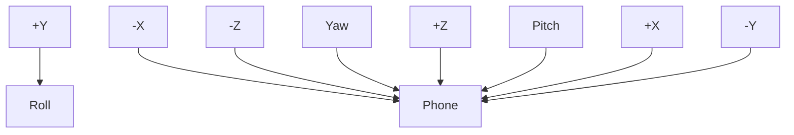
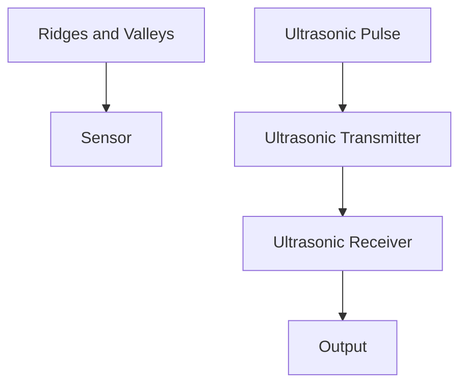
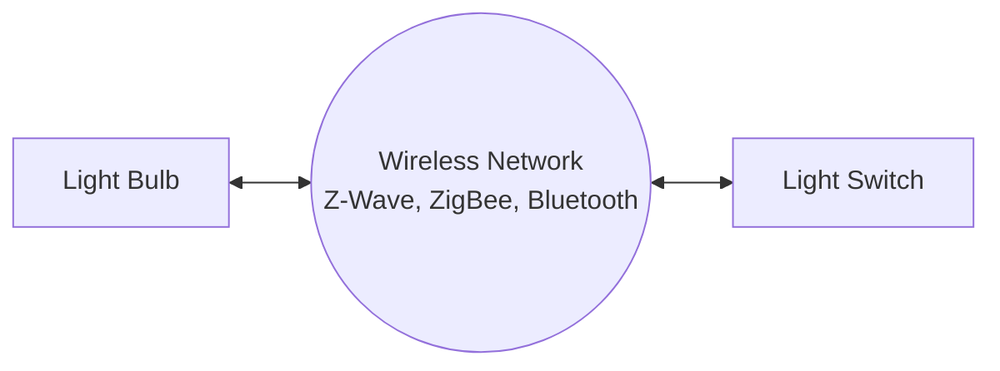
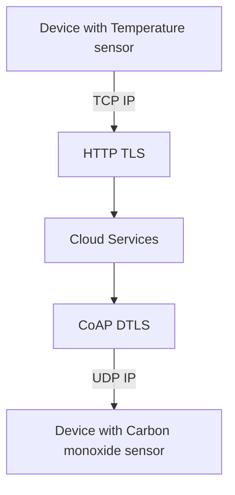
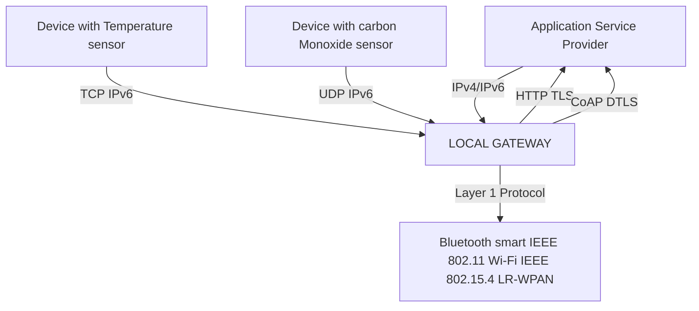
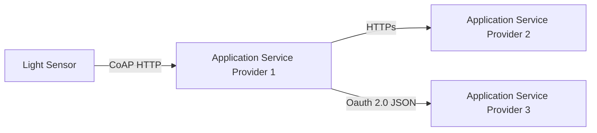

Journal of Data Analysis and Information Processing, 2021, 9, 77-101
https://www.scirp.org/journal/jdaip
ISSN Online: 2327-7203
ISSN Print: 2327-7211

# Internet of Things (IoT)

Radouan Ait Mouha

Anhui Polytechnic University, Wuhu, China
Email: redl.aitmouha@gmail.com

How to cite this paper: Mouha, R.A. (2021) Internet of Things (IoT). Journal of Data Analysis and Information Processing, 9, 77-101.
https://doi.org/10.4236/jdaip.2021.92006

Received: February 2, 2021
Accepted: April 18, 2021
Published: April 21, 2021

Copyright © 2021 by author(s) and Scientific Research Publishing Inc.
This work is licensed under the Creative Commons Attribution International License (CC BY 4.0).
http://creativecommons.org/licenses/by/4.0/

Open Access

## Abstract

Currently, the world is experiencing a strong rush towards modern technology, while specialized companies are living a terrible rush in the information technology towards the so-called Internet of things IoT or Internet of objects, which is the integration of things with the world of Internet, by adding hardware or/and software to be smart and so be able to communicate with each other and participate effectively in all aspects of daily life, so enabling new forms of communication between people and things, and between things themselves, that's will change the traditional life into a high style of living. But it won't be easy, because there are still many challenges and issues that need to be addressed and have to be viewed from various aspects to realize their full potential. The main objective of this review paper will provide the reader with a detailed discussion from a technological and social perspective. The various IoT challenges and issues, definition and architecture were discussed. Furthermore, a description of several sensors and actuators and their smart communication. Also, the most important application areas of IoT were presented. This work will help readers and researchers understand the IoT and its potential application in the real world.

## Keywords

Internet of things (IoT), Smart Communication, Sensors, Actuators, System integration, Smart house/city, Network interface

## 1. Introduction

The term "Internet of Things" (IoT) was coined by Kevin Ashton at a presentation to Proctor & Gamble in 1999. He is one of the founders of the Massachusetts Institute of Technology's Automatic Recognition Lab. He pioneered RFID (used in barcode detector) technology in the field of supply chain management. He also founded Zensi, a company that manufactures energy sensing and monitoring technologies.

DOI: 10.4236/jdaip.2021.92006  Apr. 21, 2021               77            Journal of Data Analysis and Information Processing
The Internet of Things is an emerging topic of technical, social and economic importance. Consumer products, durable goods, cars and trucks, industrial components and facilities, sensors, and other everyday objects are combined with internet connectivity and powerful data analysis capabilities that promise to transform the way we live and work.

A major shift in our daily routines can be observed along with the widespread implementation of IoT devices and technologies. IoT is everywhere, although we don't always see it or know that a device is part of it. For consumers, new IoT products like Internet-enabled devices, home automation components and power management devices drives us toward seeing "Smart home", which provides more safety and energy efficiency. Other IoT personal devices such as wearable fitness and health monitors that support the network-enabled medical devices are transforming the way healthcare services are delivered. The Internet of Things transforms physical objects into an information ecosystem shared between wearable, portable, and even implantable devices, making our life technology and data rich.

The IoT technology promises to be useful for people with disabilities and the elderly, allowing for improved levels of independence quality of life at reasonable cost [1]. Internet of things systems such as networked vehicles, smart traffic systems, and sensors embedded in roads and bridges bring us closer to the idea of "smart cities", which help reduce congestion and energy consumption. IoT technology offers the potential to transform agriculture, industry, and energy production and distribution is increasing availability of information along the production value chain using networked sensors.

A number of companies and research organizations have provided a wide range of expectations about the potential impact of the Internet of Things on Internet and the economy over the next decade. Huawei expects 100 billion IoT connections by 2025 [2]. Manyika et al. [3] estimating the potential economic impact of the Internet of Things from $3.9 to $11 trillion annually in 2025, driven by: Lower device prices, advanced cloud storage computing, higher speed and lower delivery costs. This increases the number of machines and devices connected to the Internet. Also estimated (2015) that the Internet of Things will contribute 4% - 11% of global GDP in 2025.

However, at the same time, the Internet of Things raises significant challenges that could stand in the way of realizing its potential benefits. Attention-grabbing headlines about internet device hacking [4], surveillance concerns [5], and privacy concerns have already captured the public's attention Technical challenges remain, and new political, legal and development challenges arise. This discussion is "promise versus risk" along with the flow of information through popular media and Marketing can make the Internet of Things a complex topic to understand.

This overview paper is designed to help readers and researchers understanding the IoT potential benefits and most key issues that face it. The paper is orga-
nized as follows: Section 2 provides a definition and literature review of IoT; Section 3: describes the components of IoT architecture; Section 4: Sensors and actuators are discussed followed by section 5: identifies important key issues and challenges then communication stage in Section 6. Finally, section 7 provides emerging application domains of IoT.

## 2. Definition and Literature Review

### 2.1. Definition

The definition of the Internet of Things (IoT) is not definitively limited and not currently defined, meaning that there is no general definition approved by the majority or by the global user community, and therefore the Internet of Things is maturing and continuing to be the newest, most popular concept in the world of information technology.

The "Thing" in IoT can be any device with any type of sensor embedded with the ability to collect data and transmit it across the network without manual intervention. The technology embedded in the object helps to interact with internal states and the external environment, which in turn aids in the decision-making process.

The Internet of Things (IoT) is a framework in which all things have a representation and a presence in the Internet. More specifically, the Internet of Things aims at offering new applications and services bridging the physical and virtual worlds, in which Machine-to-Machine (M2M) communications represents the baseline communication that enables the interactions between Things and applications in the cloud. This is defined by IEEE communication magazine [6].

Oxford Dictionaries provides a summary definition that calls the Internet as an element of IoT: "Internet of things (noun): The interconnection via the Internet of computing devices embedded in everyday objects, enabling them to send and receive data" [7].

The Internet of Things creates an inclusive information system, which consists of smaller information systems; Smart devices are connected to the smart home system and connected to smart city systems. In reality, the Internet of Things is far more complicated than that.

### 2.2. Literature Review

The field of Internet of Things leads to a world of technology and to a new era where things can communicate, calculate and transform information fastly. This technology has attracted many researchers who have provided their own researches.

| Research | Direction trend |
| - | - |
| Gaona-Garcia et al. \[8] | Architecture, security and privacy |
| Zhou et al. \[9] | Security and privacy |
| Alavi et al. \[10] | Smart city, transport and healthcare |


DOI: 10.4236/jdaip.2021.92006                              79            Journal of Data Analysis and Information Processing
R. A. Mouha

Continued

| Reference | Focus Area |
| - | - |
| Zanella et al. \[11] | Smart city, transport and healthcare |
| Khajenasiri et al. \[12] | Environment, power and energy |
| Liu et al. \[13] | Authentication and identification |
| Yan et al. \[14] | Authentication and identification, QoS |
| Pei et al. \[15] | Standardization, authentication and identification |
| Palattella et al. \[16] | Interoperability, reliability, scalability |
| Clausen et al. \[17] | Data processing, reliability |
| Qiu et al. \[18] | Agriculture, environmental |
| Talavera et al. \[19] | Agriculture, industrial, environmental |
| Distefano et al. \[20] | Interoperability, scalability |
| Zhang. \[21] | Security and privacy, data processing |
| Li et al. \[22] | Security and privacy, reliability |
| Pereira et al. \[23] | Interoperability, QoS, scalability |


## 3. Architecture

The main problem with the Internet of Things is that it is very broad and unlimited, so to implement its concept is fundamentally dependent on its architecture. In the initial stage of research, the three layer architecture was introduced [24].

### 3.1. The Three Layer Architecture

This architecture consists of three layers. First is the perception layer which is the physical layer. It has sensors for sensing and gathering information about the environment. It senses some physical parameters or identifies other smart objects in the environment. The second is the network layer which is responsible for connecting to other smart things, network devices, and servers. It is also characterized by transmitting and processing sensor data. The third one is the application layer which is responsible for delivering application specific services to the user. It defines various applications in which the Internet of things can be deployed as title of example: smart houses, smart cities and smart health. Figure 1 depicted this architecture.

```mermaid
graph TD
    A[Application Layer<br>Servers | cloud] -->|↕| B[Network Layer<br>Routers & Gateways]
    B -->|↕| C[Perception Layer<br>Sensors & Actuators]
```

Figure 1. 3 Layer architecture

DOI: 10.4236/jdaip.2021.92006                80                Journal of Data Analysis and Information Processing

R. A. Mouha


function there are in your device? Here are the most important ones:

1) Accelerometer:

The Accelerometer sensor detects acceleration, vibration and tilt to determine movement and exact orientation along the three dimensions. Applications use this smart phone sensor to determine whether your phone is in portrait or landscape orientation. It can also tell if your phone screen is facing up word or down ward. The data patterns captured by accelerometer can be used to detect physical activities of the user such as running, walking and bicycling. Figure 3, illustrate this sensor.

2) Gyroscope:

The gyroscope provides orientation details and direction like up-down and left-right but with greater precision like how much the device is tilted. So Gyroscope has the ability of measuring rotation. Hence it can tell how much a smart phone has been rotated and in which direction. Google Sky Map Application use gyroscope sensor to determine the direction towards which your phone is pointed.

Gyroscope sensor is also known as Angular Rate Sensor or Angular Velocity Sensor as shown in Figure 4. This smart sensor is installed in the applications



Figure 3. The accelerometer.

Figure 4. Gyroscope sensor.
[An image showing a hand holding a smartphone with a compass-like interface displayed on the screen. The phone is being held against a backdrop of rocky, mountainous terrain.]

DOI: 10.4236/jdaip.2021.92006                82           Journal of Data Analysis and Information Processing
where the orientation of the object is difficult to sens by humans. Measured in degrees per second, angular velocity is the change in the rotational angle of the object per unit of time. Furthermore Gyroscope sensor can also measure the motion of the object, so for more robust and accurate motion sensing, Gyroscope sensor is combined with Accelerometer sensor.

3) Magnetometer:
Usually known as a compass, it can detect magnetic fields, so the Compass app in smartphones uses this sensor to point to the north pole of the planet. This smart sensor is used in metal detector, and you can find it whenever you open Google Maps or Maps App. The magnetometer is housed in a small electronic chip that often includes another sensor, and is usually built into the accelerometer that helps correct the initial magnetic measurements using tilt information from the auxiliary sensor. Figure 5 shows a module of magnetometer sensor.

4) GPS:
GPS speak short of Global Positioning System, units in smart phone communicate with the satellites to determine precisely our location on Earth. The GPS technology does not actually use internet data, this is why once we open the App we can find our location on maps even the offline of Network, but the map itself is blurry as it requires network to load details. GPS is used in all location-based Applications. Accelerometer, gyroscope, magnetometer and GPS work together to create the perfect navigation in your smartphone.

5) Microphone:
The microphone is basically a sound sensor that detects and measures the loudness of sound. Smartphone generally use micro-sized electret microphones as shown in Figure 6, because there are so many and diverse type of microphones.

6) Ambient Light Sensor:
The light sensor detects lighting levels in the vicinity to adjust screen brightness accordingly. It is used in automatic brightness adjustment to reduce or increase the brightness of the smartphone screen based on the availability of light, Figure 7. Dimming the screen on a mobile device also prolongs the lifetime of the battery.

[An image of a small blue electronic circuit board is shown. It appears to be a magnetometer sensor module. The board has various components and connection points visible.]

Figure 5. Magnetometer sensor.

DOI: 10.4236/jdaip.2021.92006                83           Journal of Data Analysis and Information Processing
R. A. Mouha

Figure 6. Microphone sensor.

Figure 7. Ambient light sensor.

Figure 8. Touch screen sensor.

7) Touchscreen Sensors:
The smart phone sensors in the touch screen contain an electric current running through it at all times and touching the screen causes a change in the signals. This change is an input to the device. Figure 8 illustrate it. Nowadays, all smartphones use this screen technology. Deeply, the touch screen is responsible for basic input and output operations, and it is used for tapping and writing letters. The touch screen contains three main interaction actions:

i) The main activity and goal of the touchscreen is touching or tapping is defined as the process of clicking on the screen in any place to open, to close or to type a character.

ii) Multi-touch is defined as the process of tapping the screen by more than

DOI: 10.4236/jdaip.2021.92006                              84            Journal of Data Analysis and Information Processing
one finger simultaneously, and this function is usually used in gaming applications.

iii) Gesture is defined as the process of drawing a certain pattern on the touchscreen. Gestures may be implemented with one finger as drag and drop or multi-fingers as in the process of editing photos exactly resizing and changing camera zoom.

8) Fingerprint Sensor:
Gone are the days of saving passwords and all patterns to unlock your phone and now it's technology time, as many users prefer to use a fingerprint scanner. The fingerprint sensor enables biometric verification to secure many smart-phones today. It is a capacitive scanner that records the user's fingerprint electrically. When you place your finger on its surface, the edges of your fingerprints touch the surface while there is a slight gap between the sockets between the edges. In short, it measures distances and the uneven pattern between the edges on the surface of your finger. This smartphone sensor is very useful in applications that require authentication such as mobile payment applications (ex: We-chat pay).

Moreover, it is the year 2021 of the high tech century, so we don't have just one, but instead, different types of fingerprint scanners. From the traditional fingerprint scanners prevalent during biometric authentication initiation to today's related capacitive scanners to the latest ultrasound scanners, however, in reality, the most used type of fingerprint scanner should be the capacitive scanner, currently you will start to see some smartphone manufacturers adopting an all-new ultrasonic fingerprint scanner on their smartphone. Here are the most important types:

i) Optical Fingerprint Scanners: It is obviously from the name suggests, an optical scanner involves the use of optics which is light to capture and scan fingerprints on a device. Essentially, the scanner works by capturing a digital photograph of the fingerprint and then using algorithms to find unique patterns of lines and ridges, spread across the different lighter and darker areas of the image. This image is 2 dimension (2D) depiction of the different patterns of ridges and lines present on the finger and since it comprises of details in the darker sections of the image as well, the same is lit-up using a light source, typically an LED to capture a detailed image. For increasing the level of security, the quality of image is required, because it plays an important role in getting a high definition and detailed image of the fingerprint, which would make it easier to extract more data from the image. Optical fingerprint sensors may be affected by many real-world factors such as stray light, surface pollution, and possibly even a fingerprint left by a previous user. Oil, dirt, scratches on the sensor surface, and condensation are common pollutants that degrade image quality. Figure 9 shows how optical fingerprints work.

ii) Capacitive Fingerprint Scanners: It's easy to get the idea of involving capacitors in capacitive scanners. However, the definition of a capacitor is an elec-
tronic component that stores electrical energy in an electric field. In fact, now you'll be wondering about its main role in capacitive scanners, it is really important for you to understand that unlike scanners that capture a 2D image of a fingerprint, capacitive scanners capture various details of the fingerprint using only electrical signals. For this purpose, it uses a series of small capacitor circuits, arranged in a matrix, to store the captured fingerprint data. Through the scoring process, a change in protrusions and lines leads to a change in the scoring process, as the charge will be different with respect to the finger placed on the capacitive plate and differ in relation to the air gap between the ridges and the lines. Hence, this change in the capacitor charge is determined using an operational amplifier (AOP) and then recorded with the help of an analog digital converter (ADC). Capacitive sensors can be sensitive to electrostatic discharge but insensitive to ambient light and are more resistant to pollution problems than some optical designs. Figure 10 shows the main function.

iii) Ultrasonic Fingerprint Scanners: This technology is considered the latest

Figure 9. Optical Fingerprint scanners working way.

Figure 9 shows an optical fingerprint scanner's working way. It includes:
- A ridge and valley structure of a fingerprint
- Skin contact point
- A prism that reflects light
- A light source (such as an LED)
- A lens
- An image sensor (such as CCD or CMOS)
- The path to image sampling and processing circuitries

Figure 10. Capacitive Fingerprint Scanners working way.

Figure 10 illustrates the direct capacitive measurement in fingerprint scanners:
- It shows a ridge and valley structure of a fingerprint
- A protective coating layer
- Response signal indicators
- A magnifying glass focusing on the ridge area

DOI: 10.4236/jdaip.2021.92006                86            Journal of Data Analysis and Information Processing
in fingerprint scanning technology. Unlike optical and capacitive scanners that use light and condenser, the ultrasound scanner uses a high frequency ultra-sound. The process involves the use of an ultrasound pulse, which is sent through an ultrasound transmitter toward the finger that rests on the scanner. This impulse immediately strikes the finger, part of it moves, while part of it is reflected back. This last pulse is then captured by an ultrasound receiver, which depends on the pulse's intensity, and captures a 3D image of the fingerprint. This change causes the intensity of the pulse in the finger tissue that forms the bumps and lines. Ultrasound fingerprint scanners have the advantage of being able to see under the skin. Not only does this provide live finger verification, but it provides more information as a biometric. Figure 11 shows ultrasonic.

9) Heart Rate Sensor:
The heart rate sensor measures the heartbeat with the help of optical sensors and LED lights. An LED light is emitted towards the skin and this smartphone sensor detects the light waves that are reflected on it. There is a difference in the intensity of the light when there is a pulse. Heart rhythm is measured by calculating changes in the intensity of light between minute pulses of the blood vessels. Many fitness and health apps use this method to calculate your heart rate.

10) Barcode/QR Code Sensor:
Most smartphones have barcode sensors that can read a barcode by detecting the light reflected from the code. It generates an analog signal with a variable voltage representing the barcode. Then this analog signal is converted into a digital signal and finally is decoded to reveal the information in it. Barcode sensors are useful for scanning barcode or QR code products. It is used in most social media applications and very useful in payment process.

## 4.2. Medical Sensors

The Internet of Things plays a more important role in medical technology with the goal of making medical devices more effective and safer, while simplifying their operations. The Internet of Things is expanding the medical field with many



Figure 11. Ultrasonic fingerprint scanners.

DOI: 10.4236/jdaip.2021.92006                             87            Journal of Data Analysis and Information Processing
applications based on smart sensors, which monitor the health of a patient when he is not in the hospital or when he is alone. After that, they can provide immediate feedback to the doctor, relatives, or patient. In the medical market, you can find many wearable sensors available as shown in Figure 12. They are equipped with medical sensors that are able to diagnose the patient and measure various parameters like heart rate, respiratory rate, blood pressure, blood sugar levels, and body temperature [27].

The Internet of Things is striving to obtain its new device that surpassed the smart devices that the user wears, this device to detect spots that are affixed to the skin, such tattoos on the skin are disposable, stretchy and very cheap. The electronic fitting is rubber housing. The patient is supposed to wear these pads for a few days to monitor a vital health laboratory continuously [28].

## 4.3. Specialized Physical, Mechanical, and Chemical Sensors

Touch, temperature, or air pressure sensors can be combined for use in more specialized applications. For certain mobile work settings, more sensors such as gas concentration and radiation sensors can be added to increase the user's perceptual capabilities and facilitate automatic information capture.

## 4.4. Radio Frequency Identification (RFID)

RFID (Radio Frequency Identification) [29] is a form of radio communication that involves the use of electromagnetic or electrostatic coupling in the radio frequency portion of the electromagnetic spectrum to uniquely identify an object, animal, or person. RFID technology use cases include healthcare, manufacturing, inventory management, shipping, retail sales, and home use. There are two common types of RFID. First, Active RFID tags contain the transmitter and power supply (battery) on board the tag. These are mostly UHF solutions, and reading ranges can extend up to 100 meters in some cases. Second, Passive RFID solutions, the reader and reader antenna send a signal to the tag, and this signal is used to power the tag and reverse the power back to the reader. There are negative LF, HF and UHF systems. The reading ranges are shorter than the active tags and are limited by the strength of the radio signal that is reflected back to the reader (tag back-scatter). Figure 13 shows a module of RFID.

Figure 12. Smart watches and fitness trackers in left, Embedded skin patch in right.

DOI: 10.4236/jdaip.2021.92006                             88            Journal of Data Analysis and Information Processing
Figure 13. Radio frequency identification.

Actuators:

Actuators are mechanical or electro-mechanical devices that provide controlled and sometimes limited movements or positioning that are actuated electrically, manually or by various fluids such as air, hydraulic, etc. Linear actuators convert power into linear motions, usually for positioning applications (Electric and Hydraulic). A hydraulic actuator consists of a cylinder or fluid drive that uses hydraulic power to facilitate mechanical operation. Mechanical movement gives an output in terms of linear, rotational, or oscillatory motion. Just as it is almost impossible to compress a fluid, a hydraulic actuator can exert great force. The disadvantage of this approach is its limited acceleration. Electric actuators use electrical energy. The electric actuator may provide operating power/torque in one of several ways. Electromechanical actuators can be used to drive a motor that converts electrical energy into mechanical torque. The other path is elec-tor-hydraulic actuators, where the electric motor remains the main drive and furthermore provides torque to drive a hydraulic collector which is then used to transmit drive power in the same way that a diesel engine/hydraulic component is normally used in heavy equipment.

Rotary actuators convert energy to provide rotational motion (Pneumatic). Pneumatic actuators use compressed air. Pneumatic actuators also allow large forces to be produced from relatively small pressure changes. A pneumatic actuator converts the energy formed by the vacuum or compressed air at high pressure into linear or rotational motion. The pneumatic power is eligible for main motor control because it can respond quickly at start and stop as the power supply does not need backup storage for operation. Pneumatic actuators are safer, cheaper, more reliable, and more powerful than other motors. Figure 14 shows an example of water pump.

## 5. Main Issues and Challenges of IoT

The sharing of IoT based systems in all aspects of human lives and the various technologies involved in transferring data between embedded devices made it complex and led to many problems and challenges. These include security; privacy;

DOI: 10.4236/jdaip.2021.92006                             89           Journal of Data Analysis and Information Processing
R. A. Mouha

```mermaid
graph LR
    A[Soil moisture sensor detects unwanted water content] -->|wfv| B[Sends detected value signal to the control center]
    B -->|o)))| C[Control center sends command to water pump]
    C -->|<...>| D[Water pump switched-off and halt to deliver water]
```

Figure 14. Example of an actuator (pump water).

interoperability and standards; legal, regulatory, and rights; and emerging economies and development.

## 5.1. Security

While security considerations are not new in the IT context, the features of many IoT applications present new and unique security challenges. Facing these challenges and ensuring security in IoT products and services should be a primary priority, and users need to trust that IoT devices and related data services are protected from vulnerabilities, especially as this technology has become more pervasive and integrated in our daily lives. Poorly secured IoT devices and services can act as potential entry points for a cyber attack and expose user data to theft by leaving data flow insufficiently protected [30]. The interconnected nature of IoT devices means that every poorly secured device connected to the Internet has the potential to affect Internet security and resiliency globally. This challenge is amplified by other considerations such as the widespread deployment of homogeneous IoT devices, the ability of some devices to automatically connect to others, and the potential for deploying these devices in insecure environments [31].

## 5.2. Privacy

The full potential of the Internet of Things depends on strategies that respect individual privacy options across a wide range of expectations. The data flows and user privacy that IoT devices provide can open up incredible and unique value for IoT users, but concerns about privacy and potential harms may hinder the full adoption of IoT. This means that privacy rights and respect for user privacy expectations are integral to ensuring user confidence in the Internet, connected devices, and related services [32].

## 5.3. Interoperability and Standards

Interoperability is the ability to exchange information between various IoT devices and systems. This exchange of information is not based on published software and hardware. The problem of interoperability arises due to the heterogeneous nature of the technology and the various solutions used to develop IoT. The four levels of interoperability are technical, semantic, syntactic, and organi-

DOI: 10.4236/jdaip.2021.92006                             90         Journal of Data Analysis and Information Processing
zational [33]. With interoperability as an important issue, researchers have agreed with several solutions such as adaptive, gateway based, virtual network and service based architecture. They are also known as approaches to dealing with interoperability [34]. Although the methods of dealing with interoperability relieve some pressure on IoT systems, there are still some challenges that remain with the possibility of interoperability which could be an area for future studies [35].

## 5.4. Legal, Regulatory, and Rights

The use of IoT devices raises many new regulatory and legal questions in addition to amplifying existing legal issues around the Internet. The questions are wide-ranging, and the rapid rate of change in IoT technology often outpaces the adaptability of associated policies and legal and regulatory structures. With the development of the Internet of Things, many real-life problems have been solved but have also given rise to critical ethical and legal challenges such as data security, privacy protection, trust, security, and data usability [36]. It has also been observed that the majority of IoT users support government rules and regulations regarding data protection, privacy and safety due to mistrust of IoT devices. Therefore, this issue should be taken into consideration to maintain and improve trust among people regarding the use of IoT devices and systems.

## 5.5. Emerging Economies and Development

The Internet of Things holds great promise to deliver social and economic benefits to emerging and developing economies. This includes areas such as sustainable agriculture, water quality and use, health care, manufacturing, and environmental management, among others. As such, the Internet of Things holds promise as a tool for achieving the United Nations Sustainable Development Goals [37].

## 6. Communication

The Internet of Things consists of many smart devices that communicate with each other. These devices enable data exchange and collection. Smart devices can have a wired or wireless connection. Typically, IoT devices connect to the Internet through the Internet Protocol (IP) stack. This combination is very complex and requires a large amount of power and memory from the connected devices. These devices can also be connected locally through NON-IP networks which consume less power and connect to internet via smart gateway [38].

### 6.1. Device-to-Device Communications

A device-to-device communication model represents two or more devices that directly communicate and communicate with each other, rather than an intermediary application server. These devices communicate over many types of networks, including IP and The internet. However, these devices use protocols like Bluetooth, Z-Wave or ZigBee to create direct device-to-device connections [39]. Figure 15 shows this direct connection of a real example.
Device-to-device networks allow these devices that committed to a specific connection a protocol for communication and exchange messages to achieve their task. This is the contact form is commonly used in applications such as home automation systems. Usually, small data packets are used information for communicating between devices with relatively low data rate requirements.

## 6.2. Device-to-Cloud Communications

In the device-to-cloud communication model, IoT device connects directly to the internet cloud. A service like an application service provides data exchange and message movement control. This approach often takes advantage of the menu communication mechanisms like traditional Ethernet or Wi-Fi wired connections to create connection between device and IP network, which eventually connects to the cloud services as illustrated in Figure 16.

## 6.3. Device-to-Gateway Communications

In the device-to-gateway model, the device layer gateway to the application (ALG). The IoT device communicates through an ALG serving as a channel to access the cloud services. Simply, this means that there is an application program running on a local gateway device which acts as an intermediary between device and cloud service and provides security and data translation. The form is shown in Figure 17.

In most cases, a smartphone with an application to communicate with a device

Figure 15. Example of device-to-device communication model.

Figure 15. Example of device-to-device communication model.



Figure 16. Example of device-to-cloud communication model.

Figure 16. Example of device-to-cloud communication model.



DOI: 10.4236/jdaip.2021.92006                          92          Journal of Data Analysis and Information Processing
acts as a local gateway and transfers the data to a cloud service. Devices like a fitness tracker are unable to connect directly to the cloud. Hence, they rely on smart phone applications to transfer data to the cloud.

## 6.4. Back-End Data-Sharing Model

The back-End data sharing model refers to a communication architecture that enables users to export and analyze smart object data from a cloud service in combination with data from other sources. The data is then uploaded to two different application service providers. The architecture also helps with data collection and analysis. For example, an industrialist is interested in analyzing the energy consumption of the plant by collecting the data produced by the IoT sensors and utility systems.

The back-end data sharing model suggests unified cloud services [40] or cloud approach application programmer interfaces (APIs) are necessary to achieve smart interoperability Cloud-hosted device data [41]. Figure 18 presents this model.

Figure 17. Example of device-to-gateway model.



Figure 18. Example of Back-End data sharing model.



DOI: 10.4236/jdaip.2021.92006                           93           Journal of Data Analysis and Information Processing
# 7. Applications of IoT

This new wave of technology will stand at the leading position for all technologies around the world, which are directed towards billions and billions of connected smart devices that use all the data in our lives. With new wireless networks, high sensors, and superior capabilities, IoT applications promise to make our lives easier and bring enormous value. Some uses of IoT applications are found in several important areas. The following application areas are the top for 2020 analysis [42].

## 7.1. Area 1: Manufacturing/Industrial

The IoT industrial application area covers a wide range connection of objects to objects, projects from inside and outside. For the inside, many IoT-based factory automation and control projects include comprehensive smart factory solutions with many elements such as production floor monitoring, wearable devices and augmented reality in the shop floor, remote PLC or automated quality control systems. Typical off-plant projects include remote control of connected machines, and equipment monitoring. Several case studies indicate that the main drivers for OEMs to provide IoT solutions are "reduced downtime and cost savings".

### Autonomous vehicles: Free-roaming robots move across factory floors:
Nowadays with the convergence of technologies like robotics, sensors, 3D cameras, 5G connectivity, software and artificial intelligence, swarms of autonomous vehicles having found their way safely onto factory floors as a means of increasing the speed and accuracy of routine operation. These free-roaming robots can be coordinated to a greater extent than ever before, enabling them to perform automated tasks in a controllable and predictable manner and with minimum human oversight. This gives them the potential to improve operations inside manufacturing plants, especially in areas such as component handling and transportation, offering opportunities to increase productivity, reduce risk, decrease cost and improve data collection. This liberates workers to focus their attention on higher value activities such as production and assembly. For example, an Italian manufacturer namely Automotive Systems Manufacturer Faurecia (ASMF) is using autonomous vehicles from Mobile Industrial Robots to increase the efficiency of its logistics [43].

### Machine utilisation: Making the most of industrial assets:
The IoT architecture has emerged as a popular and powerful way to monitor machine usage, sending valuable performance data to operators via dashboards to inform them of machines that are running more efficiently compared to other equipment. These platforms can act as a major driver in improving factory floor production, primarily by eliminating bottlenecks due to low-performing assets. They can also be used to compare the performance of devices across one or more sites [44].

## 7.2. Area 2: Transportation/Mobility

### Maintaining vehicle health:
Predictive maintenance technology relies on the
use of Internet of Things (IoT) communication tools that collect data about the performance of different parts, transfer that data to the cloud in real time and assess the risk of a possible malfunction of the vehicle's hardware or software. After the information is processed, the driver is notified and informed of any service or repair necessary to avoid potential accidents. With Internet of Things connectivity tools, you can forget about unplanned stops or breakdowns during the ride [45].

Transforming the meaning of vehicle ownership: One of the most interesting future applications of the IoT in transportation is vehicle ownership. According to a recent study by Tony and James [46], car ownership will decrease by 80% by 2030. You can see that actually happen. City dwellers sell or never buy cars. They choose to use ride-sharing and vehicle-sharing platforms or ride-sharing like Uber, DiDi and Alibaba bikes, in addition to relying on steadily improving public transportation services.

## 7.3. Area 3: Energy

With energy consumption worldwide expected to grow by 40% over the next 25 years, the need for a smarter energy solution has reached an all-time high. Fortunately, there are some major shifts towards more efficient energy management from smart light bulbs to fully autonomous offshore oil platforms. Overall, IoT is revolutionizing nearly every part of the energy industry from generation to transmission to distribution and changing how energy companies and customers interact. It is difficult to underestimate the current impact of the Internet of Things on the energy sector. With the increasing demand for process automation and operational efficiency, more companies are exploring IoT use cases in energy management.

Energy system monitoring and maintenance: IoT can be used in the energy industry to track a number of system metrics, including overall health, performance, and efficiency. As a result, their maintenance is simplified. Whether it's a wind turbine, solar panels, or other important equipment, it can be difficult to pinpoint a problem before the system crashes. Moreover, checking for issues manually is a very waste and tedious process.

Increased efficiency: Improving the efficiency of coal-fired plants is one of the most difficult challenges in the electricity industry today. Plant technology is usually more mature, systems are very complex and average efficiency rates are low. General Electric today released a new digital energy program designed to play a significant role in helping countries meet COP21 greenhouse gas emissions targets. Using IoT helps increase the efficiency of a coal power plant by up to 16%, while reducing greenhouse gas emissions by 3%. This is achieved by improving fuel combustion and adjusting the process according to the characteristics of the fuel being burned.

Safety and disaster prevention: IoT solutions can also be used in the energy industry to improve operational safety and prevent production accidents, as well
as eliminate their consequences, such as Safety drones [47] that can be used as part of a risk management system to reduce employee risks at nuclear plants or on mining sites.

Smart meters: These IoT power devices connect consumers directly to the power distribution station, allowing two-way communication. Thus, they can send critical operating information to utility agencies in real time. So this direct connection helps utility agencies to quickly address any performance issues, including outages and reduce system downtime. Smart meters can automatically identify and isolate the damaged portion of the line without affecting the performance of the rest of the network. In general, specialized companies find that there are many ways in which consumers can benefit from the use of smart meters.

## 7.4. Area 4: Retail

More and more retailers are realizing that they can improve their cost efficiency and in-store customer experience through innovative IoT use cases. There is an increase for retailers to digitize stores and create smarter operations. Retail now accounts for 9% of selected projects, up from 5%. Typical IoT in retail solutions include in-store digital signage, customer tracking and engagement, merchandise control, inventory management, smart vending machines and more [48].

## 7.5. Area 5: Smart Cities

Thanks to the power of the Internet of Things, entire cities are becoming digitally interconnected and thus smarter. By collecting and analyzing huge amounts of data from IoT devices across different city systems, cities improve the lives of citizens. Smart cities can make better decisions through the data they collect on infrastructure needs, transportation requirements, crime and safety. A study shows that using existing smart city applications, cities improve quality of life indicators (such as crime, traffic, and pollution) by between 10% and 30%. Internet of Things technologies in everyday life as part of your home, transportation, or city, relate to a more efficient and enjoyable life experience. IoT promises a better quality of life through routine chores and increased health and wellness [49].

## 7.6. Area 6: Healthcare

The Internet of Things has only slowly spread in healthcare. However, things seem to be changing in light of the epicenter of the COVID-19 pandemic. Early data indicates that digital health solutions related to COVID-19 are on the rise. Demand is increasing for specific IoT health applications such as telehealth consulting, digital diagnostics, remote monitoring, and robotic assistance. IoT Healthcare apps help with; Reduced waiting time for the emergency room; Track patients, employees, and inventory; Strengthening drug management; Ensure the availability of important devices. IoT has also introduced several wearables and devices which has made lives of patients and doctors comfortable. Please check
this work [50] for more details.

## 7.7. Area 7: Supply Chain

As supply chains extend more and more to end customers, resulting in more complex flows of goods whose delivery is more complex, logistics service providers are increasingly integrating connected digital solutions to address complexity. In the supply chain, Internet of Things devices are an effective way to track and authenticate products and shipments using GPS and other technologies. In addition, they can also monitor product storage conditions which enhance quality management throughout the supply chain. IoT devices revolutionized supply chain management. It is easier to understand where the goods are and how they are also stored when they can be expected at a specific location.

Here are the major benefits:
1) Authenticate the Location of Goods at any time.
2) Track Speed of Movement and when Goods will arrive.
3) Monitor Storage Conditions of Raw Materials and Products.
4) Streamline the Problematic Movement of Goods.
5) Locate Goods in Storage.
6) Administer Goods Immediately Upon Receipt [51].

## 7.8. Area 8: Agriculture

The current world population is 7.8 billion in 2020 and it is expected to reach 8.6 billion in 2030, 10 billion in 2050 and 11.2 billion in 2100, according to the most recent United Nations estimates elaborated by Worldometer [52]. Just imagine how you can feed such a massive population with a simple agriculture. So to feed this huge population required to marry agriculture to technology and obtain good results.

A smart greenhouse is one of many possibilities that exist for solving this problem. The smart greenhouse is a revolution in agriculture, creating a self-regulating microclimate suitable for plant growth through the use of sensors, motors, and monitoring and control systems that improve growing conditions and automate the growth process [53].

## 7.9. Area 9: Buildings

Majority believe that smart buildings will provide greater connectivity in building systems. Certainly, buildings contain complex mechanical HVAC systems as well as control systems that can improve the comfort and productivity of building occupants. Therefore, smart building technology can provide the means to achieve higher levels of integration between existing building systems. This is expected to increase as open standards continually pave the way. However, smart building technology will go beyond those concepts. Smart buildings have an amazing ability to connect people with technology. Not only will smart building technology assist in the facility management effort, but smart building technology will also provide valuable insights for the use and enjoyment of building spaces. It will benefit energy efficiency, building sustainability, and workforce

DOI: 10.4236/jdaip.2021.92006                            97           Journal of Data Analysis and Information Processing
management efforts. Smart house, also called home automation is the trend in this area [54].

## 8. Conclusions

IoT has gradually brought about a lot of technological changes in our daily life, which in turn helps make our lives simpler and more comfortable, through various technologies and applications. There is an infinite benefit to IoT applications in all fields. The Internet of Things holds an important promise to provide social and economic benefits to the emerging and developing economy. This includes areas such as sustainable agriculture, water quality and use, health care, manufacturing and environmental management, among others. As such, the IoT holds promise as a tool in achieving the United Nations Sustainable Development Goals. However, the issues and challenges associated with IoT must be considered and addressed in order to realize the potential benefits to individuals, society and the economy.

Ultimately, solutions will not be found to maximize the benefits of the IoT while minimizing the risks by engaging in a polarized discussion that pits IoT's promises against its potential risks. In a way, it will take informed participation, dialogue and collaboration across a range of stakeholders to chart the most effective way forward, and the set of IoT challenges will not be limited to industrialized countries. Developing regions will also need to respond to realize the potential benefits of the Internet of Things. In addition, it will need to address unique needs and challenges for implementation in less developed regions, including infrastructure readiness, market and investment incentives, technical skills requirements, and policy resources.

## Conflicts of Interest

The author declares no conflicts of interest regarding the publication of this paper.

## References

[1] Domingo, M.C. (2012) An Overview of the Internet of Things for People with Disabilities. Journal of Network and Computer Applications, 35, 584-596.
    https://doi.org/10.1016/j.jnca.2011.10.015

[2] Manyika, et al. (2015) The Internet of Things: Mapping the Value Beyond the Hype.
    Mckinsey Global Institute, San Francisco.

[3] Global Connectivity Index. Huawei Technologies Co., Ltd., 2015. Web. 6 Sept. 2015.
    http://www.huawei.com/minisite/gci/en/index.html

[4] Greenberg, A. (2015) Hackers Remotely Kill a Jeep on the Highway—With Me in It.
    http://www.wired.com/2015/07/hackers-remotely-kill-jeep-highway

[5] Bradbury, D. (2015) How Can Privacy Survive in the Era of the Internet of Things?
    The Guardian, April 7, Sec. Technology.

[6] IEEE Communication Society—IEEE Communication Magazine.
    https://www.comsoc.org/publications/magazines/ieee-communications-magazine

DOI: 10.4236/jdaip.2021.92006                98         Journal of Data Analysis and Information Processing
[7] Oxford Dictionaries, Definition of "Internet of Things".
https://www.lexico.com/en/definition/internet_of_things

[8] Gaona-Garcia, P., Montenegro-Marin, C.E., Prieto, J.D., Nieto, Y.V. (2017) Analysis of Security Mechanisms Based on Clusters IoT Environments. International Journal of Interactive Multimedia and Artificial Intelligence, 4, 55-60.

[9] Zhou, J., Cap, Z., Dong, X. and Vasilakos, A.V. (2017) Security and Privacy for Cloud-Based IoT: Challenges. IEEE Communications Magazine, 55, 26-33.
https://doi.org/10.1109/MCOM.2017.1600363CM

[10] Alavi, A.H., Jiao, P., Buttlar, W.G. and Lajnef, N. (2018) Internet of Things-Enabled Smart Cities: State-of-the-Art and Future Trends. Measurement, 129, 589-606.
https://doi.org/10.1016/j.measurement.2018.07.067

[11] Zanella, A., Bui, N., Castellani, A., Vangelista, L. and Zorgi, M. (2014) Internet of Things for Smart Cities. IEEE Internet of Things Journal, 1, 22-32.

[12] Khajenasiri, I., Estebsari, A., Verhelst, M. and Gielen, G. (2017) A Review on Internet of Things for Intelligent Energy Control in Buildings for Smart City Applications. Energy Procedia, 111, 770-779.

[13] Liu, T., Yuan, R. and Chang, H. (2012) Research on the Internet of Things in the Automotive Industry. ICMeCG 2012, Beijing, 20-21 October 2012, 2-13.
https://doi.org/10.1109/ICMeCG.2012.80

[14] Yan, Z., Zhang, P. and Vasilakos, A.V. (2014) A Survey on Trust Management for Internet of Things. Journal of Network and Computer Applications, 42, 120-134.
https://doi.org/10.1016/j.jnca.2014.01.014

[15] Pei, M., Cook, N., Yoo, M., Atyeo, A. and Tschofenig, H. (2016) The Open Trust Protocol (OTrP). IETF.

[16] Palattella, M.R., Dohler, M., Grieco, A., Rizzo, G., Torsner, J., Engel, T. and Ladid, L. (2016) Internet of Things in the 5G Era: Enablers, Architecture and Business Models. IEEE Journal on Selected Areas in Communications, 34, 510-527.

[17] Clausen, T., Herberg, U. and Philipp, M. (2011) A Critical Evaluation of the IPv6 Routing Protocol for Low Power and Lossy Networks (RPL). IEEE 7th International Conference on Wireless and Mobile Computing, Networking and Communications (WiMob), Shanghai, 10-12 October 2011, 1-11.

[18] Qiu, T., Xiao, H. and Zhou, P. (2013) Framework and Case Studies of Intelligent Monitoring Platform in Facility Agriculture Ecosystem. 2013 Second International Conference on Agro-Geoinformatics (Agro-Geoinformatics), Fairfax, 12-16 August 2013, 1-9.

[19] Talavera, J.M., et al. (2017) Review of IoT Applications in Agro-Industrial and Environmental Fields. Computers and Electronics in Agriculture, 142, 283-297.
https://doi.org/10.1016/j.compag.2017.09.015

[20] Distefano, S., Longo, F. and Scarpa, M. (2015) QoS Assessment of Mobile Crowd Sensing Services. Journal of Grid Computing, 13, 629-650.
https://doi.org/10.1007/s10723-015-9338-7

[21] Zhang, L. (2011) An IoT System for Environmental Monitoring and Protecting with Heterogeneous Communication Networks. 2011 6th International ICST Conference on Communications and Networking in China (CHINACOM), Harbin, 17-19 August 2011, 122-134.

[22] Li, H., Wang, H., Yin, W., Li, Y., Qian, Y. and Hu, F. (2015) Development of Remote Monitoring System for Henhouse Based on IoT Technology. Future Internet, 7, 329-341. https://doi.org/10.3390/fi7030329
[23] Pereira, C. and Aguiar, A. (2014) Towards Efficient Mobile M2M Communications: Survey and Open Challenges. Sensors, 14, 19582-19608. https://doi.org/10.3390/s141019582

[24] Miao, W., Ting, L., Fei, L., ling, S. and Hui, D. (2010) Research on the Architecture of Internet of Things. 3rd International Conference on Advanced Computer Theory and Engineering (ICACTE), Chengdu, 20-22 August 2010, 1-15. https://doi.org/10.1109/ICACTE.2010.5579493

[25] Zhang, H.D. and Zhu, L. (2011) Internet of Things: Key Technology, Architecture and Challenging Problems. 2011 IEEE ICCSAE, Shanghai, 10-12 June 2011, 3-12. https://doi.org/10.1109/CSAE.2011.5952899

[26] Schmidt, A. and Van Laerhoven, K. (2001) How to Build Smart Appliance. IEEE Personal Communications, 8, 66-71. https://doi.org/10.1109/98.944006
https://www.researchgate.net/publication/216439745_How_to_Build_Smart_Appliances

[27] McGrath, M.J. and Scanaill, C.N. (2013) Body-Worn, Ambient, and Consumer Sensing for Health Applications. In: Sensor Technologies, Springer, Berlin, 181-216. https://doi.org/10.1007/978-1-4302-6014-1_9

[28] Swan, M. (2012) Sensor Mania! The Internet of Things, Wearable Computing, Objective Metrics and the Quantified Self 2.0. Journal of Sensor and Actuator Networks, 1, 217-253.

[29] Zhu, X., Mukhopadhyay, S.K. and Kurata, H. (2012) A Review of RFID Technology and Its Managerial Applications in Different Industries. Journal of Engineering and Technology Management, 29, 152-167.

[30] Gatsis, K. and Pappas, G.J. (2017) Wireless Control for the IoT: Power Spectrum and Security Challenges. 2017 IEEE/ACM Second International Conference on Internet of Things Design and Implementation (IoTDI), Pittsburgh, 18-21 April 2017, 341-342. https://doi.org/10.1145/3054977.3057313

[31] Babovic, Z.B., Protic, V. and Milutinovic, V. (2016) Web Performance Evaluation for Internet of Things Applications. IEEE Access, 4, 6974-6992.

[32] Wilton, R. (2014) CREDS 2014-Position Paper: Four Ethical Issues in Online Trust. Issue Brief No. CREDS-PP-2.0. Internet Society.

[33] Van-der-Veer, H. and Wiles, A. (2008) Achieving Technical, Interoperability—The ETSI Approach.

[34] Noura, M., Atiquazzaman, M. and Gaedke, M. (2017) Interoperability in Internet of Things Infrastructure: Classification, Challenges and Future Work. Third International Conference, IoTaaS 2017, Taichung, 20-22 September 2017, 11-18. https://doi.org/10.1007/978-3-030-00410-1_2

[35] Noura, M., Atiquazzaman, M. and Gaedke, M. (2019) Interoperability in Internet of Things: Taxonomies and Open Challenges. Mobile Networks and Applications, 24, 796-809.

[36] Tzafestad, S.G. (2018) Ethics and Law in the Internet of Things World. Smart Cities, 1, 98-120. https://doi.org/10.3390/smartcities1010006

[37] The Internet Governance Forum Dynamic Coalition on the Internet of Things (DC IoT) Has Been Particularly Active in Considering the Impact and Challenges of IoT in Emerging and Developing Economies. http://www.iot-dynamic-coalition.org

[38] The List of United Nations Sustainable Development Goals and Targets. https://www.un.org/development/desa/disabilities/envision2030.html

[39] IoT Technology & Protocols. https://data-flair.training/blogs/iot-technology
[40] Tschofenig, H., et al. (2015) Architectural Considerations in Smart Object Networking. Internet Architecture Board. https://www.rfc-editor.org/rfc/rfc7452.txt

[41] Federated Cloud-Sharing Tool Is Own-Cloud, Produced by Own-Cloud.org.
https://owncloud.com/features/federated-cloud-sharing

[42] IOT Analytics: Market Insight for IOT; Top 10 IoT Applications in 2020.
https://iot-analytics.com/top-10-iot-applications-in-2020

[43] Automotive Systems Manufacturer Faurecia (ASMF).
https://www.mobile-industrial-robots.com/en/about-mir/news/mobile-industrial-robots-announces-strategic-collaboration-with-faurecia-to-optimize-its-internal-logistics-globally

[44] IoT in Manufacturing. https://www.scnsoft.com/blog/iot-in-manufacturing

[45] The Next Level of Predictive Maintenance.
https://connectitude.com/sv/the-next-level-of-predictive-maintenance

[46] Tony Seba and James Arbib; Rethinking Transportation 2020-2030.
https://static1.squarespace.com/static/585c3439be65942f022bbf9b/t/591a2e4be6f2e1c13df930c5/1494888038959/RethinkX+Report_051517.pdf

[47] Public Safety Drones Use: Policy and Legal Challenges.
https://medium.com/homeland-security/public-safety-drone-use-policy-legal-challenges-491a504a1b3c

[48] The Internet of Things (IoT) in the Retail Industry—Evolutions and Use Cases.
https://www.i-scoop.eu/internet-of-things-guide/internet-things-retail-industry

[49] Durán-Sánchez, A., et al. (2017) Sustainability and Quality of Life in Smart Cities: Analysis of Scientific Production. In: Sustainable Smart Cities. Creating Spaces for Technological, Social and Business Development, Springer, Berlin, 159-181.
https://www.researchgate.net/publication/308963358_Sustainability_and_Quality_of_Life_in_Smart_Cities_Analysis_of_Scientific_Production

[50] https://econsultancy.com/internet-of-things-healthcare

[51] The Internet of Things Changing the Future of Supply Chain.
https://cerasis.com/future-of-the-supply-chain
https://www.supplychaindigital.com/supply-chain-2/five-benefits-iot-enhanced-supply-chain

[52] Projections of Population Growth.
https://en.wikipedia.org/wiki/Projections_of_population_growth

[53] Smart Greenhouse Remote Monitoring Systems.
https://www.postscapes.com/smart-greenhouses

[54] What Is Smart Home Technology?
https://www.pcmag.com/news/the-best-smart-home-devices

DOI: 10.4236/jdaip.2021.92006                                 101             Journal of Data Analysis and Information Processing